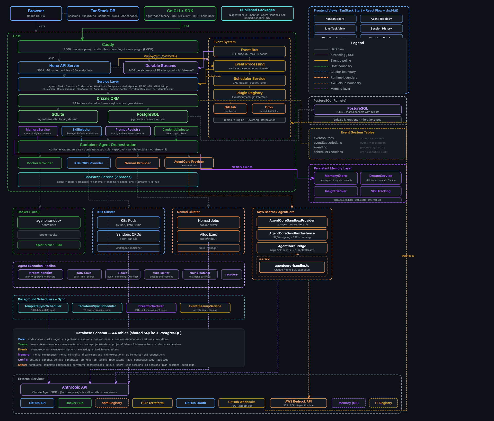
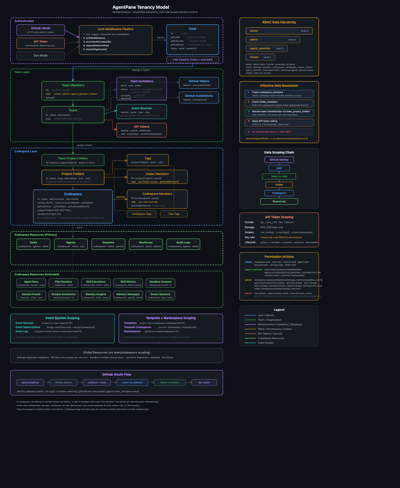
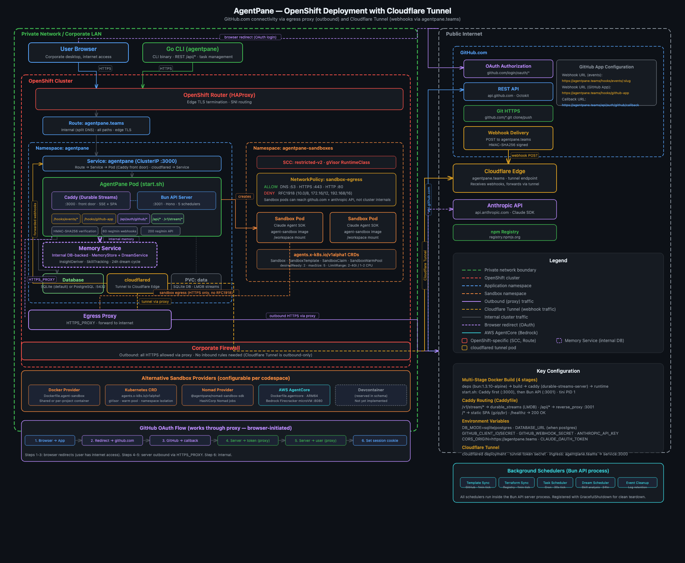
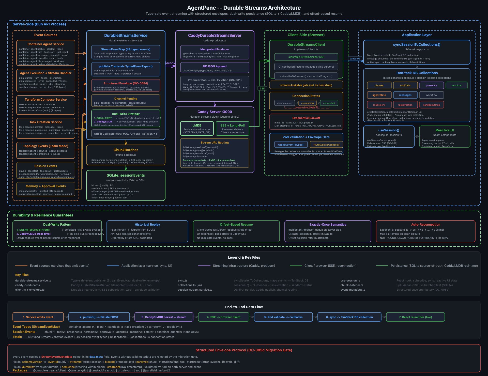
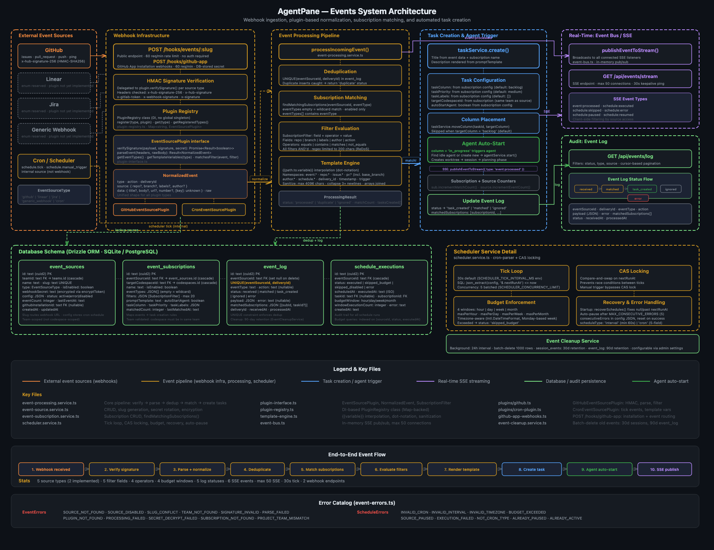

# AgentPane Architecture Diagrams

Visual architecture diagrams for AgentPane. Each diagram is authored as an SVG-embedded HTML file with a matching PNG export.

## Diagrams

### System Architecture



Comprehensive system architecture showing the browser client, Go CLI + SDK, published packages, TanStack DB collections, 15 frontend view modules, Caddy durable streams, Hono API (40 route modules, 60+ endpoints), 17+ service layer, Drizzle ORM (44 tables, SQLite + PostgreSQL), prompt registry, credential injector, skill injector, memory layer (MemoryStore, DreamService, InsightDeriver, SkillTracking), container agent orchestration with 5 sandbox providers (Docker, K8s CRD, Nomad, AWS Bedrock AgentCore, Devcontainer), agent execution pipeline (stream-handler, hooks, turn-limiter, chunk-batcher), 7-phase bootstrap service, 4 background schedulers, and complete database schema inventory.

- **HTML**: [`_architecture-diagram.html`](_architecture-diagram.html)
- **PNG**: [`_architecture-diagram.png`](_architecture-diagram.png)

---

### Architecture Explorer (Interactive)

Interactive pan-and-zoom architecture explorer with preset views for different subsystems (agents, streaming, sandbox, API). Built as a full HTML application rather than a static SVG.

- **HTML**: [`agentpane-architecture.html`](agentpane-architecture.html)
- **PNG**: [`architecture.png`](architecture.png)

---

### Tenancy Model



Authentication, ownership hierarchy, and role-based access control. Shows the GitHub OAuth flow, workspace/folder/codespace/task ownership chain, folder-level RBAC with role cascade (team → folder → codespace), 35 permission actions by role, event system scoping (team-scoped sources, codespace-scoped subscriptions), template + marketplace scoping, 10 codespace-scoped resource types (agent runs, plan sessions, skill executions, skill metrics, sandbox instances, session events/summaries, memory insights/messages, dream sessions), GitHub Tokens + Installations split, tag scoping (folder-level), and global resources.

- **HTML**: [`_tenancy-model.html`](_tenancy-model.html)
- **PNG**: [`tenancy-model.png`](tenancy-model.png)

---

### OpenShift Deployment (Cloudflare Tunnel)



Private network deployment on OpenShift with Cloudflare Tunnel for inbound webhook delivery. GitHub webhooks are received at `agentpane.teams` via Cloudflare Edge, forwarded through an outbound-only tunnel to a `cloudflared` pod inside the cluster — no inbound firewall rules needed. Caddy front door on :3000 reverse-proxying to Bun API on :3001. Shows dual webhook endpoints (`/hooks/events/:slug` + `/hooks/github-app`), rate limiting (60 req/min webhooks, 200 req/min API), egress proxy for outbound API calls, sandbox namespace with 4 K8s CRD types and gVisor RuntimeClass, internal DB-backed Memory Service (MemoryStore + DreamService + InsightDeriver), 5 alternative sandbox providers (Docker, K8s CRD, Nomad, AWS AgentCore, Devcontainer), 5 background schedulers, multi-stage Docker build (4 stages), and Go CLI + GitHub OAuth flow.

- **HTML**: [`_openshift-deployment.html`](_openshift-deployment.html)
- **PNG**: [`_openshift-deployment.png`](_openshift-deployment.png)

---

### Durable Streams Architecture



End-to-end event streaming pipeline from service-side event emission to reactive UI updates. Shows event sources (Container Agent 14 types, Agent Execution, Terraform Compose, Task Creation, Memory Service, Topology 3 types, Approval events) publishing through `DurableStreamsService` with structured envelope protocol (OC-005d), ChunkBatcher (100ms flush, max 10 batch), dual-write persistence (SQLite first, Caddy best-effort with LRU producer pool of 200), SSE delivery with Zod validation, 10 TanStack DB collections, and reactive React hooks with ref-counted SSE sharing. Includes corrected reconnection config (1s initial, 30s max, 8 attempts), 8 stream channels, and 48 StreamEventMap event types.

- **HTML**: [`_durable-streams-architecture.html`](_durable-streams-architecture.html)
- **PNG**: [`_durable-streams-architecture.png`](_durable-streams-architecture.png)

---

### Events System



Webhook ingestion, plugin-based normalization, subscription matching, and automated task creation. Shows 5 source types (2 implemented: GitHubEventSourcePlugin + CronEventSourcePlugin; 3 reserved: Linear, Jira, Generic), dual webhook endpoints (`/hooks/events/:slug` + `/hooks/github-app`), HMAC verification with 5 signature header fallbacks, PluginRegistry (DI-based Map), NormalizedEvent parsing, deduplication, subscription matching with field filters, `{{variable}}` template interpolation, task creation with `targetCodespaceId` and `autoStartAgent`, and team-scoped event routing. Includes 4-table database schema (event_sources team-scoped, event_subscriptions bridging to codespace, event_log with 90-day retention, schedule_executions), EventCleanupService (24h batch cleanup), scheduler with CAS locking and `MAX_CONSECUTIVE_ERRORS: 5`, and 35 error catalog codes.

- **HTML**: [`_events-system-architecture.html`](_events-system-architecture.html)
- **PNG**: [`_events-system-architecture.png`](_events-system-architecture.png)

---

## Written Documentation

| Document | Description |
|----------|-------------|
| [`agent-streaming-architecture.md`](agent-streaming-architecture.md) | Detailed write-up of the agent event streaming architecture |
| [`durable-streams-architecture.md`](durable-streams-architecture.md) | Detailed write-up of the durable streams system design |
| [`research/README.md`](research/README.md) | Broad architecture technology research across 11 domains |
| [`research/opencode/README.md`](research/opencode/README.md) | UX-first architecture supplement with executive brief, roadmap, backlog, and open questions |

## Regenerating PNGs

PNGs are captured from the HTML source files using Playwright:

```bash
npx playwright screenshot --viewport-size="1920,1200" "file://$(pwd)/docs/<file>.html" docs/<file>.png
```
