# System Architecture

High-level architecture of AgentPane showing how the frontend, API layer, database, agent runtime, sandbox providers, event streaming, and external services connect.

In production, Caddy (durable-streams-server) is the single entry point on port 3000. It serves static assets, proxies `/api/*` requests to the Bun API server on port 3001, and handles `/v1/stream/*` for durable event streaming with LMDB persistence. In development, Vite serves the frontend directly on port 3000 while the API runs on port 3001.

```mermaid
flowchart TB
    %% ── Clients ──
    Browser["Browser Client"]

    %% ── Reverse Proxy ──
    subgraph Caddy["Caddy · durable-streams-server :3000"]
        direction TB
        StaticFiles["Static Assets<br/><small>SPA fallback, gzip/br</small>"]
        StreamsEndpoint["Durable Streams<br/><small>/v1/stream/*</small><br/><small>SSE + long-poll · LMDB</small>"]
        APIProxy["Reverse Proxy<br/><small>/api/* → :3001</small>"]
    end

    %% ── Frontend ──
    subgraph Frontend["Frontend · Vite dev :3000"]
        direction TB
        TanStackStart["TanStack Start<br/><small>React 19 · TanStack Router</small>"]
        UIComponents["UI Components<br/><small>Radix · Tailwind · CVA</small>"]
        ClientState["Client State<br/><small>TanStack DB · React Query</small>"]
        DurableClient["DurableStreamsClient<br/><small>EventSource SSE</small>"]
        ReactFlow["Workflow Designer<br/><small>React Flow · ELK layout</small>"]
        DndKit["Kanban Board<br/><small>dnd-kit drag & drop</small>"]
    end

    %% ── API Layer ──
    subgraph API["Bun API Server · Hono :3001"]
        direction TB
        Routes["REST Routes<br/><small>projects · tasks · agents<br/>sessions · settings · worktrees<br/>workflows · terraform · git<br/>sandbox · webhooks · health</small>"]
        Auth["Authentication<br/><small>GitHub OAuth · RBAC tokens<br/>API keys · Team membership</small>"]
        Validation["Request Validation<br/><small>Zod schemas</small>"]
    end

    %% ── Services ──
    subgraph Services["Business Logic Services"]
        direction TB
        ProjectSvc["ProjectService"]
        TaskSvc["TaskService"]
        AgentSvc["AgentService"]
        SessionSvc["SessionService"]
        WorktreeSvc["WorktreeService"]
        SandboxSvc["SandboxService"]
        ContainerAgentSvc["ContainerAgentService"]
        StreamsSvc["DurableStreamsService"]
        SchedulerSvc["SchedulerService"]
        TerraformSvc["TerraformComposeService"]
        TaskCreationSvc["TaskCreationService"]
        TemplateSvc["TemplateService"]
    end

    %% ── Agent Runtime ──
    subgraph AgentRuntime["Agent Runtime"]
        direction TB
        AgentExec["AgentExecutionService<br/><small>lifecycle · abort · hooks</small>"]
        PlanPhase["Planning Phase<br/><small>permissionMode: plan<br/>ExitPlanMode tool</small>"]
        ExecPhase["Execution Phase<br/><small>permissionMode: acceptEdits</small>"]
        TeamMode["Team Mode<br/><small>parallel agent spawning</small>"]
        StreamHandler["Stream Handler<br/><small>SDK session management<br/>tool hooks · event publish</small>"]
    end

    %% ── Database ──
    subgraph Database["Database"]
        direction LR
        SQLite["SQLite<br/><small>better-sqlite3<br/>default · file-based</small>"]
        PostgreSQL["PostgreSQL<br/><small>postgres.js<br/>optional · DB_MODE=postgres</small>"]
        Drizzle["Drizzle ORM<br/><small>shared schema<br/>migrations</small>"]
    end

    %% ── Sandbox Providers ──
    subgraph Sandbox["Sandbox Providers"]
        direction TB
        DockerProv["Docker<br/><small>dockerode · per-project<br/>or shared container</small>"]
        NomadProv["Nomad<br/><small>HashiCorp Nomad<br/>job scheduling</small>"]
        AgentCoreProv["AgentCore<br/><small>Anthropic managed<br/>cloud sandboxes</small>"]
        AgentSandboxProv["Agent Sandbox<br/><small>Dockerfile.agent-sandbox<br/>Claude CLI inside</small>"]
    end

    %% ── External Services ──
    subgraph External["External Services"]
        direction TB
        AnthropicAPI["Anthropic API<br/><small>Claude Agent SDK<br/>@anthropic-ai/sdk</small>"]
        GitHubAPI["GitHub<br/><small>OAuth · App · Webhooks<br/>Octokit REST + GraphQL</small>"]
        GitWorktrees["Git Worktrees<br/><small>isolated branches<br/>per-task workspaces</small>"]
    end

    %% ── Event Streaming ──
    subgraph Events["Event Streaming"]
        direction LR
        EventPublish["Event Publishing<br/><small>DB persist first<br/>then Caddy publish</small>"]
        SSE["SSE Delivery<br/><small>real-time to browser<br/>reconnect + replay</small>"]
        EventPlugins["Event Sources<br/><small>GitHub webhooks<br/>Cron schedules</small>"]
    end

    %% ── Connections: Client → Caddy ──
    Browser -->|"HTTPS"| Caddy

    %% ── Caddy routing ──
    StaticFiles -.->|"production"| Browser
    APIProxy -->|"proxy"| API
    StreamsEndpoint -->|"SSE"| Browser

    %% ── Dev mode: Frontend direct ──
    Browser -->|"dev mode"| Frontend

    %% ── Frontend → API ──
    TanStackStart --> ClientState
    UIComponents --> DndKit
    UIComponents --> ReactFlow
    ClientState -->|"fetch /api/*"| API
    DurableClient -->|"SSE /v1/stream"| StreamsEndpoint

    %% ── API internals ──
    Routes --> Auth
    Routes --> Validation
    Routes --> Services

    %% ── Services → Database ──
    Services --> Drizzle
    Drizzle --> SQLite
    Drizzle --> PostgreSQL

    %% ── Services → Agent Runtime ──
    AgentSvc --> AgentExec
    ContainerAgentSvc --> Sandbox
    AgentExec --> PlanPhase
    PlanPhase -->|"plan approved"| ExecPhase
    ExecPhase -->|"team mode"| TeamMode
    AgentExec --> StreamHandler

    %% ── Agent Runtime → External ──
    StreamHandler -->|"Claude Agent SDK"| AnthropicAPI
    TerraformSvc -->|"Claude Agent SDK"| AnthropicAPI
    TaskCreationSvc -->|"Anthropic SDK"| AnthropicAPI

    %% ── Services → External ──
    WorktreeSvc --> GitWorktrees
    Services -->|"Octokit"| GitHubAPI

    %% ── Services → Events ──
    StreamsSvc --> EventPublish
    EventPublish -->|"persist"| Drizzle
    EventPublish -->|"publish"| StreamsEndpoint
    SSE --> StreamsEndpoint
    EventPlugins --> Services

    %% ── Sandbox connections ──
    SandboxSvc --> DockerProv
    SandboxSvc --> NomadProv
    SandboxSvc --> AgentCoreProv
    SandboxSvc --> AgentSandboxProv
    AgentSandboxProv -->|"agent-runner"| AnthropicAPI

    %% ── Styling ──
    classDef client fill:#e0f2fe,stroke:#0284c7,color:#0c4a6e
    classDef proxy fill:#fef3c7,stroke:#d97706,color:#78350f
    classDef frontend fill:#dbeafe,stroke:#3b82f6,color:#1e3a5f
    classDef api fill:#d1fae5,stroke:#10b981,color:#064e3b
    classDef service fill:#ede9fe,stroke:#8b5cf6,color:#3b0764
    classDef runtime fill:#fce7f3,stroke:#ec4899,color:#701a46
    classDef db fill:#fed7aa,stroke:#f97316,color:#7c2d12
    classDef sandbox fill:#e0e7ff,stroke:#6366f1,color:#312e81
    classDef external fill:#ccfbf1,stroke:#14b8a6,color:#134e4a
    classDef events fill:#fef9c3,stroke:#eab308,color:#713f12

    class Browser client
    class Caddy,StaticFiles,StreamsEndpoint,APIProxy proxy
    class Frontend,TanStackStart,UIComponents,ClientState,DurableClient,ReactFlow,DndKit frontend
    class API,Routes,Auth,Validation api
    class Services,ProjectSvc,TaskSvc,AgentSvc,SessionSvc,WorktreeSvc,SandboxSvc,ContainerAgentSvc,StreamsSvc,SchedulerSvc,TerraformSvc,TaskCreationSvc,TemplateSvc service
    class AgentRuntime,AgentExec,PlanPhase,ExecPhase,TeamMode,StreamHandler runtime
    class Database,SQLite,PostgreSQL,Drizzle db
    class Sandbox,DockerProv,NomadProv,AgentCoreProv,AgentSandboxProv sandbox
    class External,AnthropicAPI,GitHubAPI,GitWorktrees external
    class Events,EventPublish,SSE,EventPlugins events
```

