# Agent Execution Flow

The complete lifecycle of an agent working on a task in AgentPane, from the user dragging a task card on the Kanban board or the Live Task View through planning, approval, execution, and final review.

## Key source files

| File | Role |
|------|------|
| `src/server/routes/tasks.ts` | PATCH /api/tasks/:id/move endpoint |
| `src/services/task.service.ts` | Task state transitions, delegates to container agent service |
| `src/services/agent/agent-execution.service.ts` | Agent lifecycle: worktree, session, planning kickoff |
| `src/lib/agents/stream-handler.ts` | Claude SDK sessions for planning and execution phases |
| `src/services/container-agent/container-exec.service.ts` | Container-based execution, skill injection, plan approval |

## Sequence Diagram

```mermaid
sequenceDiagram
    participant User
    participant Frontend
    participant API
    participant TaskService
    participant AgentExecutionService
    participant ClaudeSDK
    participant DurableStreams
    participant MemoryService

    %% ── Phase 1: Task Move ──────────────────────────────────
    Note over User,DurableStreams: Phase 1 - Task Move to In Progress

    User->>Frontend: Drag task to "In Progress" column
    Frontend->>API: PATCH /api/tasks/:id/move<br/>{column: "in_progress", startAgent: true}
    API->>TaskService: moveColumn(taskId, "in_progress")

    TaskService->>TaskService: Validate transition (backlog -> in_progress)
    TaskService->>TaskService: Generate sessionId, create session record
    TaskService->>TaskService: Update task column, position, sessionId

    alt Container sandbox enabled
        TaskService->>TaskService: Trigger container agent via containerAgentService
        Note right of TaskService: Skills injected into<br/>.claude/skills/ during startup
    else Host-side agent
        API->>API: Log: container agent will run if sandbox enabled
    end

    API-->>Frontend: 200 {task, agentError?}
    Frontend->>Frontend: Update Kanban board optimistically

    %% ── Phase 2: Agent Start ────────────────────────────────
    Note over User,DurableStreams: Phase 2 - Agent Initialization

    AgentExecutionService->>AgentExecutionService: Find idle agent or create new one
    AgentExecutionService->>AgentExecutionService: Validate agent status == "idle"
    AgentExecutionService->>AgentExecutionService: Check codespace concurrency limits

    AgentExecutionService->>AgentExecutionService: Create git worktree<br/>(isolated branch for task)
    AgentExecutionService->>AgentExecutionService: Create session record

    AgentExecutionService->>AgentExecutionService: Update task with agentId,<br/>sessionId, worktreeId, branch
    AgentExecutionService->>AgentExecutionService: Set agent status = "starting"
    AgentExecutionService->>AgentExecutionService: Create agent_run record

    AgentExecutionService->>DurableStreams: Publish state:update<br/>{status: "starting"}
    AgentExecutionService->>AgentExecutionService: Set agent status = "planning"
    AgentExecutionService->>AgentExecutionService: Resolve model (task -> agent -> codespace -> global)
    AgentExecutionService->>AgentExecutionService: Create agent hooks (streaming + audit)

    AgentExecutionService->>AgentExecutionService: Build task prompt<br/>(title, description, worktree path)

    opt Task has skillId
        AgentExecutionService->>AgentExecutionService: Prepend "use skill {skillName}"<br/>directive to prompt
    end

    opt MemoryService available
        AgentExecutionService->>MemoryService: getContext(codespaceId, taskTitle)
        MemoryService-->>AgentExecutionService: MemoryContext {text, sources}
        AgentExecutionService->>AgentExecutionService: Append memory context to prompt
    end

    %% ── Phase 3: Planning ───────────────────────────────────
    Note over User,DurableStreams: Phase 3 - Planning (permissionMode: "plan")

    AgentExecutionService->>ClaudeSDK: runAgentPlanning(prompt, model, cwd)
    ClaudeSDK->>DurableStreams: Publish agent:planning<br/>{agentId, runId, model}

    ClaudeSDK->>ClaudeSDK: unstable_v2_createSession()<br/>permissionMode: "plan"
    ClaudeSDK->>ClaudeSDK: session.send(taskPrompt)

    opt MemoryService available
        AgentExecutionService->>MemoryService: startSession(codespaceId,<br/>agentId, taskId, "planning")
    end

    loop Streaming planning turns
        ClaudeSDK->>DurableStreams: Publish chunk<br/>{delta, accumulated, phase: "planning"}
        DurableStreams-->>Frontend: SSE: chunk event
        Frontend->>Frontend: Render streaming text

        ClaudeSDK->>DurableStreams: Publish tool:start<br/>{tool, input, phase: "planning"}
        Note right of ClaudeSDK: Agent reads files, explores codebase

        ClaudeSDK->>DurableStreams: Publish agent:turn<br/>{turn, phase: "planning"}
        DurableStreams-->>Frontend: SSE: agent:turn event
    end

    %% ── Phase 4: ExitPlanMode ───────────────────────────────
    Note over User,DurableStreams: Phase 4 - Plan Ready

    ClaudeSDK->>ClaudeSDK: Agent calls ExitPlanMode tool
    ClaudeSDK->>ClaudeSDK: canUseTool callback captures<br/>ExitPlanModeOptions<br/>{allowedPrompts?, launchSwarm?, teammateCount?}

    ClaudeSDK->>ClaudeSDK: Extract plan content from accumulated text
    ClaudeSDK->>ClaudeSDK: session.close()

    opt MemoryService available
        AgentExecutionService->>MemoryService: finalizeSession()
        Note right of MemoryService: Triggers Honcho deriver
    end

    ClaudeSDK->>DurableStreams: Publish agent:metrics<br/>{totalCostUsd, durationMs, numTurns}
    ClaudeSDK->>DurableStreams: Publish agent:plan_ready<br/>{plan, allowedPrompts}
    DurableStreams-->>Frontend: SSE: agent:plan_ready event

    ClaudeSDK-->>AgentExecutionService: Return {status: "planning",<br/>plan, planOptions}

    AgentExecutionService->>AgentExecutionService: Update agent_run status = "running"<br/>(DB maps planning -> running)
    AgentExecutionService->>AgentExecutionService: Agent status stays "planning"
    AgentExecutionService->>AgentExecutionService: Store plan + planOptions on task

    Frontend->>Frontend: Display plan in approval UI

    %% ── Phase 5: Plan Approval ──────────────────────────────
    Note over User,DurableStreams: Phase 5 - User Reviews Plan

    alt User approves plan
        User->>Frontend: Click "Approve Plan"
        Frontend->>API: POST /api/tasks/:id/approve-plan
        API->>TaskService: approvePlan(taskId)
        TaskService->>TaskService: containerAgentService.approvePlan()
        TaskService->>TaskService: Move task back to in_progress
        TaskService->>TaskService: Clear pending plan cache

        Note over TaskService,ClaudeSDK: Start execution phase with plan as prompt

    else User rejects plan
        User->>Frontend: Click "Reject Plan" (optional reason)
        Frontend->>API: POST /api/tasks/:id/reject-plan<br/>{reason?}
        API->>TaskService: rejectPlan(taskId, reason)
        TaskService->>TaskService: Move task to backlog
        TaskService->>TaskService: Clear plan, planOptions,<br/>worktreeId, branch
        TaskService->>TaskService: Clean up worktree (best-effort)
        API-->>Frontend: 200 {rejected: true}
        Frontend->>Frontend: Move task card back to Backlog
    end

    %% ── Phase 6: Execution ──────────────────────────────────
    Note over User,DurableStreams: Phase 6 - Execution (permissionMode: "acceptEdits")

    AgentExecutionService->>ClaudeSDK: runAgentExecution(plan, model, cwd)
    ClaudeSDK->>DurableStreams: Publish agent:started<br/>{phase: "execution"}

    ClaudeSDK->>ClaudeSDK: unstable_v2_createSession()<br/>permissionMode: "acceptEdits"
    ClaudeSDK->>ClaudeSDK: session.send(executionPrompt)

    loop Streaming execution turns
        ClaudeSDK->>DurableStreams: Publish chunk<br/>{delta, phase: "execution"}
        DurableStreams-->>Frontend: SSE: chunk event
        Frontend->>Frontend: Render streaming output

        ClaudeSDK->>DurableStreams: Publish tool:start {tool, input}
        ClaudeSDK->>DurableStreams: Publish tool:result {output, isError}
        DurableStreams-->>Frontend: SSE: tool events
        Frontend->>Frontend: Show tool activity

        ClaudeSDK->>DurableStreams: Publish agent:turn<br/>{turn, maxTurns, remaining}
        DurableStreams-->>Frontend: SSE: agent:turn event

        alt Turn limit reached
            ClaudeSDK->>DurableStreams: Publish agent:turn_limit<br/>{turn, maxTurns}
            ClaudeSDK->>ClaudeSDK: session.close()
            ClaudeSDK-->>AgentExecutionService: Return {status: "turn_limit"}
            AgentExecutionService->>AgentExecutionService: Set agent status = "paused"
            AgentExecutionService->>AgentExecutionService: Move task to waiting_approval
        end
    end

    %% ── Phase 7: Completion ─────────────────────────────────
    Note over User,DurableStreams: Phase 7 - Agent Completes

    ClaudeSDK->>ClaudeSDK: session.close()
    ClaudeSDK->>DurableStreams: Publish agent:metrics
    ClaudeSDK->>DurableStreams: Publish agent:completed<br/>{turnCount, usage}
    DurableStreams-->>Frontend: SSE: agent:completed event

    ClaudeSDK-->>AgentExecutionService: Return {status: "completed"}
    AgentExecutionService->>AgentExecutionService: Set agent status = "idle"
    AgentExecutionService->>AgentExecutionService: Clear currentTaskId, currentSessionId
    AgentExecutionService->>AgentExecutionService: Move task to "waiting_approval"
    AgentExecutionService->>AgentExecutionService: Set task completedAt

    Frontend->>Frontend: Move task card to "Waiting Approval"

    %% ── Phase 8: Review ─────────────────────────────────────
    Note over User,DurableStreams: Phase 8 - User Reviews Changes

    User->>Frontend: Open task in Waiting Approval
    Frontend->>API: GET /api/tasks/:id/diff
    API->>TaskService: getDiff(taskId)
    API-->>Frontend: Diff data (file changes)
    Frontend->>Frontend: Display diff viewer

    alt User approves changes
        User->>Frontend: Approve changes
        Frontend->>API: PATCH /api/tasks/:id/move<br/>{column: "verified"}
        API->>TaskService: moveColumn(taskId, "verified")
        API-->>Frontend: 200 {task}
        Frontend->>Frontend: Move task to "Verified" column
    else User rejects changes
        User->>Frontend: Reject (send back for rework)
        Frontend->>API: PATCH /api/tasks/:id/move<br/>{column: "backlog"}
        API->>TaskService: moveColumn(taskId, "backlog")
        API-->>Frontend: 200 {task}
        Frontend->>Frontend: Move task back to Backlog
    end
```



## Event Reference

Events published to DurableStreams during the agent lifecycle:

| Event | Phase | Description |
|-------|-------|-------------|
| `state:update` | Init | Agent status changed to "starting" |
| `agent:planning` | Planning | Planning session created with model info |
| `chunk` | Planning / Execution | Streaming text delta from Claude |
| `tool:start` | Planning / Execution | Tool invocation begins |
| `tool:result` | Execution | Tool returns result (truncated to 1000 chars) |
| `agent:turn` | Planning / Execution | Turn completed with count |
| `agent:tool_progress` | Planning / Execution | Long-running tool progress update |
| `agent:compacted` | Planning / Execution | Context window compaction occurred |
| `agent:metrics` | Planning / Execution | Cost, duration, token usage |
| `agent:plan_ready` | Planning | Plan complete, awaiting user approval |
| `agent:started` | Execution | Execution phase session created |
| `agent:turn_limit` | Execution | Max turns reached, agent paused |
| `agent:completed` | Execution | Agent finished successfully |
| `agent:error` | Any | Error with recovery action |

## ExitPlanMode Options

When the agent calls `ExitPlanMode` during planning, it can pass these options:

```typescript
interface ExitPlanModeOptions {
  allowedPrompts?: Array<{ tool: 'Bash'; prompt: string }>;
  launchSwarm?: boolean;
  teammateCount?: number;
  pushToRemote?: boolean;
}
```

## State Transitions

```
Task:    backlog -> in_progress -> [planning] -> in_progress -> waiting_approval -> verified
Agent:   idle -> starting -> planning -> [approval] -> running -> idle
```

- If the user rejects the plan, the task moves back to `backlog` and the agent returns to `idle`.
- If the agent hits the turn limit, it is set to `paused` and the task moves to `waiting_approval`.
- On error, the agent is set to `error` and recovery logic determines if it should be paused or remain in error state.
