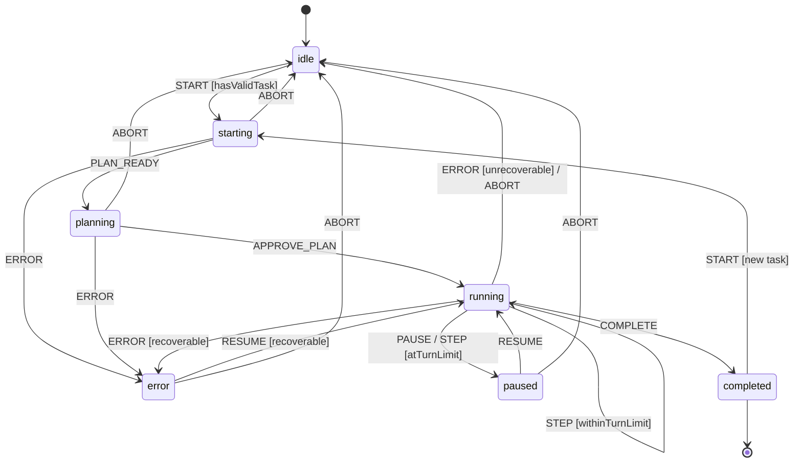
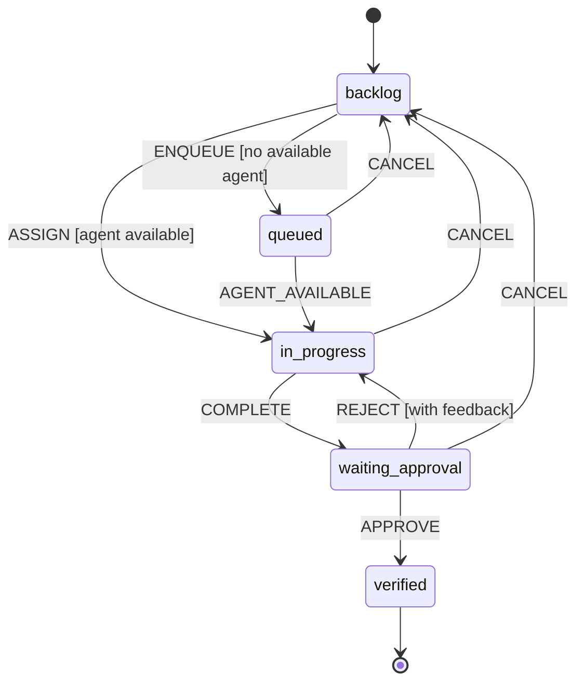
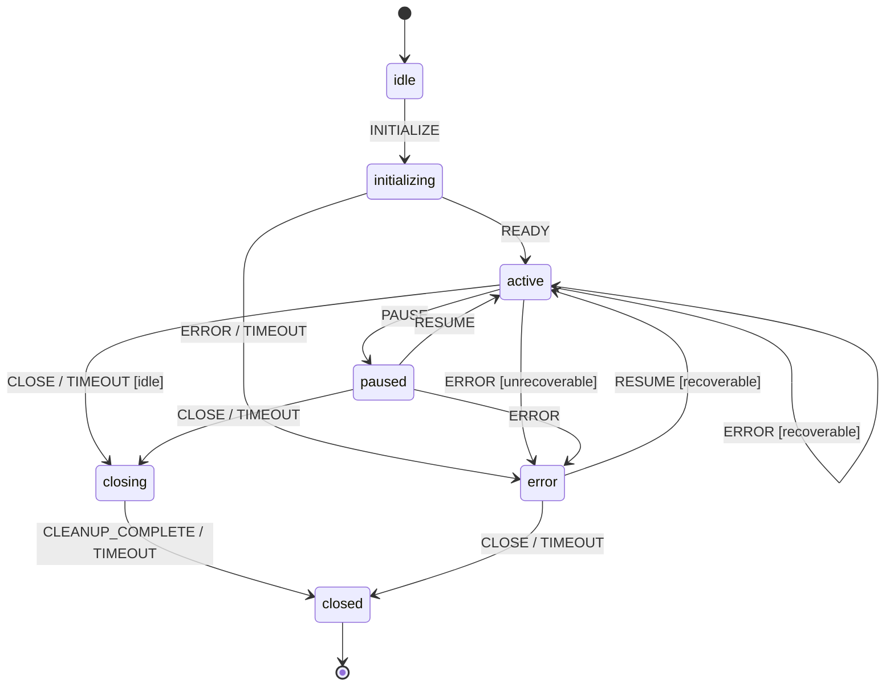
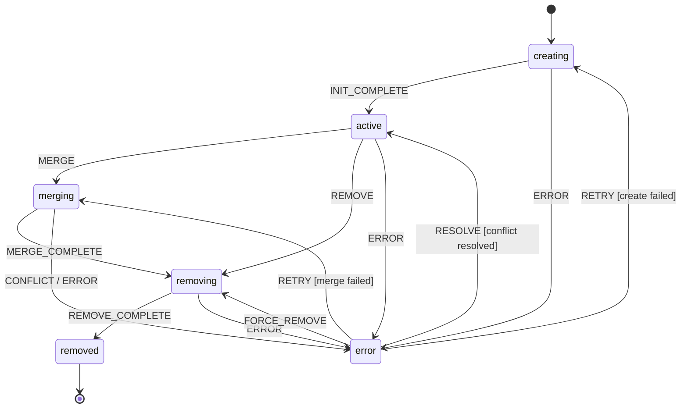

# AgentPane State Machines

Four state machines govern the core lifecycles in AgentPane. Each diagram below uses the actual enum values defined in `src/db/schema/shared/enums.ts`.

---

## 1. Agent Lifecycle

**Enum:** `AGENT_STATUS = ['idle', 'starting', 'planning', 'running', 'paused', 'error', 'completed']`

The agent lifecycle governs execution from task assignment through completion. After starting, the agent enters a **planning** phase where it explores the codebase and creates an implementation plan (using `permissionMode: 'plan'`). If the task has an associated skill, the prompt includes a `use skill` directive. If MemoryService is available, context from previous sessions is injected into the prompt before planning begins. Once the plan is approved, the agent transitions to **running** for full execution. The agent can be paused (e.g., turn limit reached or user input needed) and resumed, and errors may be recoverable or terminal.

- **Initial state:** `idle`
- **Terminal state:** `completed` (can also restart from `completed` via a new `START` event)
- **Recovery path:** `error` can resume to `running` if the error is recoverable, or abort back to `idle`

---

## 2. Task Workflow

**Enum:** `TASK_COLUMNS = ['backlog', 'queued', 'in_progress', 'waiting_approval', 'verified']`

The task workflow maps directly to Kanban board columns. Tasks begin in **backlog** and move to **queued** when submitted for execution but all agents are busy. When an agent becomes available, the task moves to **in_progress**. After the agent completes work, the task enters **waiting_approval** for human review. Approval merges the branch and moves the task to **verified**. Rejection sends the task back to **in_progress** with feedback for the agent.

- **Initial state:** `backlog`
- **Terminal state:** `verified`
- **Cancel path:** Tasks in `queued`, `in_progress`, or `waiting_approval` can be cancelled back to `backlog`
- **Reject path:** `waiting_approval` returns to `in_progress` with reviewer feedback

---

## 3. Session Lifecycle

**Enum:** `SESSION_STATUS = ['idle', 'initializing', 'active', 'paused', 'closing', 'closed', 'error']`

The session lifecycle manages real-time streaming sessions between the backend and connected clients. Sessions start **idle**, move through **initializing** (creating durable stream, allocating resources), then become **active** to accept connections and events. Sessions can be **paused** (e.g., agent paused) and **resumed**. Graceful shutdown proceeds through **closing** (draining events, persisting history) before reaching **closed**. Errors are reachable from most active states; recoverable errors can resume to **active**, while unrecoverable errors transition to **closed** after cleanup.

- **Initial state:** `idle`
- **Terminal state:** `closed`
- **Error recovery:** `error` can resume to `active` if recoverable, or close with cleanup
- **Timeout paths:** Idle timeout in `active` triggers `closing`; cleanup timeout in `closing` forces `closed`

---

## 4. Worktree Lifecycle

**Enum:** `WORKTREE_STATUS = ['creating', 'active', 'merging', 'removing', 'removed', 'error']`

The worktree lifecycle manages isolated git worktrees used for agent execution. A worktree is **created** with a new branch from the base branch, becomes **active** once initialization completes (env copied, deps installed), and enters **merging** when the task is approved and the branch is being merged back to the target. After a successful merge, the worktree transitions to **removing** for cleanup (git worktree remove, branch prune) and finally reaches **removed**. Errors during any operation (create, merge, remove) transition to the **error** state, from which the operation can be retried or the worktree force-removed.

- **Initial state:** `creating`
- **Terminal state:** `removed`
- **Error recovery:** `error` can retry the failed operation or be force-removed
- **Merge conflicts:** During `merging`, a conflict transitions to `error`; resolution returns to `merging`

