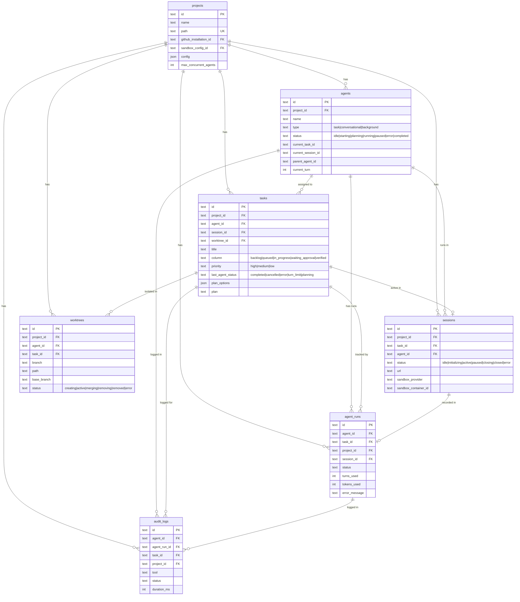
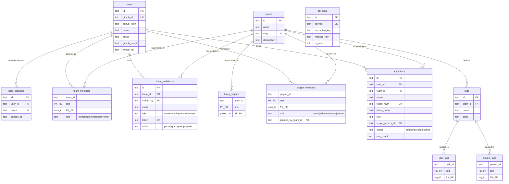

# AgentPane Database Schema

Entity-relationship diagrams for the AgentPane SQLite database. The schema is defined with Drizzle ORM across 36+ tables in `src/db/schema/sqlite/`. These diagrams show key columns (primary keys, foreign keys, status/type fields) and all foreign key relationships.

## 1. Core Domain

The central tables that drive agent-based task execution: projects own tasks, agents work on tasks within sessions, worktrees provide git isolation, and agent runs track execution history.



## 2. Auth and RBAC

Authentication via GitHub OAuth, session tokens, team-based access control with role inheritance, API tokens with scoped permissions, and tag-based organization for projects and tasks.



## 3. Extended Features

Supporting subsystems: event-driven automation (sources, subscriptions, log, schedules), sandbox infrastructure (configs, instances, tmux sessions), Terraform registry, templates and workflows, marketplace plugins, CLI monitoring, session telemetry, and GitHub integration.

```mermaid
erDiagram
    event_sources {
        text id PK
        text team_id FK
        text name
        text type "github|webhook|schedule|..."
        text slug UK
        text status "active|disabled|error"
        int is_enabled
        int event_count
    }

    event_subscriptions {
        text id PK
        text event_source_id FK
        text target_project_id FK
        text name
        int is_enabled
        json event_types
        json filters
        text prompt_template
        int auto_start_agent
        text task_column
        text task_priority
    }

    event_log {
        text id PK
        text event_source_id FK
        text event_type
        text action
        text status "received|matched|task_created|ignored|error"
        text delivery_id
        json matched_subscriptions
    }

    schedule_executions {
        text id PK
        text event_source_id FK
        text task_id FK
        text subscription_id FK
        text status
        text scheduled_at
        text executed_at
        text budget_window
    }

    sandbox_configs {
        text id PK
        text name
        text type "docker|kubernetes|nomad"
        int is_default
        text base_image
        int memory_mb
        real cpu_cores
        int timeout_minutes
    }

    sandbox_instances {
        text id PK
        text project_id FK_UK
        text container_id
        text status "running|stopped|error"
        text image
        int memory_mb
        int cpu_cores
    }

    sandbox_tmux_sessions {
        text id PK
        text sandbox_id FK
        text task_id FK
        text session_name
        int window_count
        int attached
    }

    terraform_registries {
        text id PK
        text name
        text org_name
        text status "active|syncing|error"
        int module_count
    }

    terraform_modules {
        text id PK
        text registry_id FK
        text name
        text namespace
        text provider
        text version
        text source
    }

    templates {
        text id PK
        text name
        text scope "org|project"
        text project_id FK
        text github_owner
        text github_repo
        text branch
        text status "active|syncing|error|disabled"
        json cached_skills
    }

    template_projects {
        text template_id PK_FK
        text project_id PK_FK
    }

    workflows {
        text id PK
        text name
        text source_template_id FK
        text status "draft|published|archived"
        json nodes
        json edges
        int ai_generated
    }

    plan_sessions {
        text id PK
        text task_id FK
        text project_id FK
        text status "active|waiting_user|completed|cancelled"
        json turns
    }

    marketplaces {
        text id PK
        text name
        text github_owner
        text github_repo
        text status "active|syncing|error"
        int is_default
        int is_enabled
        json cached_plugins
    }

    settings {
        text key PK
        text value
    }

    cli_sessions {
        text id PK
        text session_id UK
        text project_name
        text project_hash
        text status "idle|active|..."
        text model
        int message_count
        int turn_count
        text parent_session_id
        int is_subagent
    }

    session_events {
        text id PK
        text session_id FK
        int offset
        text type
        text channel
        json data
        int timestamp
    }

    session_summaries {
        text id PK
        text session_id FK_UK
        int duration_ms
        int turns_count
        int tokens_used
        int files_modified
        text final_status "success|failed|cancelled"
        real cost_usd
    }

    github_tokens {
        text id PK
        text team_id FK
        text encrypted_token
        text token_type "pat|oauth"
        text github_login
        int is_valid
    }

    github_installations {
        text id PK
        text installation_id UK
        text account_login
        text account_type
        text status
    }

    repository_configs {
        text id PK
        text installation_id FK
        text owner
        text repo
        json config
    }

    event_sources ||--o{ event_subscriptions : "triggers"
    event_sources ||--o{ event_log : "receives"
    event_sources ||--o{ schedule_executions : "schedules"

    event_subscriptions ||--o{ schedule_executions : "executes"

    sandbox_instances ||--o{ sandbox_tmux_sessions : "hosts"

    terraform_registries ||--o{ terraform_modules : "contains"

    templates ||--o{ template_projects : "assigned to"

    workflows ||--o| templates : "sourced from"

    github_installations ||--o{ repository_configs : "configures"

    session_events }o--|| sessions : "belongs to"
    session_summaries ||--|| sessions : "summarizes"
```
