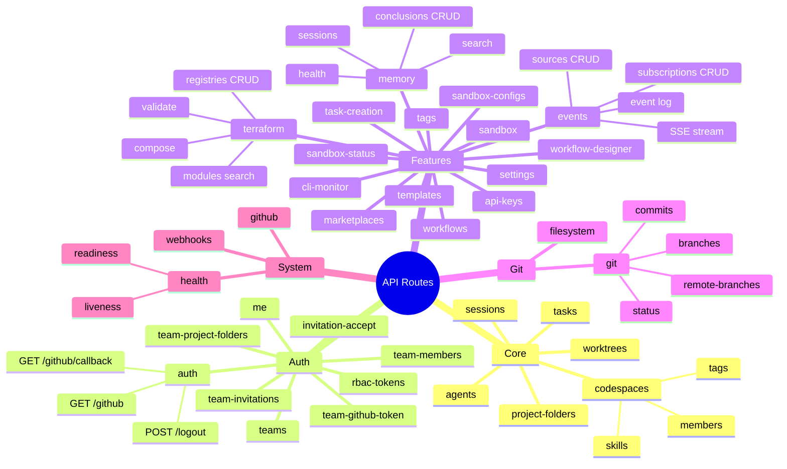

# API Route Map

All Hono route modules registered under `/api`, grouped by domain. Each module lives in `src/server/routes/<name>.ts` and is mounted by the main API router. Core routes manage codespaces (formerly projects) and their child resources.

