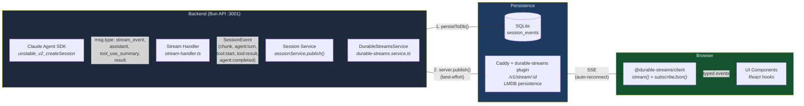

# Event Streaming Pipeline

Real-time event delivery from agent execution to browser UI. Events are persisted to SQLite for durability and published to the Caddy durable-streams server for SSE delivery. Clients subscribe directly to Caddy streams via the `@durable-streams/client` library -- the Bun API server is not involved in the SSE connection path.

## Event Types

| Category | Events |
|----------|--------|
| Agent lifecycle | `state:update`, `agent:started`, `agent:planning`, `agent:turn`, `agent:plan_ready`, `agent:completed`, `agent:error`, `agent:turn_limit`, `agent:stopped`, `agent:rate_limit` |
| Streaming | `chunk` (text deltas with accumulated content) |
| Tool use | `tool:start`, `tool:result`, `agent:tool_progress` |
| Diagnostics | `agent:metrics`, `agent:compacted` |
| Plan mode | `plan:started`, `plan:turn`, `plan:token`, `plan:interaction`, `plan:completed` |
| Sandbox | `sandbox:creating`, `sandbox:ready`, `sandbox:idle`, `sandbox:stopping`, `sandbox:stopped`, `sandbox:error` |
| Container agent | `container-agent:status`, `container-agent:started`, `container-agent:message`, `container-agent:error`, `container-agent:cancelled`, `container-agent:task-update-failed` |
| Terraform compose | `terraform:status`, `terraform:text`, `terraform:modules`, `terraform:questions`, `terraform:code`, `terraform:done` |
| Topology | `topology:agent_spawned`, `topology:agent_progress`, `topology:agent_completed` |
| Task creation | `task-creation:started`, `task-creation:message`, `task-creation:token`, `task-creation:suggestion`, `task-creation:questions`, `task-creation:completed` |
