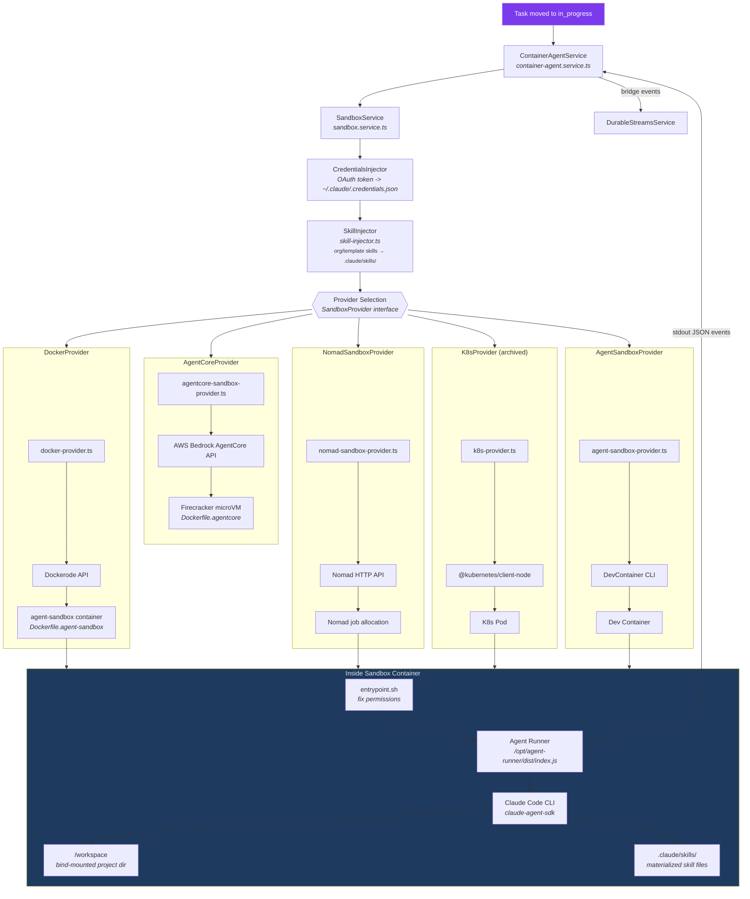

# Sandbox Architecture

Multi-provider sandbox system for isolated agent execution. The `SandboxService` manages container lifecycle (create, idle-check, stop) while the `ContainerAgentService` orchestrates agent processes inside those containers — including skill injection from org/template configurations — via stdout event bridging or SSE invocation.

## Provider Comparison

| Provider | Runtime | Isolation | Use Case |
|----------|---------|-----------|----------|
| DockerProvider | Docker Engine / OrbStack | Container | Local dev, single-machine deployment |
| NomadSandboxProvider | HashiCorp Nomad | Job allocation | Multi-node orchestration |
| K8sProvider | Kubernetes | Pod | Cloud-native orchestration (archived) |
| AgentCoreProvider | AWS Bedrock AgentCore | Firecracker microVM | Managed AWS runtime, SSE invoke |
| AgentSandboxProvider | DevContainer CLI | Dev Container | IDE-integrated sandboxes |

## Container Configuration

Defaults from `SANDBOX_DEFAULTS`:
- **Image**: `srlynch1/agent-sandbox:latest`
- **Memory**: configurable per-codespace
- **CPU**: configurable per-codespace
- **Idle timeout**: auto-stop after inactivity (checked every 5 minutes)
- **Volume mounts**: project path bind-mounted to `/workspace`
- **Security**: non-root `node` user, limited sudo, `git safe.directory *`
- **Skill injection**: org/template skills materialized to `/workspace/.claude/skills/{skillId}/SKILL.md` before agent execution (non-fatal on failure)
