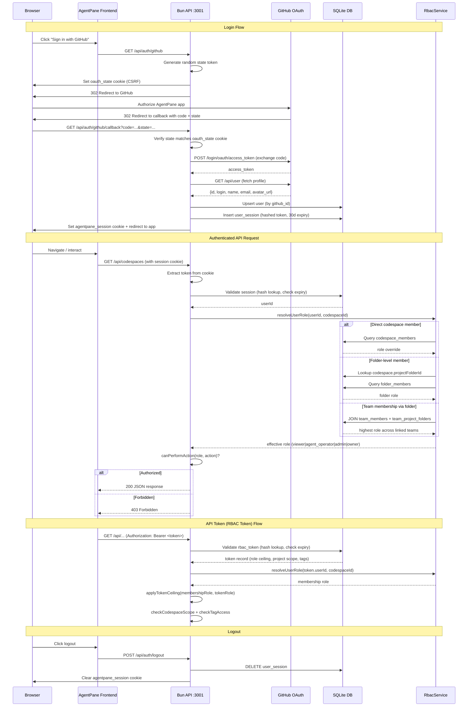

# Authentication Flow

GitHub OAuth login with session-based authentication and RBAC role resolution. API access is protected by auth middleware that supports session cookies, API tokens (RBAC tokens), and a dev-mode bypass.

## RBAC Permission Matrix

| Role | Level | Example Permissions |
|------|-------|-------------------|
| **viewer** | 10 | Read codespaces, folders, tasks, sessions, agents |
| **agent_operator** | 20 | Create/update tasks, start/stop agents, approve plans |
| **admin** | 30 | Create/delete codespaces, manage members/folders, update settings |
| **owner** | 40 | Delete team, transfer ownership |

## Role Resolution Order

1. **Direct codespace_members override** -- if the user has a row in `codespace_members` for this codespace, use that role
2. **Folder-level membership via folder_members** -- look up the codespace's `projectFolderId`, query `folder_members` for that folder
3. **Team membership via team_project_folders** -- JOIN `team_members` with `team_project_folders` on the folder, take the highest role across all linked teams
4. **No membership found** -- deny access (return null)

## API Token Scoping

RBAC tokens support three scoping mechanisms:
- **Role ceiling**: effective role = min(membership role, token role)
- **Codespace scope**: token can be restricted to a single codespace
- **Tag access**: token scope tags must overlap with resource tags
