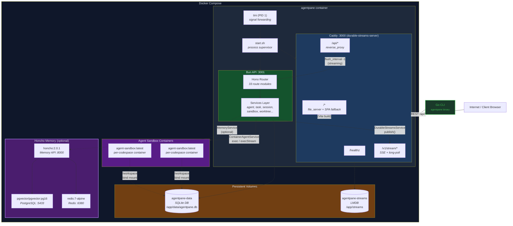

# Deployment Architecture

Production deployment uses a single Docker container running Caddy (with the durable-streams plugin) as the front door on port 3000. Caddy reverse-proxies API requests to the Bun server on port 3001, serves static frontend assets directly, and handles durable stream SSE endpoints backed by LMDB.

## Docker Images

| Image | Dockerfile | Purpose |
|-------|-----------|---------|
| `agentpane:latest` | `docker/Dockerfile` | Main application (Caddy + Bun) |
| `srlynch1/agent-sandbox:latest` | `docker/Dockerfile.agent-sandbox` | Sandboxed agent execution (Claude CLI + agent-runner) |
| `agentpane-agentcore:latest` | `docker/Dockerfile.agentcore` | AWS Bedrock AgentCore runtime (ARM64) |
| `ghcr.io/plastic-labs/honcho:2.0.1` | `docker/docker-compose.memory.yml` | Persistent agent memory (Honcho API + pgvector + Redis) |

## Build Stages (Main Dockerfile)

1. **deps** -- `oven/bun:1.3.10-alpine`, install dependencies with frozen lockfile
2. **build** -- compile frontend (Vite) + typecheck + agent-runner
3. **caddy** -- download `durable-streams-server` binary for target architecture
4. **runtime** -- `oven/bun:1.3.10-alpine` with git, tini, wget, bash; runs as non-root `bun` user

## Caddy Configuration

| Path | Handler | Target |
|------|---------|--------|
| `/healthz` | respond 200 | Health check |
| `/v1/stream/*` | `durable_streams` plugin | LMDB-backed SSE + long-poll (30s timeout, 120s reconnect) |
| `/api/*` | `reverse_proxy` | `localhost:3001` (streaming enabled) |
| `/*` | `file_server` | `/app/dist` with SPA fallback + gzip/brotli + immutable cache for `/assets/*` |

## Process Lifecycle (start.sh)

1. Start Caddy (`durable-streams-server run`) in background
2. Wait up to 15s for Caddy to be ready on `:3000/healthz`
3. Start Bun API (`bun src/server/api.ts`) in background
4. Wait for either process to exit; if one dies, kill the other
5. `tini` handles SIGTERM/SIGINT forwarding to both processes

## Volumes

| Volume | Mount | Contents |
|--------|-------|----------|
| `agentpane-data` | `/app/data` | SQLite database |
| `agentpane-streams` | `/app/streams` | LMDB durable stream data |
| `honcho_pgdata` | Honcho PostgreSQL | Honcho memory data (optional) |
| `honcho_redis` | Honcho Redis | Honcho cache data (optional) |

## Alternative Configurations

- **PostgreSQL**: `docker/docker-compose.postgres.yml` provides a PostgreSQL 18 instance for environments requiring a relational database instead of SQLite
- **Agent sandbox containers**: created dynamically by `ContainerAgentService` with project directories bind-mounted to `/workspace`
- **Honcho Memory**: `docker/docker-compose.memory.yml` provides Honcho (memory API), pgvector PostgreSQL, and Redis as an optional sidecar for persistent agent memory
