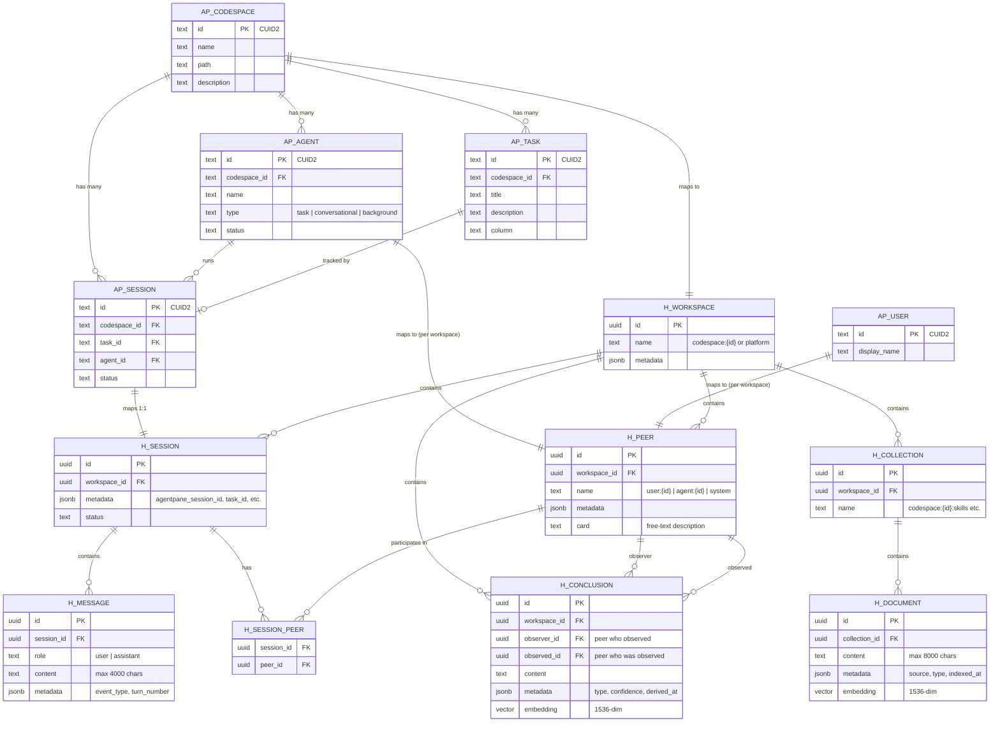

# Memory Service Data Model

Detailed mapping between AgentPane entities and Honcho memory entities. This spec defines naming conventions, lifecycles, metadata structures, and relationships for every entity in the memory layer.

> **Related specs**: [Architecture](./architecture.md) | [API](./api.md)

---

## 1. Workspace Model

Honcho workspaces provide top-level isolation for memory data. AgentPane uses a **dual workspace** design: one workspace per codespace for project-scoped memory, plus a single global workspace for cross-cutting platform knowledge.

### 1.1 Workspace Types

| Workspace | Naming Pattern | Purpose | Created When |
|-----------|---------------|---------|-------------|
| **Codespace workspace** | `codespace-{codespaceId}` | Per-codespace isolation. Agents remember patterns, skills, and user preferences scoped to this codebase. | First agent execution in the codespace |
| **Platform workspace** | `platform` | Global cross-project knowledge. User preferences, skill optimization data, and patterns that transcend any single codespace. | First successful Honcho connection (bootstrap) |

### 1.2 Workspace Naming

```
codespace-cm4x7k2a10001 .......... per-codespace workspace
platform ............................. global platform workspace
```

The codespace ID is the CUID2 value from the AgentPane `codespaces` table (`codespaces.id`).

### 1.3 Workspace Lifecycle

```
                  +-----------------+
                  |  Codespace      |
                  |  Created in     |
                  |  AgentPane      |
                  +-------+---------+
                          |
                          | First agent execution
                          v
                  +-------+---------+
                  |  Honcho         |
                  |  Workspace      |
                  |  Created        |
                  +-------+---------+
                          |
                          | Codespace deleted
                          v
                  +-------+---------+
                  |  Honcho         |
                  |  Workspace      |
                  |  Deleted        |
                  |  (cascade)      |
                  +-----------------+
```

**Creation**: Lazy. The workspace is created on the first `memoryService.ensureWorkspace(codespaceId)` call, which happens at agent start. If Honcho is unavailable, workspace creation is skipped and the agent proceeds without memory.

**Deletion**: When a codespace is deleted in AgentPane, the memory service deletes the corresponding Honcho workspace. This cascades and removes all peers, sessions, messages, collections, documents, and conclusions within that workspace.

**Platform workspace**: Created once during `MemoryService` bootstrap in `service-container.ts`. Never deleted.

### 1.4 Workspace Metadata

```typescript
// Codespace workspace metadata
interface CodespaceWorkspaceMetadata {
  type: 'codespace';
  codespace_id: string;        // AgentPane codespace CUID2
  codespace_name: string;      // Human-readable name
  codespace_path: string;      // Filesystem path to repo
  github_owner?: string;       // GitHub owner if connected
  github_repo?: string;        // GitHub repo if connected
  created_at: string;          // ISO 8601
}

// Platform workspace metadata
interface PlatformWorkspaceMetadata {
  type: 'platform';
  created_at: string;          // ISO 8601
}
```

### 1.5 Global Workspace Use Cases

The `platform` workspace stores knowledge that is not scoped to any single codespace:

| Use Case | Example |
|----------|---------|
| **User preferences** | "User prefers concise commit messages", "User always wants tests" |
| **Skill optimization** | Learned patterns about how to use tools more effectively |
| **Cross-project patterns** | "User's repos always use Biome for linting", "User prefers Drizzle over raw SQL" |
| **Agent behavioral tuning** | "User prefers agents to ask before making breaking changes" |

### 1.6 Honcho SDK Usage

```typescript
// Create codespace workspace
const workspace = await honcho.workspaces.getOrCreate('codespace-cm4x7k2a10001', {
  metadata: {
    type: 'codespace',
    codespace_id: 'cm4x7k2a10001',
    codespace_name: 'my-app',
    codespace_path: '/home/user/repos/my-app',
    created_at: new Date().toISOString(),
  },
});

// Create platform workspace (bootstrap)
const platform = await honcho.workspaces.getOrCreate('platform', {
  metadata: {
    type: 'platform',
    created_at: new Date().toISOString(),
  },
});
```

---

## 2. Peer Model

Honcho peers represent participants in a workspace. Each peer is either a user, an agent, or the system itself.

### 2.1 Peer Types and Naming

| Peer Type | Naming Pattern | Scope | Purpose |
|-----------|---------------|-------|---------|
| **User** | `user-{userId}` | Per workspace | Represents the human user interacting with agents |
| **Agent** | `agent-{agentId}` | Per workspace | Represents a specific agent instance |
| **System** | `system` | Platform workspace only | Represents the platform itself for global observations |

```
user-cm4x8abc0002 ................. a user peer
agent-cm4x9def0003 ................ an agent peer
system ............................... platform-level system peer
```

The `userId` comes from the AgentPane users table. The `agentId` comes from the `agents` table.

### 2.2 Peer Lifecycle

**Creation**: Lazy. Peers are created on first reference via `memoryService.ensurePeer()`.

- **User peer**: Created when a user's agent first executes in a workspace. One user peer per workspace.
- **Agent peer**: Created when an agent first executes in a workspace. One peer per agent per workspace.
- **System peer**: Created once when the platform workspace is bootstrapped.

**Deletion**: Peers are **never explicitly deleted**. They are only removed when their parent workspace is deleted (cascade). This preserves the full history of observations and conclusions.

### 2.3 Peer Metadata

```typescript
// User peer metadata
interface UserPeerMetadata {
  type: 'user';
  user_id: string;              // AgentPane user CUID2
  display_name?: string;        // User's display name
  role?: string;                // RBAC role in this codespace
}

// Agent peer metadata
interface AgentPeerMetadata {
  type: 'agent';
  agent_id: string;             // AgentPane agent CUID2
  agent_name: string;           // Agent display name
  agent_type: 'task' | 'conversational' | 'background';
  capabilities?: string[];      // e.g. ['code_edit', 'bash', 'file_search']
}

// System peer metadata (platform workspace only)
interface SystemPeerMetadata {
  type: 'system';
  version: string;              // AgentPane version
}
```

### 2.4 Peer Cards

Peer cards are free-text descriptions that peers maintain about each other. They evolve over time as interactions accumulate.

| Card Holder | Card Subject | Example Content |
|-------------|-------------|----------------|
| Agent | User | "Senior TypeScript developer. Prefers functional patterns. Insists on comprehensive error handling. Writes tests first." |
| User | Agent | "Reliable for refactoring tasks. Sometimes over-engineers solutions. Good at finding edge cases." |
| System | Agent | "Specialized in infrastructure tasks. 94% task completion rate. Average 12 turns per task." |

Cards are updated by the Honcho deriver after session finalization. They are not manually editable via the AgentPane UI.

### 2.5 Peer Observation Configuration

Peers are configured as observer/observed pairs that control what the Honcho deriver processes:

| Observer | Observed | Derives |
|----------|----------|---------|
| Agent peer | User peer | User preferences, expertise level, communication style |
| System peer | Agent peer | Agent performance patterns, common failure modes |

```typescript
// Configure agent to observe user
await honcho.workspaces.peers.update(workspaceId, agentPeerId, {
  observe: [{ peer_id: userPeerId }],
});
```

### 2.6 Honcho SDK Usage

```typescript
// Ensure user peer exists
const userPeer = await honcho.workspaces.peers.getOrCreate(
  workspaceId,
  `user:${userId}`,
  {
    metadata: {
      type: 'user',
      user_id: userId,
      display_name: 'Simon',
      role: 'owner',
    },
  }
);

// Ensure agent peer exists
const agentPeer = await honcho.workspaces.peers.getOrCreate(
  workspaceId,
  `agent:${agentId}`,
  {
    metadata: {
      type: 'agent',
      agent_id: agentId,
      agent_name: 'Agent Alpha',
      agent_type: 'task',
    },
  }
);
```

---

## 3. Session Model

Honcho sessions map 1:1 to AgentPane sessions. Each agent execution creates exactly one Honcho session that captures the conversation history.

### 3.1 Mapping

| AgentPane | Honcho | Relationship |
|-----------|--------|-------------|
| `sessions.id` | Session ID | 1:1 (Honcho session metadata contains `agentpane_session_id`) |
| `sessions.codespaceId` | Workspace | Session belongs to workspace `codespace-{codespaceId}` |
| `sessions.agentId` | Session peer (agent) | Agent peer is added on creation |
| `sessions.taskId` | Session metadata | Stored in metadata for correlation |

### 3.2 Session Metadata

```typescript
interface HonchoSessionMetadata {
  agentpane_session_id: string;  // AgentPane session CUID2
  task_id: string | null;        // AgentPane task CUID2
  agent_id: string;              // AgentPane agent CUID2
  codespace_id: string;          // AgentPane codespace CUID2
  task_title?: string;           // Human-readable task title
  agent_name?: string;           // Human-readable agent name
  phase: 'planning' | 'execution'; // Which phase this session represents
  model?: string;                // Model used (e.g. 'claude-sonnet-4-6')
  started_at: string;            // ISO 8601
  completed_at?: string;         // ISO 8601 (set on finalization)
  status?: 'active' | 'completed' | 'error' | 'cancelled';
  total_turns?: number;          // Final turn count
  total_tokens?: number;         // Estimated total token usage
}
```

### 3.3 Session Lifecycle

```
AgentPane                          Honcho
--------                          ------

Task moves to in_progress
  |
  v
AgentExecutionService.start()
  |
  +-- Create AgentPane session
  |
  +-- memoryService.createSession() ---> Create Honcho session
  |     - Add agent peer                  with metadata
  |     - Add user peer
  |
  +-- Stream handler runs
  |     |
  |     +-- onMessage callbacks -------> Create Honcho messages
  |
  +-- Agent completes/errors
  |
  +-- memoryService.finalizeSession() -> Update session metadata
        - Set completed_at                (status, total_turns)
        - Trigger deriver                 Deriver generates conclusions
```

**Creation**: A Honcho session is created in `AgentExecutionService.start()` immediately after the AgentPane session is created. Both the agent peer and the user peer are added to the session.

**Active**: During execution, the stream handler's `onMessage` callback sends messages to the Honcho session via `memoryService.captureMessage()`.

**Finalization**: When the agent completes (success, error, or cancellation), `memoryService.finalizeSession()` updates the session metadata with final statistics and triggers the Honcho deriver to generate conclusions.

### 3.4 Session Peers

Each Honcho session has two peers added on creation:

```typescript
// Create session with both peers
const session = await honcho.workspaces.sessions.create(workspaceId, {
  metadata: { /* see 3.2 */ },
  peers: [agentPeerId, userPeerId],
});
```

### 3.5 Session Cloning (Plan Revision)

When a user rejects an agent's plan and requests revision, the agent re-enters planning with a new AgentPane session. The memory service creates a new Honcho session for the revised planning phase. The original planning session is finalized as `cancelled`, and conclusions from it are still preserved.

```
Plan Phase 1 (rejected)     Plan Phase 2 (approved)     Execution
  Session A (cancelled)  ->   Session B (completed)  ->   Session C (completed)
  [conclusions derived]       [conclusions derived]       [conclusions derived]
```

---

## 4. Message Model

Honcho messages capture the conversation between agents and users within a session. Not all AgentPane session events become Honcho messages -- only semantically meaningful turns are captured.

### 4.1 Event Type Mapping

| AgentPane Event | Captured? | Honcho Role | Rationale |
|----------------|-----------|-------------|-----------|
| `chunk` (accumulated) | Yes | `assistant` | Agent's reasoning and output text |
| `agent:turn` | Yes | `assistant` | Complete turn summary with tool usage |
| User prompt / plan approval | Yes | `user` | User input that shapes agent behavior |
| `agent:started` | No | -- | Lifecycle event, not conversational |
| `tool:start` | No | -- | Too noisy; tool usage captured in turn summary |
| `tool:result` | No | -- | Too noisy; results captured in turn summary |
| `agent:completed` | No | -- | Captured in session finalization metadata |
| `agent:error` | Yes | `assistant` | Error context is valuable for future debugging patterns |
| `agent:plan_ready` | Yes | `assistant` | Plan content is high-value memory |

### 4.2 Message Metadata

```typescript
interface HonchoMessageMetadata {
  event_type: string;           // Original AgentPane event type
  turn_number: number;          // Sequential turn index (0-based)
  token_count?: number;         // Estimated token count for this message
  has_tool_use?: boolean;       // Whether this turn included tool calls
  tool_names?: string[];        // Which tools were used (e.g. ['Bash', 'Read'])
}
```

### 4.3 Message Content Truncation

Honcho messages have practical size limits. The memory service truncates content to keep storage efficient and deriver processing fast.

| Rule | Value | Rationale |
|------|-------|-----------|
| Max content length | 4000 characters | Prevents deriver overload on verbose agent output |
| Truncation marker | `\n\n[truncated: {originalLength} chars]` | Preserves awareness that content was shortened |
| Min content length | 10 characters | Skip near-empty messages (whitespace, single tokens) |

```typescript
function truncateContent(content: string, maxLength = 4000): string {
  if (content.length <= maxLength) return content;
  return content.slice(0, maxLength) + `\n\n[truncated: ${content.length} chars]`;
}
```

### 4.4 Message Capture Flow

```typescript
// In stream-handler.ts onMessage callback
async function captureMessage(
  sessionId: string,
  role: 'user' | 'assistant',
  content: string,
  metadata: HonchoMessageMetadata
): Promise<void> {
  // Skip near-empty messages
  if (content.trim().length < 10) return;

  // Truncate if needed
  const truncated = truncateContent(content);

  // Fire-and-forget: capture failures don't block agent execution
  await honcho.workspaces.sessions.messages.create(
    workspaceId,
    sessionId,
    {
      role,
      content: truncated,
      metadata,
    }
  ).catch(err => {
    logger.warn('Memory capture failed', { sessionId, error: err.message });
  });
}
```

### 4.5 Message Ordering

Messages are ordered by creation timestamp within a session. The `turn_number` metadata field provides an explicit ordering for reconstruction, independent of wall-clock time.

---

## 5. Collection & Document Model

Honcho collections and documents provide a RAG (Retrieval-Augmented Generation) corpus for semantic search. Documents store learned skills, code patterns, and factual knowledge that agents can retrieve at execution time.

### 5.1 Collection Naming

| Collection | Naming Pattern | Contents |
|-----------|---------------|----------|
| **Skills** | `codespace-{codespaceId}:skills` | Learned procedures and techniques |
| **Docs** | `codespace-{codespaceId}:docs` | Code patterns, architecture notes, factual knowledge |
| **Platform skills** | `platform:skills` | Cross-project skills and optimization patterns |

### 5.2 Document Types

| Type | Description | Example |
|------|------------|---------|
| `skill` | A learned procedure or technique | "To run tests in this repo: `bun test --filter=services`" |
| `code_pattern` | A recurring code pattern in this codebase | "All services return `Result<T, ServiceError>` using the Result pattern" |
| `fact` | A factual observation about the codebase | "The database uses SQLite with Drizzle ORM, not PostgreSQL" |
| `pitfall` | A known gotcha or common mistake | "Never use `git add .` in this repo -- it picks up `.env` files" |
| `preference` | An explicit user preference | "User wants all new files to use Biome formatting" |

### 5.3 Document Schema

```typescript
interface HonchoDocument {
  id: string;                    // Honcho-generated UUID
  collection_id: string;         // Parent collection ID
  content: string;               // The document text (max 8000 chars)
  metadata: DocumentMetadata;
  embedding?: number[];          // 1536-dim vector (auto-generated or provided)
  created_at: string;            // ISO 8601
}

interface DocumentMetadata {
  source: 'derived' | 'manual' | 'imported';  // How this document was created
  type: 'skill' | 'code_pattern' | 'fact' | 'pitfall' | 'preference';
  indexed_at: string;            // ISO 8601 when embedding was generated
  codespace_id?: string;         // AgentPane codespace (if scoped)
  session_id?: string;           // Session that produced this insight
  task_id?: string;              // Task that produced this insight
  tags?: string[];               // Optional categorization tags
  confidence?: number;           // 0.0-1.0 confidence score
}
```

### 5.4 Embedding Configuration

| Parameter | Value | Notes |
|-----------|-------|-------|
| Model | `text-embedding-3-small` | OpenAI embedding model |
| Dimensions | 1536 | Default for text-embedding-3-small |
| Storage | pgvector in Honcho PostgreSQL | Automatic via Honcho |
| Similarity metric | Cosine similarity | Default for Honcho vector search |

### 5.5 Deduplication

Documents are deduplicated on insertion to prevent the corpus from accumulating redundant entries.

| Rule | Threshold | Action |
|------|-----------|--------|
| Exact match | Content hash equality | Reject silently |
| Semantic duplicate | Cosine similarity > 0.95 | Reject and log |
| Near-duplicate | Cosine similarity > 0.85 | Accept but tag `near_duplicate: true` |

```typescript
// Deduplication check before insertion
async function addDocument(
  collectionId: string,
  content: string,
  metadata: DocumentMetadata
): Promise<Result<HonchoDocument, MemoryError>> {
  // Check for semantic duplicates
  const similar = await honcho.workspaces.collections.documents.query(
    workspaceId,
    collectionId,
    { query: content, top_k: 1 }
  );

  if (similar.length > 0 && similar[0].similarity > 0.95) {
    return err(new MemoryError('MEMORY_DUPLICATE_DOCUMENT', 'Document too similar to existing entry'));
  }

  const doc = await honcho.workspaces.collections.documents.create(
    workspaceId,
    collectionId,
    { content, metadata }
  );

  return ok(doc);
}
```

### 5.6 Honcho SDK Usage

```typescript
// Create or get a collection
const skillsCollection = await honcho.workspaces.collections.getOrCreate(
  workspaceId,
  `codespace:${codespaceId}:skills`,
);

// Add a document
await honcho.workspaces.collections.documents.create(
  workspaceId,
  skillsCollection.id,
  {
    content: 'To run database migrations: bun drizzle-kit push:sqlite',
    metadata: {
      source: 'derived',
      type: 'skill',
      indexed_at: new Date().toISOString(),
      codespace_id: codespaceId,
    },
  }
);

// Semantic search
const results = await honcho.workspaces.collections.documents.query(
  workspaceId,
  skillsCollection.id,
  { query: 'how to run migrations', top_k: 5 }
);
```

---

## 6. Conclusion Model

Conclusions are automatically generated by the Honcho deriver after session finalization. They represent distilled knowledge extracted from agent-user interactions.

### 6.1 Conclusion Generation Flow

```
Session finalized
  |
  v
Honcho deriver triggered
  |
  +-- Analyzes all messages in session
  |
  +-- Cross-references with existing conclusions
  |
  +-- Generates new/updated conclusions
  |
  v
Conclusions stored with embeddings
  |
  v
Available for retrieval at next agent start
```

### 6.2 Observer/Observed Relationships

Conclusions are always generated in the context of an observer watching an observed peer. The observer determines what kind of conclusions are derived.

| Observer | Observed | Conclusion Focus |
|----------|----------|-----------------|
| Agent peer | User peer | User preferences, expertise, communication style, domain knowledge |
| System peer | Agent peer | Agent performance, failure patterns, skill gaps, optimization opportunities |

```typescript
// After session finalization, the deriver produces conclusions like:
{
  observer: 'agent:cm4x9def0003',   // The agent that observed
  observed: 'user:cm4x8abc0002',    // The user that was observed
  content: 'User prefers functional TypeScript patterns over class-based OOP. Consistently requests explicit error handling with Result types rather than try/catch.',
  metadata: {
    type: 'preference',
    session_id: 'honcho-session-uuid',
    confidence: 0.87,
    derived_at: '2026-03-22T10:30:00Z',
  }
}
```

### 6.3 Conclusion Types

| Type | Description | Example |
|------|------------|---------|
| `preference` | User's coding or workflow preferences | "Prefers named exports over default exports" |
| `pattern` | Recurring behavioral pattern | "User usually provides detailed task descriptions with acceptance criteria" |
| `expertise` | Observed skill level in an area | "User has deep expertise in React hooks and state management" |
| `pitfall` | Common mistake or recurring issue | "Agent frequently forgets to update test files after renaming" |
| `relationship` | How entities relate | "This codespace uses a monorepo structure with shared packages" |
| `workflow` | Process or workflow insight | "User prefers to review plans before execution and often requests modifications" |

### 6.4 Conclusion Lifecycle

```
                  +------------------+
                  |  Deriver runs    |
                  |  after session   |
                  |  finalization    |
                  +--------+---------+
                           |
              +------------+------------+
              |                         |
              v                         v
    +---------+---------+     +---------+---------+
    |  New conclusion   |     |  Existing updated |
    |  created          |     |  (reinforced or   |
    |                   |     |   modified)       |
    +--------+----------+     +---------+---------+
             |                          |
             +------------+-------------+
                          |
                          v
              +-----------+-----------+
              |  Available for        |
              |  semantic search      |
              |  at next agent start  |
              +-----------+-----------+
                          |
                          | Admin deletes via API
                          v
              +-----------+-----------+
              |  Conclusion deleted   |
              |  (permanent)          |
              +-----------------------+
```

**Created**: Automatically by the Honcho deriver after `memoryService.finalizeSession()`.

**Updated**: The deriver may reinforce or modify existing conclusions when new evidence supports or contradicts them. Confidence scores adjust accordingly.

**Deleted**: Only via the admin API (`DELETE /api/memory/conclusions/:id`). Users can remove incorrect or unwanted conclusions through the memory management UI.

**Never expired**: Conclusions persist indefinitely unless explicitly deleted. The deriver naturally deprioritizes stale conclusions by reducing their confidence over time if they are not reinforced.

### 6.5 Conclusion Search

Conclusions are embedded and searchable via semantic query. At agent start, the memory query service retrieves the most relevant conclusions for the current task context.

```typescript
// Query conclusions relevant to the current task
const conclusions = await honcho.workspaces.peers.conclusions.search(
  workspaceId,
  agentPeerId,
  {
    query: taskTitle + ' ' + (taskDescription ?? ''),
    top_k: 10,
    observed_peer_id: userPeerId,  // Get conclusions about this user
  }
);
```

### 6.6 Conclusion Injection

Retrieved conclusions are formatted and injected into the agent's system prompt at execution start:

```typescript
function formatConclusionsForPrompt(conclusions: Conclusion[]): string {
  if (conclusions.length === 0) return '';

  const lines = conclusions.map(c =>
    `- ${c.content} (confidence: ${(c.metadata.confidence * 100).toFixed(0)}%)`
  );

  return [
    '## Memory Context',
    '',
    'Based on previous interactions, here is what I know:',
    '',
    ...lines,
  ].join('\n');
}
```

---

## 7. Entity Relationship Diagram



### Cross-Reference Summary

| AgentPane Entity | Honcho Entity | Cardinality | Key Link |
|-----------------|---------------|-------------|----------|
| Codespace | Workspace | 1:1 | `codespace:{codespaces.id}` |
| User | Peer | 1:N (one per workspace) | `user:{users.id}` |
| Agent | Peer | 1:N (one per workspace) | `agent:{agents.id}` |
| Session | Session | 1:1 | `metadata.agentpane_session_id` |
| Session Event (turn) | Message | N:M (filtered) | `metadata.event_type` |
| -- | Collection | N per workspace | Named by convention |
| -- | Document | N per collection | Semantic content |
| -- | Conclusion | N per workspace | Auto-derived by Honcho |
| Platform (singleton) | Workspace `platform` | 1:1 | Fixed name |
| -- | Peer `system` | 1 per platform | Fixed name |

---

## Appendix A: ID Mapping Strategy

AgentPane uses CUID2 identifiers. Honcho uses UUIDs. The mapping is maintained through Honcho entity metadata and naming conventions -- there is no separate mapping table.

| Lookup Direction | Method |
|-----------------|--------|
| AgentPane ID -> Honcho entity | Use naming convention: `codespace:{id}`, `user:{id}`, `agent:{id}` with `getOrCreate` |
| Honcho entity -> AgentPane ID | Parse the entity name or read from `metadata.codespace_id`, `metadata.user_id`, etc. |
| Session correlation | Honcho session `metadata.agentpane_session_id` contains the AgentPane session CUID2 |

No AgentPane database tables are added for memory. All memory state lives exclusively in Honcho's PostgreSQL database.

## Appendix B: Size Limits and Quotas

| Entity | Limit | Notes |
|--------|-------|-------|
| Message content | 4,000 chars | Truncated with marker |
| Document content | 8,000 chars | Rejected if exceeded |
| Conclusions per workspace | No hard limit | Deriver self-regulates |
| Documents per collection | No hard limit | Dedup prevents bloat |
| Sessions per workspace | No hard limit | Old sessions can be archived |
| Memory context injection | ~2,000 tokens | Configurable via `memory.contextMaxTokens` |
| Embedding dimensions | 1,536 | Fixed by model choice |
