# 01 -- Service Layer Deep Dive

**Review Date:** 2026-03-18
**Scope:** `src/services/*.ts`, `src/services/agent/`, `src/services/session/`, `src/services/cli-monitor/`, and all other service files
**Methodology:** Full source code read of every service file; line counts via `wc -l`; dependency tracing through imports; manual cyclomatic complexity estimation

---

## Overview

The AgentPane service layer comprises **27 service classes/modules** totalling approximately **15,500 lines of production code** (excluding tests). Services follow a consistent pattern: constructor-injected dependencies, Drizzle ORM for data access, and a `Result<T, E>` monad for error propagation. Two facade services (AgentService, SessionService) decompose into focused sub-services.

The layer is well-structured overall. The Result pattern is adopted almost universally. The facade decomposition of Agent and Session services is a mature pattern. However, several findings around missing transactions, inconsistent error types, module-level mutable state, and a few oversized methods warrant attention.

---

## Architecture Diagram

```mermaid
graph TB
    subgraph "Facade Services"
        AS[AgentService<br/>229 LOC]
        SS[SessionService<br/>179 LOC]
    end

    subgraph "Agent Sub-services"
        CRUD[AgentCrudService<br/>172 LOC]
        EXEC[AgentExecutionService<br/>576 LOC]
        QUEUE[AgentQueueService<br/>73 LOC]
    end

    subgraph "Session Sub-services"
        SCRUD[SessionCrudService<br/>232 LOC]
        SPRES[SessionPresenceService<br/>132 LOC]
        SSTRM[SessionStreamService<br/>333 LOC]
    end

    subgraph "Core Services"
        TS[TaskService<br/>706 LOC]
        PS[ProjectService<br/>526 LOC]
        WS[WorktreeService<br/>695 LOC]
        SETS[SettingsService<br/>291 LOC]
        TCS[TaskCreationService<br/>2567 LOC]
        PMS[PlanModeService<br/>680 LOC]
    end

    subgraph "Infrastructure Services"
        DS[DurableStreamsService<br/>800 LOC]
        CAS[ContainerAgentService<br/>3076 LOC]
        SBS[SandboxService<br/>541 LOC]
        SBC[SandboxConfigService<br/>379 LOC]
        CLM[CliMonitorService<br/>550 LOC]
    end

    subgraph "Integration Services"
        AKS[ApiKeyService<br/>169 LOC]
        GTS[GitHubTokenService<br/>605 LOC]
        MPS[MarketplaceService<br/>484 LOC]
        TPS[TemplateService<br/>572 LOC]
        TFC[TerraformComposeService<br/>764 LOC]
        TFR[TerraformRegistryService<br/>522 LOC]
    end

    subgraph "RBAC Services"
        RBAC[RbacService<br/>177 LOC]
        RBACT[RbacTokenService<br/>283 LOC]
    end

    subgraph "Event Services"
        EPS[EventProcessingService<br/>374 LOC]
        ESS[EventSourceService<br/>260 LOC]
        ESUB[EventSubscriptionService<br/>260 LOC]
        SCHED[SchedulerService<br/>931 LOC]
    end

    subgraph "Schedulers (functions)"
        TSYNC[TemplateSyncScheduler<br/>228 LOC]
        TFSYNC[TerraformSyncScheduler<br/>225 LOC]
        TTRANS[TaskTransitions<br/>25 LOC]
    end

    AS --> CRUD
    AS --> EXEC
    AS --> QUEUE
    SS --> SCRUD
    SS --> SPRES
    SS --> SSTRM

    EXEC --> WS
    EXEC --> TS
    EXEC --> SS
    EXEC --> SETS

    TS --> WS
    TS --> CAS
    TS --> SETS

    CAS --> DS
    CAS --> AKS
    CAS --> WS
    CAS --> GTS
    CAS --> SETS

    PS --> WS
    SBS --> DS

    PMS --> DS
    TCS --> DS
    TCS --> SS
    TCS --> SETS

    TFC --> TFR
    TFC --> DS
    TFC --> SETS

    EPS --> ESS
    EPS --> ESUB
    EPS --> TS
    SCHED --> EPS
    SCHED --> ESS

    TSYNC --> TPS
    TFSYNC --> TFR
```



---

## Service Inventory

| Service | File | LOC | Public Methods | Dependencies | Instantiation | Result Pattern |
|---------|------|-----|---------------|-------------|---------------|----------------|
| AgentService (facade) | `agent.service.ts` | 229 | 14 | AgentCrud, AgentExecution, AgentQueue | Class instance | Yes |
| AgentCrudService | `agent/agent-crud.service.ts` | 172 | 7 | Database | Class instance | Yes |
| AgentExecutionService | `agent/agent-execution.service.ts` | 576 | 8 | Database, WorktreeService, TaskService, SessionService | Class instance + module-level Map | Yes |
| AgentQueueService | `agent/agent-queue.service.ts` | 73 | 4 | Database | Class instance (stub) | Yes |
| SessionService (facade) | `session.service.ts` | 179 | 14 | SessionCrud, SessionPresence, SessionStream | Class instance + module-level Map | Yes |
| SessionCrudService | `session/session-crud.service.ts` | 232 | 8 | Database, DurableStreamsServer | Class instance | Yes |
| SessionPresenceService | `session/session-presence.service.ts` | 132 | 4 | Database, presenceStore Map | Class instance | Yes |
| SessionStreamService | `session/session-stream.service.ts` | 333 | 7 | Database, DurableStreamsServer | Class instance | Yes |
| TaskService | `task.service.ts` | 706 | 14 | Database, WorktreeService, ContainerAgentTrigger | Class instance | Yes |
| ProjectService | `project.service.ts` | 526 | 10 | Database, WorktreeService, CommandRunner | Class instance | Yes |
| WorktreeService | `worktree.service.ts` | 695 | 11 | Database, CommandRunner | Class instance | Yes |
| SettingsService | `settings.service.ts` | 291 | 10 | Database | Class instance | Yes |
| TaskCreationService | `task-creation.service.ts` | 2567 | ~8 | Database, SessionService, SettingsService, DurableStreams | Class instance | Yes |
| PlanModeService | `plan-mode.service.ts` | 680 | 5 | Database, DurableStreams, GitHubIssueCreator | Class instance | Yes |
| ContainerAgentService | `container-agent.service.ts` | 3076 | ~12 | Database, SandboxProvider, DurableStreams, ApiKeyService, WorktreeService, GitHubTokenService | Class instance + 3 Maps + Set | Mixed |
| SandboxService | `sandbox.service.ts` | 541 | 10 | Database, SandboxProvider, DurableStreams | Class instance + interval | Yes |
| SandboxConfigService | `sandbox-config.service.ts` | 379 | 6 | Database | Class instance | Yes |
| DurableStreamsService | `durable-streams.service.ts` | 800 | 15+ | DurableStreamsServer, Database | Class instance | Throws |
| CliMonitorService | `cli-monitor/cli-monitor.service.ts` | 550 | 12 | StreamsServer, Database | Class instance + intervals | No (returns raw) |
| ApiKeyService | `api-key.service.ts` | 169 | 5 | Database | Class instance | Yes |
| GitHubTokenService | `github-token.service.ts` | 605 | 12 | Database | Class instance | Yes |
| MarketplaceService | `marketplace.service.ts` | 484 | 7 | Database | Class instance | Yes |
| TemplateService | `template.service.ts` | 572 | 8 | Database | Class instance | Yes |
| TerraformComposeService | `terraform-compose.service.ts` | 764 | 3 | TerraformRegistryService, Database, SettingsService, DurableStreams | Class instance + session Map | Mixed |
| TerraformRegistryService | `terraform-registry.service.ts` | 522 | 7 | Database | Class instance | Yes |
| RbacService | `rbac.service.ts` | 177 | 7 | Database | Class instance | No (returns raw) |
| RbacTokenService | `rbac-token.service.ts` | 283 | 6 | Database | Class instance | Custom `{ok, data/error}` |
| EventProcessingService | `event-processing.service.ts` | 374 | 2 | Database, PluginRegistry, EventSourceService, EventSubscriptionService, TaskService | Class instance | Yes |
| EventSourceService | `event-source.service.ts` | 260 | 8 | Database | Class instance | Yes |
| EventSubscriptionService | `event-subscription.service.ts` | 260 | 7 | Database | Class instance | Yes |
| SchedulerService | `scheduler.service.ts` | 931 | 5 | Database, PluginRegistry, EventProcessingService, EventSourceService | Class instance + interval | Yes |
| TemplateSyncScheduler | `template-sync-scheduler.ts` | 228 | 4 (functions) | Database, TemplateService | Module-level state | N/A |
| TerraformSyncScheduler | `terraform-sync-scheduler.ts` | 225 | 4 (functions) | Database, TerraformRegistryService | Module-level state | N/A |
| TaskTransitions | `task-transitions.ts` | 25 | 2 (functions) | None | Pure functions | N/A |

---

## Detailed Findings

### SL-001: ContainerAgentService is an oversized god class (3076 LOC)
- **Severity**: High
- **File**: `src/services/container-agent.service.ts`
- **Impact**: At 3076 lines, ContainerAgentService is by far the largest service. It manages Docker containers, Kubernetes pods, Nomad jobs, AWS AgentCore runtimes, plan approval/rejection, worktree initialization, remote workspace setup, and event bridging. This makes it extremely difficult to test, reason about, and modify safely.
- **Recommendation**: Decompose following the same facade pattern used by AgentService and SessionService:
  - `ContainerAgentCrudService` -- lifecycle (start, stop, isRunning)
  - `ContainerAgentPlanService` -- plan approval/rejection
  - `ContainerAgentBridgeService` -- event bridging from stdout/SSE
  - `RemoteWorkspaceService` -- K8s/Nomad workspace initialization

### SL-002: Module-level mutable state in AgentExecutionService
- **Severity**: High
- **File**: `src/services/agent/agent-execution.service.ts:30`
- **Code**:
```typescript
const runningAgents = new Map<string, AbortController>();
```
- **Impact**: This module-level `Map` persists across all instances of `AgentExecutionService`. If the service is instantiated multiple times (e.g., in tests, hot reloads, or module re-imports), the state is shared unexpectedly. The comment says "module-level to allow proper cleanup across service instances" but this creates hidden coupling.
- **Recommendation**: Move into the class as an instance field, or if truly shared, use an explicit singleton pattern with a `reset()` method for testing:
```typescript
export class AgentExecutionService {
  private readonly runningAgents = new Map<string, AbortController>();
  // ...
}
```

### SL-003: Module-level mutable state in SessionService (presenceStore)
- **Severity**: Medium
- **File**: `src/services/session.service.ts:51`
- **Code**:
```typescript
const presenceStore = new Map<string, Map<string, ActiveUser>>();
```
- **Impact**: Same issue as SL-002. The presence store is shared across all SessionService instances via module scope. In tests or multi-tenant scenarios this creates leakage.
- **Recommendation**: Pass via constructor or use a dedicated PresenceStore class that can be injected and reset.

### SL-004: Missing database transactions in multi-step operations
- **Severity**: High
- **File**: `src/services/agent/agent-execution.service.ts:106-170` (AgentExecutionService.start)
- **Impact**: The `start()` method performs 6 sequential database writes (move task, create worktree, create session, update task with IDs, update agent status, insert agent run) without wrapping them in a transaction. If any step fails mid-way, the database is left in an inconsistent state with partially applied changes. For example, if session creation succeeds but the agent status update fails, the task references a session but no agent is running.
- **Recommendation**: Wrap the entire start sequence in `this.db.transaction(async (tx) => { ... })`. Same applies to:
  - `TaskService.moveColumn()` at `task.service.ts:321-410` (session insert + task update + agent trigger)
  - `TaskService.approve()` at `task.service.ts:584-643` (diff check + merge + task update + worktree remove)
  - `WorktreeService.create()` at `worktree.service.ts:168-289` (git worktree add + DB insert + env copy + deps install + status update)

### SL-005: Inconsistent Result pattern in DurableStreamsService
- **Severity**: Medium
- **File**: `src/services/durable-streams.service.ts:520-537`, `612-660`
- **Impact**: DurableStreamsService throws exceptions instead of returning `Result<T, E>`. This breaks the convention used by every other service. Callers must wrap calls in try/catch, creating inconsistent error handling patterns. For example, `createStream()` at line 533 throws directly, while services like SessionCrudService that call it must catch:
```typescript
// DurableStreamsService throws:
throw new Error(`[DurableStreamsService] Failed to create stream '${id}': ...`);

// vs. every other service returns:
return err(SomeError.SOMETHING_FAILED);
```
- **Recommendation**: Adopt the Result pattern consistently. Return `err()` values instead of throwing. The 15+ helper methods (`publishPlanStarted`, `publishPlanTurn`, etc.) should also return `Result`.

### SL-006: CliMonitorService bypasses Result pattern entirely
- **Severity**: Medium
- **File**: `src/services/cli-monitor/cli-monitor.service.ts`
- **Impact**: CliMonitorService returns raw values (arrays, booleans, objects) and uses `void` returns rather than `Result<T, E>`. Methods like `getSessions()`, `getStatus()`, `isDaemonConnected()` return plain values. `ingestSessions()` returns a boolean. `getHistoricalSessions()` throws on DB errors. This is inconsistent with the rest of the service layer.
- **Recommendation**: Wrap public methods in Result types for consistency, especially `getHistoricalSessions()` which can throw DB errors.

### SL-007: RbacTokenService uses custom result format instead of standard Result
- **Severity**: Low
- **File**: `src/services/rbac-token.service.ts:102-106`
- **Code**:
```typescript
async create(params: CreateTokenParams): Promise<
  { ok: true; data: CreateTokenResult } | { ok: false; error: string; message: string }
>
```
- **Impact**: The `create()` and `revoke()` methods return `{ ok: true, data }` or `{ ok: false, error, message }` instead of `Result<T, E>`. This differs from the standard `Result` type used elsewhere (`{ ok: true, value }` or `{ ok: false, error }`). Callers must handle `data` vs `value` depending on which service they call.
- **Recommendation**: Use the standard `Result<CreateTokenResult, RbacTokenError>` pattern.

### SL-008: AgentQueueService is a stub with no implementation
- **Severity**: Low
- **File**: `src/services/agent/agent-queue.service.ts`
- **Impact**: All 4 methods return hardcoded empty values. `queueTask()` always returns `err(ConcurrencyErrors.QUEUE_FULL(0, 0))`. The class holds a `db` reference that is immediately voided with `void this.db`. This dead code adds complexity to the AgentService facade for no benefit.
- **Recommendation**: Either implement the queue functionality or remove the stub and the corresponding facade methods until the feature is needed.

### SL-009: TaskCreationService is the second-largest service (2567 LOC)
- **Severity**: Medium
- **File**: `src/services/task-creation.service.ts`
- **Impact**: At 2567 LOC, this service handles AI-powered task creation with Claude SDK sessions, clarifying questions, multi-turn conversations, task suggestion generation, and auto-creation. The `runAgentTurn()` method and the overall state machine for managing creation sessions are complex.
- **Recommendation**: Extract the Claude SDK interaction into a separate `TaskCreationAgentService` and keep the session/state management in the main service.

### SL-010: ProjectService.listWithSummaries performs N+1 queries
- **Severity**: Medium
- **File**: `src/services/project.service.ts:183-255`
- **Impact**: `listWithSummaries()` first fetches all projects, then for each project: (1) fetches all tasks, (2) fetches running agents, (3) for each running agent fetches its task title. With 10 projects having 5 running agents each, this becomes 10 + 10 + 50 = 70 queries. The task counting is done in-memory by filtering the full task list for each column.
- **Recommendation**: Use a single SQL query with GROUP BY and COUNT to get task counts per column per project, and JOIN agents with tasks for running agent details:
```typescript
// Single query approach with subqueries
const summaries = await this.db
  .select({ projectId, column, count: sql`count(*)` })
  .from(tasks)
  .groupBy(tasks.projectId, tasks.column);
```

### SL-011: Fire-and-forget promise in WorktreeService.list
- **Severity**: Medium
- **File**: `src/services/worktree.service.ts:664-674`
- **Code**:
```typescript
if (staleIds.length > 0) {
  this.db
    .delete(worktrees)
    .where(inArray(worktrees.id, staleIds))
    .then(() => { ... })
    .catch((err) => { ... });
}
```
- **Impact**: The deletion of stale worktree records is fire-and-forget. If the delete fails, the stale records persist and will be re-detected on every `list()` call, potentially causing repeated error logs. The `.catch()` handler only logs -- there's no retry or state tracking.
- **Recommendation**: Either await the deletion (it's a fast DB operation) or track which IDs have been attempted to avoid retrying on every call.

### SL-012: Scheduler services use module-level mutable singletons
- **Severity**: Medium
- **File**: `src/services/template-sync-scheduler.ts:33-38`, `src/services/terraform-sync-scheduler.ts:33-38`
- **Code**:
```typescript
const state: SchedulerState = {
  intervalId: null,
  isRunning: false,
  lastCheckAt: null,
  syncInProgress: new Set(),
};
```
- **Impact**: Both sync schedulers use module-level state objects. This means only one instance of each scheduler can exist per process, and the state cannot be reset without re-importing the module. This is a testing hazard and prevents running multiple scheduler instances.
- **Recommendation**: Convert to class-based services like `SchedulerService` which keeps state as instance fields.

### SL-013: Duplicated GitHub auth resolution pattern
- **Severity**: Medium
- **File**: `src/services/template.service.ts:340-404`, `src/services/marketplace.service.ts:280-337`
- **Impact**: Both `TemplateService.sync()` and `MarketplaceService.sync()` contain nearly identical code for resolving a GitHub Octokit client: (1) try GitHub App installation, (2) fall back to PAT, (3) decrypt token, (4) handle decryption failure by marking token invalid, (5) handle 401 by invalidating token. This is ~60 lines of duplicated logic.
- **Recommendation**: Extract into a shared utility:
```typescript
// src/lib/github/resolve-octokit.ts
export async function resolveOctokit(db: Database): Promise<Result<Octokit, AuthError>> { ... }
```

### SL-014: TaskService.moveColumn creates sessions directly
- **Severity**: Medium
- **File**: `src/services/task.service.ts:361-381`
- **Code**:
```typescript
await this.db.insert(sessions).values({
  id: sessionId,
  projectId: task.projectId,
  taskId: task.id,
  // ...
});
```
- **Impact**: TaskService directly inserts into the `sessions` table instead of delegating to SessionService. This bypasses any session creation logic (stream initialization, presence setup) that SessionService provides. It also creates a hidden dependency on the sessions table schema.
- **Recommendation**: Inject SessionService and use `sessionService.create()` for session creation, or at minimum document why the bypass is intentional (the comment suggests it's for FK constraint ordering).

### SL-015: SandboxService.checkIdleSandboxes lacks error boundaries per-sandbox
- **Severity**: Low
- **File**: `src/services/sandbox.service.ts:455-479`
- **Impact**: The `checkIdleSandboxes()` loop calls `this.stop()` for each idle sandbox, but if `this.streams.publish()` throws before `this.stop()`, the error propagates and aborts checking remaining sandboxes. The outer interval handler catches this but the remaining sandboxes in the loop are skipped.
- **Recommendation**: Wrap each sandbox check in a try/catch so one sandbox failure doesn't prevent checking others.

### SL-016: PlanModeService uses lazy singleton with race condition protection
- **Severity**: Info
- **File**: `src/services/plan-mode.service.ts:75-98`
- **Code**:
```typescript
private async getClaudeClient(): Promise<Result<ClaudeClient, PlanModeError>> {
  if (this.claudeClient) return ok(this.claudeClient);
  if (this.claudeClientPromise) return this.claudeClientPromise;
  this.claudeClientPromise = createClaudeClient();
  const result = await this.claudeClientPromise;
  if (result.ok) this.claudeClient = result.value;
  this.claudeClientPromise = null;
  return result;
}
```
- **Impact**: Good pattern -- prevents multiple concurrent Claude client initializations. However, clearing `this.claudeClientPromise = null` after completion means a failed initialization will be retried on the next call, which is appropriate behavior.
- **Recommendation**: No change needed. This is well-implemented.

### SL-017: ContainerAgentService has 3 separate in-memory Maps plus a Set
- **Severity**: Medium
- **File**: `src/services/container-agent.service.ts:179-192`
- **Code**:
```typescript
private runningAgents = new Map<string, RunningAgent>();
private runningAgentCoreAgents = new Map<string, RunningAgentCoreAgent>();
private pendingPlans = new Map<string, PlanData>();
private startingAgents = new Set<string>();
```
- **Impact**: Four separate in-memory data structures track agent lifecycle state. This state is lost on server restart with no recovery mechanism. If the server crashes while agents are running, the in-memory maps are empty on restart but the database may still have tasks marked as `in_progress`.
- **Recommendation**: Consider persisting state transitions to the database so the service can recover running agents on restart, or implement a startup reconciliation that marks orphaned tasks.

### SL-018: SettingsService.setMany uses proper transaction
- **Severity**: Info
- **File**: `src/services/settings.service.ts:171-205`
- **Code**:
```typescript
await this.db.transaction(async (tx) => {
  for (const [key, value] of entries) {
    await tx.insert(settings).values({ ... }).onConflictDoUpdate({ ... });
  }
});
```
- **Impact**: This is the **only service method** that uses an explicit database transaction. It is correctly applied for batch upsert atomicity.
- **Recommendation**: This should be the model for other multi-step operations (see SL-004).

### SL-019: TerraformRegistryService.deleteRegistry uses synchronous transaction
- **Severity**: Low
- **File**: `src/services/terraform-registry.service.ts:237-241`
- **Code**:
```typescript
this.db.transaction((tx) => {
  tx.delete(terraformModules).where(eq(terraformModules.registryId, id)).run();
  tx.delete(terraformRegistries).where(eq(terraformRegistries.id, id)).run();
  tx.delete(settings).where(eq(settings.key, registry.tokenSettingKey)).run();
});
```
- **Impact**: Uses synchronous `.run()` calls inside a non-async transaction callback. This works with better-sqlite3 (synchronous driver) but would break if migrated to PostgreSQL. Also, the result of the transaction is not awaited.
- **Recommendation**: Use the async `await this.db.transaction(async (tx) => { ... })` pattern for forward compatibility.

### SL-020: getGlobalDefaultModel is a standalone function, not a service method
- **Severity**: Low
- **File**: `src/services/settings.service.ts:20-33`
- **Code**:
```typescript
export async function getGlobalDefaultModel(db: Database): Promise<string | undefined> { ... }
```
- **Impact**: This function is exported alongside the `SettingsService` class but takes a raw `db` parameter instead of being a method on the class. It is used by `AgentExecutionService`, `ContainerAgentService`, `TaskService`, and `TerraformComposeService`, each passing their own `db` reference. This is inconsistent with the class-based service pattern.
- **Recommendation**: Move into `SettingsService` as a method, or have callers go through an injected `SettingsService` instance.

---

## Metrics

### Service Size Distribution

| Size Category | Count | Services |
|--------------|-------|---------|
| XL (>1000 LOC) | 3 | ContainerAgentService (3076), TaskCreationService (2567), SchedulerService (931) |
| Large (500-1000) | 10 | DurableStreamsService, TerraformComposeService, TaskService, WorktreeService, PlanModeService, GitHubTokenService, AgentExecutionService, TemplateService, SandboxService, CliMonitorService |
| Medium (200-500) | 10 | ProjectService, TerraformRegistryService, MarketplaceService, SandboxConfigService, EventProcessingService, SessionStreamService, SettingsService, RbacTokenService, EventSourceService, EventSubscriptionService |
| Small (<200) | 6 | AgentService (facade), SessionService (facade), AgentCrudService, SessionCrudService, SessionPresenceService, RbacService, AgentQueueService, ApiKeyService |

### Result Pattern Adoption

| Category | Count | Services |
|---------|-------|---------|
| Full Result adoption | 22 | AgentService, AgentCrudService, AgentExecutionService, AgentQueueService, SessionService, SessionCrudService, SessionPresenceService, SessionStreamService, TaskService, ProjectService, WorktreeService, SettingsService, PlanModeService, SandboxService, SandboxConfigService, ApiKeyService, GitHubTokenService, MarketplaceService, TemplateService, TerraformRegistryService, EventSourceService, EventSubscriptionService |
| Throws exceptions | 1 | DurableStreamsService |
| Mixed/custom | 4 | ContainerAgentService, TerraformComposeService, RbacTokenService, CliMonitorService |
| N/A (raw returns) | 3 | RbacService, TemplateSyncScheduler, TerraformSyncScheduler |

**Adoption rate: 73% full Result, 87% at least partial Result.**

### Transaction Usage

| Location | Transaction? | Risk |
|---------|-------------|------|
| SettingsService.setMany | Yes (explicit) | None |
| TerraformRegistryService.deleteRegistry | Yes (sync) | Low (sync API) |
| AgentExecutionService.start | **No** | **High** -- 6 sequential writes |
| TaskService.moveColumn | **No** | **High** -- session insert + task update |
| TaskService.approve | **No** | **Medium** -- merge + update + remove |
| WorktreeService.create | **No** | **Medium** -- git op + DB insert + setup |
| RbacTokenService.create | Yes (explicit) | None |

### Dependency Count

| Service | Direct Dependencies |
|---------|-------------------|
| ContainerAgentService | 6 (Database, SandboxProvider, DurableStreams, ApiKeyService, WorktreeService, GitHubTokenService) |
| EventProcessingService | 5 (Database, PluginRegistry, EventSourceService, EventSubscriptionService, TaskService) |
| SchedulerService | 4 (Database, PluginRegistry, EventProcessingService, EventSourceService) |
| AgentExecutionService | 4 (Database, WorktreeService, TaskService, SessionService) |
| TaskService | 3 (Database, WorktreeService, ContainerAgentTrigger) |
| TerraformComposeService | 4 (TerraformRegistryService, Database, SettingsService, DurableStreams) |

No circular dependencies detected.

---

## Comparison with Feb 2026 Review

The Feb 2026 review (`specs/reviews/2026-02-architecture/02-backend-api-services.md`) identified:

| Feb Finding | Status in March | Notes |
|------------|-----------------|-------|
| "No transaction boundaries for multi-step database operations" | **Still open** (SL-004) | Only 2 of ~8 multi-step operations use transactions |
| "Inconsistent validation patterns across route modules" | N/A (route layer) | Not in scope for this service review |
| "Routes directly access db and import schema tables" | Partially improved | TaskService.moveColumn still inserts sessions directly (SL-014) |
| Agent/Session decomposition was not yet done | **Resolved** | Both services now use facade + sub-service pattern |
| "api.ts is a 1,419-line monolith" | N/A (entry point) | Not in scope |

### New findings since Feb:

- 6 new services added: EventProcessingService, EventSourceService, EventSubscriptionService, SchedulerService, RbacService, RbacTokenService
- ContainerAgentService grew from ~2000 to 3076 LOC (AgentCore support added)
- TaskCreationService added (2567 LOC)
- Result pattern adoption remains high but DurableStreamsService and CliMonitorService are notable exceptions

---

## Summary of Recommendations by Priority

### Critical / High Priority
1. **SL-004**: Add database transactions to multi-step operations in AgentExecutionService.start, TaskService.moveColumn, TaskService.approve
2. **SL-001**: Decompose ContainerAgentService (3076 LOC) into focused sub-services
3. **SL-002**: Move module-level mutable state into class instances

### Medium Priority
4. **SL-005**: Adopt Result pattern in DurableStreamsService
5. **SL-010**: Fix N+1 query in ProjectService.listWithSummaries
6. **SL-013**: Extract duplicated GitHub auth resolution
7. **SL-014**: Route session creation through SessionService
8. **SL-009**: Decompose TaskCreationService
9. **SL-012**: Convert scheduler module singletons to classes
10. **SL-017**: Add startup reconciliation for in-memory agent state

### Low Priority
11. **SL-006**: Add Result pattern to CliMonitorService
12. **SL-007**: Standardize RbacTokenService return types
13. **SL-008**: Remove AgentQueueService stub or implement
14. **SL-019**: Use async transaction in TerraformRegistryService.deleteRegistry
15. **SL-020**: Move getGlobalDefaultModel into SettingsService class
