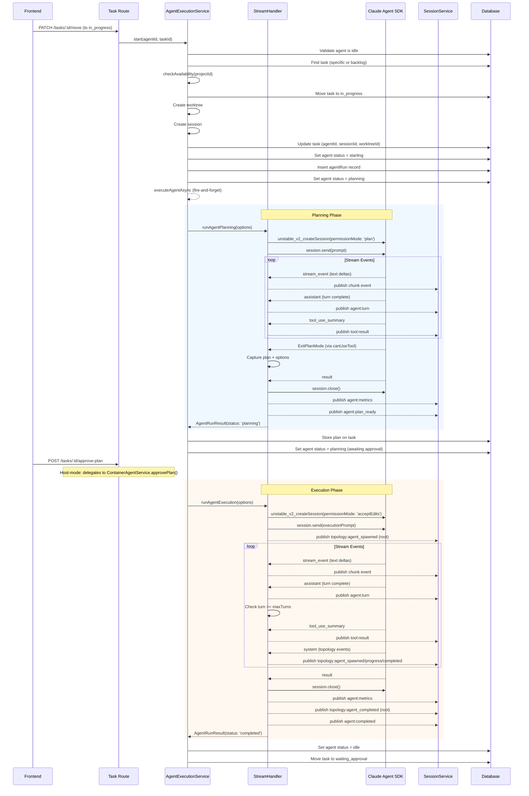
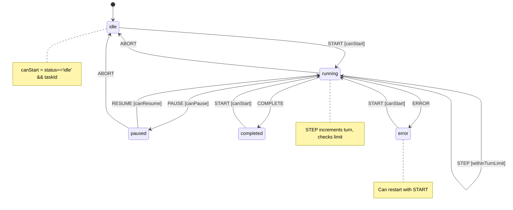

# 02 - Agent Execution Pipeline Architecture Review

**Review Date:** 2026-03-18
**Reviewer:** Architecture Review (Automated)
**Area:** Agent Execution Pipeline
**Files Analyzed:** 22 source files, 4 spec files, 3 test files

---

## 1. Overview

The agent execution pipeline is the core engine of AgentPane, orchestrating the full lifecycle of AI coding agents from task assignment through planning, approval, execution, and completion. The architecture follows a two-phase model (plan then execute) backed by the Claude Agent SDK (`@anthropic-ai/claude-agent-sdk`), with real-time event streaming to clients via Durable Streams / session service.

There are two parallel execution paths:
1. **Host-mode execution** -- `AgentExecutionService` + `stream-handler.ts` run the Claude SDK directly on the server
2. **Container/sandbox execution** -- `ContainerAgentService` delegates to Docker/AgentCore containers with event bridges

This review focuses primarily on the host-mode pipeline and its shared infrastructure.

**Key Files:**

| File | Lines | Purpose |
|------|-------|---------|
| `src/lib/agents/stream-handler.ts` | 996 | Claude SDK session creation, streaming, event processing |
| `src/services/agent/agent-execution.service.ts` | 576 | Agent lifecycle management, start/stop/pause/resume |
| `src/services/container-agent.service.ts` | 3076 | Container/sandbox agent orchestration |
| `src/lib/agents/agent-sdk-utils.ts` | 244 | Utility SDK helpers for one-shot queries |
| `src/lib/agents/recovery.ts` | 128 | Error classification and retry logic |
| `src/lib/agents/hooks/index.ts` | 37 | Hook factory: streaming, audit, tool whitelist |
| `src/lib/agents/hooks/streaming.ts` | 175 | Tool start/result event publishing |
| `src/lib/agents/hooks/audit.ts` | 45 | Audit log insertion per tool call |
| `src/lib/agents/hooks/tool-whitelist.ts` | 23 | Pre-tool-use allow/block policy |
| `src/lib/agents/tools/index.ts` | 67 | Tool registry (6 tools) |
| `src/lib/agents/turn-limiter.ts` | 86 | Turn limit tracking class (unused) |
| `src/lib/agents/types.ts` | 108 | Zod schemas, hook interfaces |
| `src/lib/agents/container-bridge.ts` | 469 | Docker stdout JSON line bridge |
| `src/lib/agents/agentcore-bridge.ts` | 329 | AgentCore SSE event bridge |
| `src/lib/agents/event-type-map.ts` | 52 | Container/AgentCore event type mapping |
| `src/lib/state-machines/agent-lifecycle/machine.ts` | 157 | State machine (custom, not XState) |
| `src/lib/state-machines/agent-lifecycle/types.ts` | 29 | State/event type definitions |
| `src/lib/state-machines/agent-lifecycle/guards.ts` | 16 | Guard functions |
| `src/lib/state-machines/agent-lifecycle/actions.ts` | 27 | Action functions |
| `src/lib/topology/map-agent-role.ts` | 45 | SDK subagent role classification |
| `src/lib/topology/types.ts` | 71 | Topology graph types |
| `src/lib/errors/agent-errors.ts` | 36 | Agent error constants |

**Assessment:** The pipeline is well-structured with clear separation between orchestration, SDK integration, and cross-cutting concerns. Since the February 2026 review, several improvements have been made (topology tracking, compact boundary handling, rate limit events, metrics publishing). However, the core findings from the previous review -- AbortController not wired to SDK, recovery system not retrying, state machine spec/impl divergence -- remain unresolved. New concerns include dual turn-limiting mechanisms, unused code artifacts, and incomplete plan approval flow in host mode.

---

## 2. Execution Pipeline Diagram



---

## 3. Stream Handler Internals

### 3.1 Architecture

The stream handler (`src/lib/agents/stream-handler.ts`) exports two primary functions and one helper:

| Function | Lines | Purpose |
|----------|-------|---------|
| `runAgentPlanning()` | 320-622 | Planning phase with `permissionMode: 'plan'` |
| `runAgentExecution()` | 627-960 | Execution phase with `permissionMode: 'acceptEdits'` |
| `executeToolWithHooks()` | 963-996 | Tool execution helper (exported but unused) |

Plus 8 internal helper functions:

| Helper | Lines | Purpose |
|--------|-------|---------|
| `runPreToolHooks()` | 51-65 | Iterate pre-tool hooks, check for blocks |
| `runPostToolHooks()` | 67-84 | Iterate post-tool hooks after execution |
| `publishToolProgress()` | 86-103 | Publish tool_progress event |
| `publishCompactBoundary()` | 105-123 | Publish context compaction event |
| `normalizeTopologyStatus()` | 128-133 | Sanitize SDK status to valid enum |
| `createTopologyTracker()` | 146-148 | Initialize topology state |
| `handleTopologySystemMessage()` | 154-261 | Route topology events |
| `extractResultMetrics()` | 263-272 | Extract metrics from result message |
| `publishMetrics()` | 274-313 | Publish agent:metrics event |

### 3.2 Event Processing

Both `runAgentPlanning` and `runAgentExecution` follow an identical streaming pattern:

1. Create SDK session via `unstable_v2_createSession()`
2. Send prompt via `session.send(prompt)`
3. Iterate `session.stream()` async generator
4. Match on `msg.type` with an if-else chain (not a switch)
5. Publish typed events via `sessionService.publish()`
6. Close session on `result` message or error

**Message types handled:**

| `msg.type` | Planning | Execution | Handler Logic |
|------------|----------|-----------|---------------|
| `stream_event` | Yes | Yes | Accumulate text deltas, publish `chunk` |
| `assistant` | Yes | Yes | Increment turn, overwrite accumulated, publish `agent:turn` |
| `tool_use_summary` | Yes | Yes | Correlate tool IDs, publish `tool:result` |
| `tool_progress` | Yes | Yes | Publish `agent:tool_progress` (fire-and-forget) |
| `rate_limit_event` | Yes | Yes | Publish `agent:rate_limit` (fire-and-forget) |
| `system` | Yes | Yes | Handle `compact_boundary` + topology events |
| `result` | Yes | Yes | Close session, publish metrics, return result |

### 3.3 Text Accumulation

Both functions accumulate text in a local `accumulated` variable. There is a subtle overwrite pattern:

```typescript
// stream-handler.ts:397 (planning), :711 (execution) -- APPEND
accumulated += event.delta.text;

// stream-handler.ts:421 (planning), :738 (execution) -- OVERWRITE
if (textContent) {
  accumulated = textContent;
}
```

The `assistant` message handler overwrites `accumulated` with the full assistant text. This means the plan content captured at ExitPlanMode time (line 484) is the assistant's full text, not the streaming delta accumulation. This is correct behavior -- the full message is more reliable than accumulated deltas which could have gaps.

### 3.4 canUseTool Callback

Both phases register a `canUseTool` callback with the SDK. In planning mode, this serves a dual purpose:

1. **Track active tools** by `toolUseID` for correlating with `tool_use_summary` events (line 344)
2. **Capture ExitPlanMode options** -- the input is stored when the tool name matches (line 359-361)
3. **Publish `tool:start` events** with the full tool input (lines 346-357)

This is the primary mechanism for tool event correlation since SDK v0.2.76+ no longer includes `tool_name`/`tool_input` in `tool_use_summary`.

### 3.5 Error Handling Strategy

Both functions use a consistent pattern:
- The main stream loop is wrapped in try/catch
- On error: publish `agent:error`, close session, return error result
- Non-critical publish failures are caught with `.catch()` (fire-and-forget) for events like `tool_progress`, `rate_limit`, `compact_boundary`
- Critical publishes (agent:plan_ready, agent:completed) are awaited

**Session close ordering** (lines 548, 887):
```typescript
session.close(); // Always close first -- before any potentially-failing publishes
```

This ensures the SDK subprocess is terminated even if subsequent event publishing fails.

---

## 4. SDK Session Lifecycle

### 4.1 Session Creation

Sessions are created via `unstable_v2_createSession()` with these configurations:

**Planning phase** (line 371-377):
```typescript
const session = unstable_v2_createSession({
  model,
  env: buildSdkEnv(),
  permissionMode: 'plan',
  executableArgs: ['--add-dir', cwd],
  canUseTool,
});
```

**Execution phase** (line 682-689):
```typescript
const session = unstable_v2_createSession({
  model,
  env: buildSdkEnv(),
  allowedTools,
  permissionMode: 'acceptEdits',
  executableArgs: ['--add-dir', cwd],
  canUseTool,
});
```

Key differences:
- Planning uses `permissionMode: 'plan'` which gives the agent read-only access + ExitPlanMode tool
- Execution uses `permissionMode: 'acceptEdits'` which auto-approves file modifications
- Execution passes `allowedTools` to restrict the tool set

### 4.2 Environment Sanitization

`buildSdkEnv()` (`agent-sdk-utils.ts:48-55`) strips sensitive environment variables before passing them to the SDK subprocess:

```typescript
const blocked =
  /^(CLAUDECODE|DATABASE_URL|DB_.*|ENCRYPTION_KEY|SESSION_SECRET|GITHUB_APP_PRIVATE_KEY)$/i;
```

The `CLAUDECODE` block prevents a "nested session" crash when the SDK tries to detect if it's already running inside a Claude session.

### 4.3 Session Teardown

Sessions are closed via `session.close()` in three scenarios:
1. On `result` message (normal completion) -- lines 548, 887
2. On stream loop exit without result (lines 582, 926)
3. On error (catch block) -- lines 614, 952

There is no timeout mechanism on the session itself -- if the SDK hangs, the session will never close unless externally terminated.

### 4.4 Session Continuity (Container Path)

For container-based execution, the `approvePlan()` method in `ContainerAgentService` (line 2203) can resume the same SDK session ID across planning and execution phases. This is used when the sandbox container persists between phases. If the sandbox changed, a fresh session is created (line 2265).

---

## 5. Planning to Execution Flow

### 5.1 Planning Phase

1. `AgentExecutionService.start()` fires-and-forgets `executeAgentAsync()` (line 214)
2. `executeAgentAsync()` calls `runAgentPlanning()` (line 276)
3. Planning session runs with `permissionMode: 'plan'`
4. Agent explores codebase, calls tools (read-only)
5. Agent calls `ExitPlanMode` tool when plan is ready
6. `canUseTool` captures ExitPlanMode options (line 359-361)
7. On `tool_use_summary` for ExitPlanMode, plan content is set (line 484)
8. On `result`, session closes, `agent:plan_ready` event published
9. `executeAgentAsync()` stores plan on task (line 340-347), sets agent status to `planning`

### 5.2 Plan Approval

The plan approval flow differs between host and container modes:

**Container mode** (the primary production path):
- `POST /tasks/:id/approve-plan` -> `taskService.approvePlan()` -> `containerAgentService.approvePlan()`
- Container service moves task back to `in_progress`, starts a new `startAgent()` call with `phase: 'execute'`

**Host mode** (gap identified):
- `executeAgentAsync()` only calls `runAgentPlanning()` -- it does NOT call `runAgentExecution()` after planning completes
- The `resume()` method (line 494-522) publishes an `approval:rejected` event with feedback, does not trigger execution
- There is no code path in `AgentExecutionService` that calls `runAgentExecution()` after plan approval

This means **host-mode execution is planning-only** -- the execution phase is only available through the container agent service.

### 5.3 State Transitions During Flow

| Step | Agent Status | Task Column | Trigger |
|------|-------------|-------------|---------|
| Task assigned | `idle` -> `starting` | `backlog` -> `in_progress` | `start()` |
| Planning begins | `starting` -> `planning` | `in_progress` | `start()` line 175 |
| Planning completes | `planning` (stays) | `in_progress` | `executeAgentAsync()` |
| Plan approved | `planning` -> `running` | `in_progress` | Container service only |
| Execution completes | `running` -> `idle` | -> `waiting_approval` | `executeAgentAsync()` |
| Turn limit reached | `running` -> `paused` | -> `waiting_approval` | `executeAgentAsync()` |
| Error occurs | -> `error` or `paused` | stays | `executeAgentAsync()` catch |

---

## 6. State Machine Analysis

### 6.1 Specification vs Implementation

The specification (`specs/application/state-machines/agent-lifecycle.md`) defines a comprehensive XState-based machine with 7 states, 9 event types, 20 transitions, 7 guards, and 10 actions. The implementation diverges significantly.

**Specification machine states:** `idle`, `starting`, `planning`, `running`, `paused`, `error`, `completed`

**Implementation machine states** (`machine.ts:3-9`): `idle`, `starting`, `running`, `paused`, `completed`, `error`

Missing from implementation: **`planning`** -- the spec's most complex state (handling PLAN_READY, APPROVE_PLAN, ERROR, ABORT) has no equivalent in the code.

**Specification events:** START, PLAN_READY, APPROVE_PLAN, STEP, PAUSE, RESUME, ERROR, COMPLETE, ABORT

**Implementation events** (`types.ts:21-29`): START, STEP, PAUSE, RESUME, ERROR, COMPLETE, ABORT, TOOL

Missing from implementation: **PLAN_READY**, **APPROVE_PLAN**. Added: **TOOL** (not in spec).

### 6.2 Implementation State Machine Diagram



### 6.3 Guards

The implementation has 5 guards (`guards.ts`):

| Guard | Implementation | Notes |
|-------|---------------|-------|
| `canStart` | `ctx.status === 'idle' && !!ctx.taskId` | Only from `idle`, not `completed`/`error` as machine allows |
| `withinTurnLimit` | `ctx.currentTurn < ctx.maxTurns` | Checked after increment |
| `isToolAllowed` | `ctx.allowedTools.includes(event.tool)` | Checked on ALL events, not just TOOL |
| `canPause` | `ctx.status === 'running'` | Redundant with state check |
| `canResume` | `ctx.status === 'paused'` | Spec says also from `error` |

**Critical guard issue**: `isToolAllowed` is checked on line 92 for EVERY event, not just TOOL events:

```typescript
// machine.ts:92
if (!isToolAllowed(ctx, event)) {
  return nextError(machine, createError('AGENT_TOOL_NOT_ALLOWED', 'Tool not allowed', 403));
}
```

Since `isToolAllowed` returns `true` for all non-TOOL events (guards.ts:8-9), this is functionally harmless but architecturally misleading -- it runs on every transition attempt.

### 6.4 The State Machine Is Not Used

The state machine in `src/lib/state-machines/agent-lifecycle/` is **not imported or used** by `AgentExecutionService`. All state transitions are performed via direct database UPDATE statements. The machine exists as a standalone module with no integration into the execution pipeline.

```
# Confirmed via grep -- no import of the machine in agent-execution.service.ts
# The machine is only exported from its own module
```

---

## 7. Topology Tracking

### 7.1 TopologyTracker

The `TopologyTracker` interface (line 139-144) maps SDK `task_id` values to generated node IDs:

```typescript
interface TopologyTracker {
  taskToNodeId: Map<string, string>;
  rootEmitted: boolean;
}
```

This is only used during execution (not planning). The root orchestrator node is emitted eagerly at execution start (line 647-658), not lazily on first subagent spawn. This differs from the planning phase topology handler which emits the root only when the first `task_started` arrives (line 172).

### 7.2 Topology Events

Three SDK system message subtypes are handled:

| SDK Subtype | Published Event | Data |
|-------------|----------------|------|
| `task_started` | `topology:agent_spawned` | nodeId, name, role, parentId, sdkTaskId |
| `task_progress` | `topology:agent_progress` | tokens, toolUses, durationMs, summary |
| `task_notification` | `topology:agent_completed` | status, summary, tokens |

Role classification is done by `mapAgentRole()` (`src/lib/topology/map-agent-role.ts`) which does keyword matching on the agent type/description to determine visual role:

```typescript
if (text.includes('deploy')) return 'deployer';
if (text.includes('plan')) return 'planner';
if (text.includes('review')) return 'reviewer';
// ... etc
```

### 7.3 Topology Cleanup

On `task_notification`, the tracker deletes the task-to-node mapping (line 256). On stream completion (result), the root topology node is marked completed (line 902-907). However, if the stream errors out, remaining tracked subagents are never marked as completed/failed -- they become orphaned in the topology view.

---

## 8. Turn Limiting

### 8.1 Dual Implementation Problem

There are **two separate turn-limiting mechanisms** in the codebase:

**1. Stream handler inline check** (used, `stream-handler.ts:773-788`):
```typescript
if (turn >= maxTurns) {
  await sessionService.publish(sessionId, {
    id: createId(),
    type: 'agent:turn_limit',
    timestamp: Date.now(),
    data: { agentId, turn, maxTurns },
  });
  session.close();
  return { runId, status: 'turn_limit', turnCount: turn, result: '...' };
}
```

**2. TurnLimiter class** (unused, `turn-limiter.ts`):
```typescript
export class TurnLimiter {
  incrementTurn(): { canContinue: boolean; warning: boolean } { ... }
}
export function createTurnLimiter(...): TurnLimiter { ... }
```

The `TurnLimiter` class provides a warning at 80% threshold (`agent:warning` event) and a limit event. However, it is **never instantiated** -- no file in the codebase imports `createTurnLimiter` outside the barrel export.

### 8.2 Turn Counting

Turns are counted on `assistant` message receipt (line 724 for execution, line 410 for planning). The check `turn >= maxTurns` is only in execution mode -- planning has no turn limit enforcement.

### 8.3 State Machine Turn Limit

The state machine also has turn limit checking in `machine.ts:104-112`:
```typescript
if (event.type === 'STEP') {
  const nextContext = incrementTurn(ctx);
  if (!withinTurnLimit(nextContext)) {
    return nextError(...)
  }
}
```

But since the state machine is not integrated with the execution pipeline, this is dead code.

---

## 9. Hook Integration

### 9.1 Hook Architecture

Hooks are created by `createAgentHooks()` (`hooks/index.ts:21-33`) which composes three hook types:

```typescript
return {
  PreToolUse: [whitelistHook, streamingHooks.PreToolUse],
  PostToolUse: [auditHook, streamingHooks.PostToolUse],
};
```

**PreToolUse chain:** Tool whitelist check -> Streaming start event
**PostToolUse chain:** Audit log -> Streaming result event

### 9.2 Hook Execution in Stream Handler

Hooks are passed to `runAgentPlanning()` via the options but are **not used directly in the stream loop**. The stream handler uses `canUseTool` callbacks to the SDK instead. The hooks are only used by `executeToolWithHooks()` (line 963-996), which is exported but **never called** from anywhere in the codebase.

This means:
- The **whitelist hook** created for each agent run is never enforced in host mode
- The **audit hook** created for each agent run never writes audit logs in host mode
- The **streaming hook** created for each agent run never publishes tool start/result events in host mode

Tool events are instead published directly via `canUseTool` (line 346-357, 666-678) and `tool_use_summary` handler (line 458-490, 792-817).

### 9.3 Duplicate Tool Event Publishing

Both the streaming hooks and the `canUseTool` callback publish `tool:start` and `tool:result` events. Since only `canUseTool` is active in the stream handler, there is no duplication at runtime. But if hooks were ever wired in, tool events would be published twice.

---

## 10. Swarm/Team Mode

### 10.1 Current State: Not Implemented

The `ExitPlanModeOptions` interface (line 23-32) has all swarm-related fields commented out:

```typescript
export interface ExitPlanModeOptions {
  allowedPrompts?: Array<{ tool: 'Bash'; prompt: string }>;
  // TODO: Pending GA -- swarm and remote session features
  // pushToRemote?: boolean;
  // launchSwarm?: boolean;
  // teammateCount?: number;
}
```

The same TODO comment appears in `container-bridge.ts:57-59` and `agentcore-bridge.ts:45-46`.

### 10.2 Topology Infrastructure Ready

Despite swarm not being implemented, the topology tracking infrastructure is in place:
- `TopologyTracker` can track multiple concurrent subagents
- `handleTopologySystemMessage()` handles spawn/progress/complete for subagents
- `mapAgentRole()` classifies agents into roles (orchestrator, coder, reviewer, etc.)
- The frontend topology view is implemented

This infrastructure handles SDK-native subagent spawning (the SDK can spawn subtasks internally), but AgentPane does not initiate multi-agent execution itself.

---

## 11. Error Recovery

### 11.1 Recovery Module

`recovery.ts` defines three components:

| Function | Lines | Purpose |
|----------|-------|---------|
| `isRetryableError()` | 15-28 | Pattern-match against retryable error messages |
| `withRetry()` | 34-62 | Generic retry wrapper with exponential backoff |
| `handleAgentError()` | 79-128 | Classify errors into recovery actions |

Error classification:

| Pattern | Action | shouldRetry |
|---------|--------|-------------|
| rate limit / 429 | `pause` | true |
| turn limit exceeded | `pause` | false |
| context length / token limit | `retry` | true |
| network / connection / timeout | `retry` | true |
| unknown | `fail` | false |

### 11.2 Recovery Usage

In `executeAgentAsync()` catch block (line 404-443):

```typescript
const recovery = handleAgentError(error instanceof Error ? error : new Error(errorMessage), {
  agentId, taskId, maxTurns, currentTurn: 0,
});
// ...
status: recovery.action === 'pause' ? 'paused' : 'error',
```

The recovery result determines agent status (`paused` vs `error`), but:
- `shouldRetry: true` is **never acted upon** -- no retry loop exists
- `withRetry()` is **never called** for agent execution
- `action: 'retry'` produces the same outcome as `action: 'fail'` (both set `error` status)
- `currentTurn: 0` is hardcoded, not the actual turn count at error time

### 11.3 Error Handling in Stream Handler

The stream handler's catch block (lines 603-621, 941-959) publishes `agent:error` then closes the session:

```typescript
await sessionService.publish(sessionId, {
  id: createId(),
  type: 'agent:error',
  timestamp: Date.now(),
  data: { agentId, runId, error: errorMessage },
});
session.close();
```

There is no distinction between recoverable and unrecoverable errors at this level -- all errors are treated the same.

### 11.4 Rate Limit Handling

Rate limit events from the SDK (`rate_limit_event`) are published to the session for UI display (lines 508-529, 835-856), but there is no backoff or retry logic. The SDK itself handles rate limit retries internally.

---

## 12. Complexity Metrics

| Function | Lines | Cyclomatic Complexity | Concern |
|----------|-------|-----------------------|---------|
| `runAgentPlanning()` | 303 | ~15 | High -- 8 msg.type branches + nested conditionals |
| `runAgentExecution()` | 334 | ~18 | High -- 8 msg.type branches + topology handling |
| `AgentExecutionService.start()` | 198 | ~8 | Medium -- sequential with many DB operations |
| `executeAgentAsync()` | 184 | ~10 | Medium -- result status switch + error handling |
| `handleTopologySystemMessage()` | 108 | ~8 | Medium -- 3 subtype branches with nested logic |
| `createContainerBridge.processStream()` | 60 | ~6 | Low -- linear event processing |

The two main stream handler functions (`runAgentPlanning` and `runAgentExecution`) share approximately 70% identical code. The primary differences are:
- Permission mode (`plan` vs `acceptEdits`)
- ExitPlanMode capture (planning only)
- Turn limit enforcement (execution only)
- Topology tracking (execution only)
- Root topology node emission strategy (eager in execution, lazy in planning)

---

## 13. Findings

### AE-001: AbortController Created But Never Wired to SDK Session (Persists)

**Severity:** High
**Status:** Unresolved (previously identified in Feb 2026 review)

An `AbortController` is created and stored in the `runningAgents` map (`agent-execution.service.ts:171-172`) for each agent run. However, it is never passed to `runAgentPlanning()` or the SDK session. When `stop()` calls `controller.abort()` (line 455), the abort signal does not reach the Claude SDK session. The agent process may continue executing after being "stopped" from the UI.

**Evidence:**
```typescript
// agent-execution.service.ts:171
const controller = new AbortController();
runningAgents.set(agentId, controller);

// agent-execution.service.ts:455
controller.abort(); // Signal goes nowhere

// stream-handler.ts:371-377 -- no signal/abort parameter
const session = unstable_v2_createSession({ model, env, permissionMode: 'plan', ... });
```

**Impact:** Stopping an agent from the UI marks it as idle in the database, but the SDK subprocess continues running. This wastes API credits and can lead to stale tool:start events being published after the stop.

**Recommendation:** Pass `AbortController.signal` through `StreamHandlerOptions` to the stream handler. Use it to break out of the `for await` loop and call `session.close()` when aborted.

---

### AE-002: Host-Mode Execution Phase Never Triggered After Plan Approval (New)

**Severity:** High

`executeAgentAsync()` calls `runAgentPlanning()` but never calls `runAgentExecution()`. After planning completes, the agent status is set to `planning` and the plan is stored on the task. However, there is no code path in `AgentExecutionService` that transitions from plan approval to execution.

The `resume()` method (line 494-522) sets agent status to `running` and publishes `approval:rejected` (even for approvals), but does not start an execution session:

```typescript
// agent-execution.service.ts:509-515
await this.sessionService.publish(agent.currentSessionId, {
  id: createId(),
  type: 'approval:rejected',  // Note: published even for approval
  timestamp: Date.now(),
  data: { feedback },
});
```

**Evidence:** `runAgentExecution()` is exported from `stream-handler.ts` but is never imported by `agent-execution.service.ts`:
```typescript
// agent-execution.service.ts:6 -- only imports runAgentPlanning
import { runAgentPlanning } from '../../lib/agents/stream-handler.js';
```

**Impact:** In host mode (non-container), agents can only plan but never execute. The execution phase is only available through `ContainerAgentService.approvePlan()`.

**Recommendation:** Add an `approvePlan()` method to `AgentExecutionService` that calls `runAgentExecution()` with the stored plan as the prompt, the worktree path as cwd, and `permissionMode: 'acceptEdits'`.

---

### AE-003: Recovery System Defines Retry Logic But Never Retries (Persists)

**Severity:** Medium
**Status:** Unresolved (previously identified in Feb 2026 review)

`handleAgentError()` returns `{ shouldRetry: true, action: 'retry' }` for network and context length errors, but `executeAgentAsync()` never retries. The `withRetry()` utility is defined but never called for agent execution.

**Evidence** (`agent-execution.service.ts:408-413`):
```typescript
const recovery = handleAgentError(error instanceof Error ? error : new Error(errorMessage), {
  agentId, taskId, maxTurns, currentTurn: 0,  // currentTurn hardcoded to 0
});
```

The `currentTurn: 0` hardcoding means `handleAgentError()` will never trigger the "turn limit reached" path regardless of actual progress.

**Impact:** Transient errors (network, rate limit) that could be retried instead terminate the agent.

**Recommendation:** Either implement retry logic using `withRetry()` around the planning/execution call, or remove the retry infrastructure to reduce confusion. Also pass actual `currentTurn` from the stream handler result.

---

### AE-004: State Machine Not Integrated with Execution Pipeline (Persists)

**Severity:** Medium
**Status:** Unresolved (previously identified in Feb 2026 review)

The formal state machine (`src/lib/state-machines/agent-lifecycle/machine.ts`) is not used by `AgentExecutionService`. All state transitions are performed via direct database UPDATE statements. The machine module is disconnected from the execution pipeline.

Additionally, the machine implementation diverges from the specification:
- Missing states: `planning`, `starting` (in transitions, only `idle`/`running`/`paused`/`completed`/`error` are handled)
- Missing events: `PLAN_READY`, `APPROVE_PLAN`
- Missing guards: `hasValidTask`, `isRecoverable`, `hasValidSession`
- The `canStart` guard requires `status === 'idle'`, but the machine allows START from `completed` and `error` states (which would fail the guard)

**Impact:** No formal transition validation. Invalid state transitions (e.g., starting an agent already in error) are caught by ad-hoc checks but not by a coherent state machine.

**Recommendation:** Either integrate the state machine as a validation layer before database writes, or remove it and document the ad-hoc transition logic. If keeping it, align it with the specification (add `planning` state, `PLAN_READY`/`APPROVE_PLAN` events).

---

### AE-005: TurnLimiter Class Defined But Never Used (New)

**Severity:** Low

`TurnLimiter` (`turn-limiter.ts`) is a 86-line class with warning threshold support (80% of max turns -> `agent:warning` event). It is exported from the barrel but never imported or instantiated anywhere in the codebase. Turn limiting is done inline in the stream handler.

**Evidence:**
```
# grep for createTurnLimiter imports outside turn-limiter.ts and index.ts:
# No results found
```

**Impact:** Dead code. The 80% warning feature that `TurnLimiter` provides is not available to users.

**Recommendation:** Either integrate `TurnLimiter` into the stream handler to provide the 80% warning feature, or remove it.

---

### AE-006: executeToolWithHooks Exported But Never Called (New)

**Severity:** Low

`executeToolWithHooks()` (`stream-handler.ts:963-996`) and the hook system it uses (`runPreToolHooks`, `runPostToolHooks`, `getToolHandler`) are exported but never called. The stream handler delegates all tool execution to the Claude SDK via `canUseTool` callbacks.

**Evidence:**
```typescript
// stream-handler.ts:963 -- defined and exported
export async function executeToolWithHooks(...)

// Only appears in stream-handler.ts and the barrel export index.ts
// Never imported by any consumer
```

Similarly, the tool registry (`tools/index.ts`) with its 6 tool handlers (`read_file`, `edit_file`, `write_file`, `bash`, `glob`, `grep`) is never used in the execution pipeline. Tools are executed by the Claude SDK subprocess, not by the AgentPane server.

**Impact:** Dead code in the execution path. The tool handlers, hook execution, and whitelist enforcement only apply if `executeToolWithHooks` were called, which it never is.

**Recommendation:** If these were intended for a non-SDK execution mode, document that intent. Otherwise, consider removing them to reduce maintenance surface.

---

### AE-007: Hooks Created Per-Run But Never Enforced in Host Mode (New)

**Severity:** Medium

`createAgentHooks()` is called in `executeAgentAsync()` (line 201-210) to create whitelist, streaming, and audit hooks for each agent run. These hooks are passed to the stream handler via `options.hooks`. However, the stream handler **never calls** the hooks -- it uses the SDK's `canUseTool` callback and `tool_use_summary` events instead.

**Evidence** (`agent-execution.service.ts:201-210`):
```typescript
const hooks = createAgentHooks({
  agentId,
  sessionId: session.value.id,
  agentRunId: agentRun?.id ?? createId(),
  // ...
});
```

The hooks object is passed to `runAgentPlanning()` via `options.hooks` but the function never reads `options.hooks`.

**Impact:**
- **Tool whitelist** is not enforced in host mode -- agents can use any tool the SDK provides
- **Audit logs** are not written for host-mode tool calls
- **Streaming hook** events are not published (but equivalent events are published via `canUseTool`)

**Recommendation:** Either wire hooks into the stream handler (call `runPreToolHooks` in `canUseTool`, call `runPostToolHooks` in `tool_use_summary` handler), or remove the hook creation from `executeAgentAsync()` to clarify that hooks are not active in host mode.

---

### AE-008: Topology Subagent Orphaning on Error (New)

**Severity:** Low

When the stream handler's stream loop encounters an error (catch block), any subagents tracked in the `TopologyTracker` are not marked as completed/failed. The root topology node's completion event is only published in the normal `result` path (line 902-907), not in the error path.

**Evidence** (`stream-handler.ts:941-959`):
```typescript
catch (error) {
  // ... publishes agent:error but NOT topology:agent_completed
  session.close();
  return { runId, status: 'error', ... };
}
```

**Impact:** If an error occurs while subagents are running, the topology view will show them as permanently "running" with no completion event.

**Recommendation:** In the catch block, iterate `topology.taskToNodeId` and publish `topology:agent_completed` with status `failed` for each remaining entry, then publish a root completion event.

---

### AE-009: Concurrency Check Race Window (Persists)

**Severity:** Medium
**Status:** Unresolved (previously identified as AE-002 in Feb 2026 review)

In `start()`, the concurrency check (line 96-104) queries agents with `status: 'running'`, but the agent's status at this point is still `idle` (it becomes `starting` only at line 145). Two concurrent `start()` calls could both pass the availability check before either has set its agent to `starting`.

Additionally, `getRunningCount()` (line 544-549) only counts agents with status `running`, missing agents in `starting`, `planning`, or `paused` states that are still occupying execution resources.

**Evidence** (`agent-execution.service.ts:544-549`):
```typescript
async getRunningCount(projectId: string): Promise<Result<number, never>> {
  const running = await this.db.query.agents.findMany({
    where: and(eq(agents.projectId, projectId), eq(agents.status, 'running')),
  });
  return ok(running.length);
}
```

**Impact:** The concurrency limit can be exceeded when multiple tasks are started simultaneously.

**Recommendation:** Change the `getRunningCount` query to include `status IN ('starting', 'planning', 'running')`. Consider using a database transaction with row-level locking for the entire start sequence.

---

### AE-010: Planning and Execution Functions Share 70% Code (New)

**Severity:** Low (Maintainability)

`runAgentPlanning()` (303 lines) and `runAgentExecution()` (334 lines) share approximately 70% identical code: the streaming loop, event publishing, text accumulation, tool tracking, compact boundary handling, rate limit handling, metrics publishing, and error handling. The differences are limited to:
- Permission mode and ExitPlanMode capture (planning)
- Turn limit checking and topology tracking (execution)
- Root node emission strategy

**Impact:** Bug fixes or SDK API changes must be applied in two places. The recent additions of `tool_progress`, `rate_limit_event`, `compact_boundary`, and assistant error handling were correctly duplicated, but this is error-prone.

**Recommendation:** Extract a shared `runAgentSession()` function parameterized by phase-specific callbacks (onExitPlanMode, onTurnComplete, topology config). Both `runAgentPlanning` and `runAgentExecution` would call this shared function with their specific behavior injected.

---

### AE-011: File Tool Handlers Have No Path Traversal Protection (New)

**Severity:** Medium

The file tools in `tools/file-tools.ts` accept arbitrary file paths with no validation:

```typescript
// file-tools.ts:22-23
export async function readFile(args: ReadFileArgs, _context: ToolContext): Promise<ToolResponse> {
  const content = await fs.readFile(args.file_path, { encoding: ... });
```

The `_context` parameter (which contains `cwd`) is unused. There is no check that `args.file_path` is within the worktree directory. A path like `/etc/passwd` or `../../.env` would be accepted.

**Note:** These tool handlers are currently dead code (see AE-006), so this is not exploitable at present. However, if they were ever activated, it would be a security issue.

**Impact:** Potential path traversal if tool handlers are activated without path validation.

**Recommendation:** Add path normalization and validation to ensure file operations are confined to the worktree directory. The bash tool already uses `cwd` from context.

---

### AE-012: Resume Publishes 'approval:rejected' Event Name (New)

**Severity:** Low

The `resume()` method (line 509-515) publishes an event with type `approval:rejected` regardless of whether it's an approval or a resume-with-feedback. The event name suggests rejection, but the method is called for both approval and resume scenarios.

**Evidence** (`agent-execution.service.ts:509-514`):
```typescript
await this.sessionService.publish(agent.currentSessionId, {
  id: createId(),
  type: 'approval:rejected',
  timestamp: Date.now(),
  data: { feedback },
});
```

**Impact:** Confusing event semantics. Clients consuming this event may misinterpret a resume-with-feedback as a plan rejection.

**Recommendation:** Use a more general event type like `agent:resumed` or publish different event types for approval vs rejection.

---

## 14. Summary

### Findings Matrix

| ID | Severity | Category | Status | Summary |
|----|----------|----------|--------|---------|
| AE-001 | High | Correctness | Unresolved | AbortController not wired to SDK session |
| AE-002 | High | Completeness | New | Host-mode execution phase never triggered |
| AE-003 | Medium | Correctness | Unresolved | Recovery system never retries |
| AE-004 | Medium | Architecture | Unresolved | State machine not integrated |
| AE-005 | Low | Dead Code | New | TurnLimiter class unused |
| AE-006 | Low | Dead Code | New | executeToolWithHooks never called |
| AE-007 | Medium | Correctness | New | Hooks created but never enforced |
| AE-008 | Low | Correctness | New | Topology subagents orphaned on error |
| AE-009 | Medium | Concurrency | Unresolved | Race window in concurrency check |
| AE-010 | Low | Maintainability | New | 70% code duplication in stream functions |
| AE-011 | Medium | Security | New | File tools lack path traversal protection |
| AE-012 | Low | Semantics | New | Resume publishes misleading event name |

### Priority Recommendations

1. **Wire AbortController to SDK session** (AE-001) -- Critical for agent stop reliability
2. **Implement host-mode execution phase** (AE-002) -- Or document that host mode is planning-only
3. **Wire hooks into stream handler** (AE-007) -- Audit logging and tool whitelisting are expected features
4. **Fix concurrency check** (AE-009) -- Count all active statuses, not just 'running'
5. **Remove or integrate dead code** (AE-005, AE-006) -- Reduce confusion and maintenance burden
