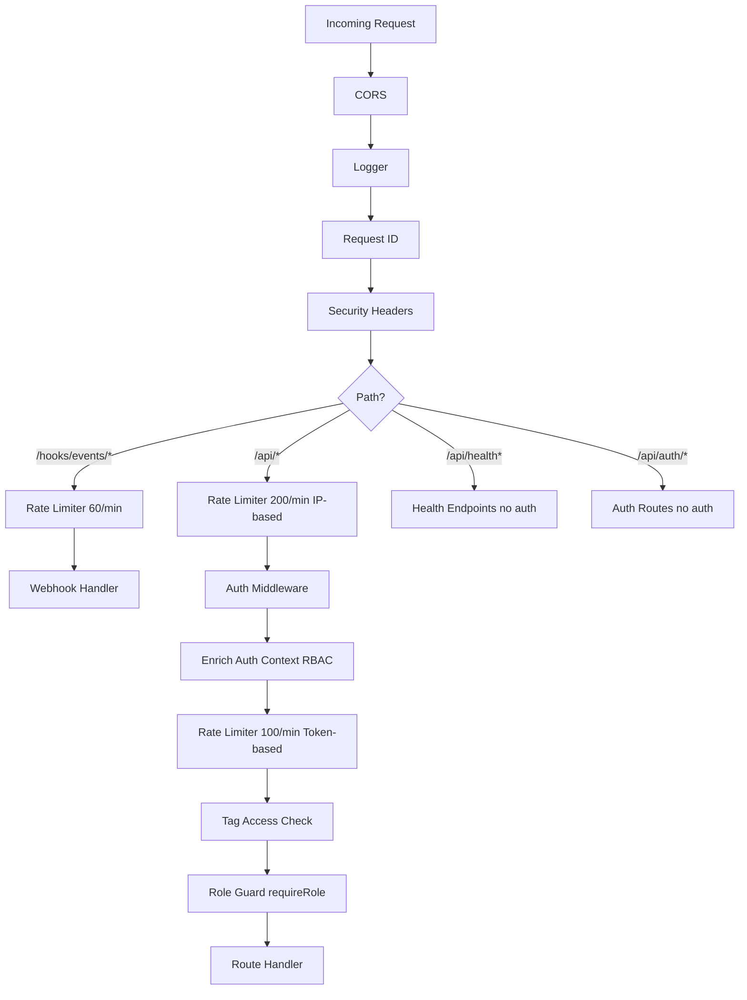

# Architecture Review: API Routes & Middleware

**Area**: 03 - API Routes & Middleware
**Date**: 2026-03-18
**Reviewer**: Claude Opus 4.6 (automated)
**Status**: Complete

---

## Executive Summary

The AgentPane API layer is a Hono-based REST API with 32 route modules providing ~170 endpoints. The architecture follows a factory pattern with dependency injection, centralized middleware for auth/RBAC, and a consistent `{ ok, data/error }` response envelope. Overall the implementation is well-structured with good separation of concerns, but has notable inconsistencies in validation patterns, some shell injection surface area in git routes, and an auth bypass in development mode that warrants careful defense-in-depth.

**Risk Profile**: Medium -- the security model is sound in production, but several findings deserve attention.

---

## 1. Middleware Chain

### Middleware Execution Order



**File**: `/Users/simon.lynch/git/agentpane_nocode/src/server/router.ts`

| Order | Middleware | Scope | Purpose | Lines |
|-------|-----------|-------|---------|-------|
| 1 | `cors()` | `*` | CORS headers, configurable origin | L195-202 |
| 2 | `logger()` | `*` | Request logging (Hono built-in) | L203 |
| 3 | `requestIdMiddleware` | `*` | X-Request-Id generation/propagation | L80-87 |
| 4 | `securityHeaders` | `*` | X-Content-Type-Options, X-Frame-Options, CSP (prod) | L89-102 |
| 5 | `rateLimiter` (60/min) | `/hooks/events/*` | Webhook rate limiting | L209 |
| 6 | `rateLimiter` (200/min) | `/api/*` | IP-based API rate limiting | L251 |
| 7 | `createAuthMiddleware` | `/api/*` | Session/token validation, dev bypass | L252 |
| 8 | `enrichAuthContext` | `/api/*` | RBAC context population | L253 |
| 9 | `rateLimiter` (100/min token) | `/api/*` | Per-token rate limiting | L257 |
| 10 | `requireTagAccess` | `/api/*` | Tag-based token scoping | L258 |
| 11 | `requireRole` | Per-route group | Minimum role enforcement | L263-342 |

### Finding: AR-001 -- Middleware Stack is Well-Layered (Positive)

**Severity**: Informational
**Location**: `src/server/router.ts:195-258`

The middleware chain is thoughtfully ordered: CORS and logging first (for all requests including preflight), auth before RBAC enrichment, and tag access after role resolution. The layered rate limiting (IP-based global, then per-token) is a good defense-in-depth pattern.

---

## 2. Route Inventory

### Route File Catalog

| File | Mount Path | Endpoints | Methods | Auth | Validation |
|------|-----------|-----------|---------|------|------------|
| `agents.ts` | `/api/agents` | 10 | GET,POST,PATCH,DELETE | viewer+ | Manual + `isValidId` |
| `api-keys.ts` | `/api/keys` | 3 | GET,POST,DELETE | admin | Zod (local) |
| `auth.ts` | `/api/auth` | 3 | GET,POST | Public | None (OAuth flow) |
| `cli-monitor.ts` | `/api/cli-monitor` | 9 | GET,POST | viewer+ | Zod (local) |
| `events.ts` | `/api/events` | 19 | GET,POST,PATCH,DELETE | viewer+ | Zod (local) + `parseJsonBody` |
| `filesystem.ts` | `/api/filesystem` | 1 | GET | admin | None |
| `git.ts` | `/api/git` | 4 | GET | agent_operator+ | `isValidId`, `isValidBranchName` |
| `github.ts` | `/api/github` | 9 | GET,POST,DELETE | viewer+ | `isValidGitHubUrl` |
| `health.ts` | `/api/health` | 3 | GET | Public | None |
| `invitation-accept.ts` | `/api/invitations` | 1 | POST | Authenticated | None |
| `marketplaces.ts` | `/api/marketplaces` | 8 | GET,POST,DELETE | viewer+ | `isValidId` |
| `me.ts` | `/api/me` | 2 | GET,PATCH | Authenticated | `parseJsonBody` |
| `project-members.ts` | `/api/projects/:id/members` | 4 | GET,POST,PATCH,DELETE | Authenticated | `parseJsonBody` |
| `projects.ts` | `/api/projects` | 6 | GET,POST,PATCH,DELETE | viewer+ | Zod (local) |
| `rbac-tokens.ts` | `/api/tokens` | 4 | GET,POST,DELETE | Authenticated | `parseJsonBody` |
| `sandbox.ts` | `/api/sandbox-configs`, `/api/sandbox/k8s`, `/api/sandbox/nomad` | 15 | GET,POST,PATCH,DELETE | admin | Zod (local) |
| `sandbox-status.ts` | `/api/sandbox/status` | 2 | GET,POST | viewer+ | `isValidId` |
| `sessions.ts` | `/api/sessions` | 7 | GET,POST,DELETE | viewer+ | `parseBody` |
| `settings.ts` | `/api/settings` | 2 | GET,PUT | admin | Zod (local) |
| `tags.ts` | `/api/tags`, `/api/projects/:id/tags`, `/api/tasks/:id/tags` | 7 | GET,POST,DELETE | Authenticated | `parseJsonBody` |
| `task-creation.ts` | `/api/tasks/create-with-ai` | 7 | GET,POST | agent_operator+ | Manual |
| `tasks.ts` | `/api/tasks` | 10 | GET,POST,PUT,PATCH,DELETE | viewer+ | `parseBody` from shared |
| `team-github-token.ts` | `/api/teams/:id/github-token` | 4 | GET,PUT,DELETE,POST | Authenticated | Zod (local) |
| `team-invitations.ts` | `/api/teams/:id/invitations` | 4 | GET,POST,DELETE | Authenticated | `parseJsonBody` |
| `team-members.ts` | `/api/teams/:id/members` | 4 | GET,POST,PATCH,DELETE | Authenticated | `parseJsonBody` |
| `team-projects.ts` | `/api/teams/:id/projects` | 2 | POST,DELETE | Authenticated | `parseJsonBody` |
| `teams.ts` | `/api/teams` | 6 | GET,POST,PATCH,DELETE | Authenticated | `parseJsonBody` |
| `templates.ts` | `/api/templates` | 6 | GET,POST,PATCH,DELETE | viewer+ | `isValidId` |
| `terraform.ts` | `/api/terraform` | 10 | GET,POST,PATCH,DELETE | viewer+ | Zod (local) |
| `webhooks.ts` | `/api/webhooks` | 1 | POST | admin | Signature verify |
| `workflow-designer.ts` | `/api/workflow-designer` | 1 | POST | viewer+ | Zod (local) |
| `workflows.ts` | `/api/workflows` | 5 | GET,POST,PATCH,DELETE | viewer+ | Manual |
| `worktrees.ts` | `/api/worktrees` | 8 | GET,POST,DELETE | viewer+ | `parseBody` from shared |

**Total**: 32 route files, ~170 endpoints

---

## 3. Auth Flow

### Finding: AR-002 -- Development Mode Auth Bypass is Broad

**Severity**: Medium
**Location**: `src/lib/api/auth-middleware.ts:155-181`

In development mode (`NODE_ENV=development`), unauthenticated requests are automatically granted access with a `local-dev` user identity, even without `SKIP_AUTH=true`. This is by design for local development, but the fallthrough at line 176-180 means any request without credentials is silently authenticated:

```typescript
// src/lib/api/auth-middleware.ts:174-181
    // Default: allow with dev user for local development
    return ok({
      userId: 'local-dev',
      authMethod: 'dev',
    });
```

Additionally, the `X-Dev-User` header (line 168-174) allows arbitrary user impersonation in development mode, which is useful for testing but could be problematic if development mode is accidentally enabled in staging.

**Mitigation**: The `enrichAuthContext` middleware in `rbac-middleware.ts:60-70` has a defense-in-depth check that blocks dev-mode auth in production. This is good. However, there is no equivalent guard in the auth middleware itself, making the RBAC middleware the sole line of defense.

**Recommendation**: Add a production guard in `getAuthContext()` itself, not just in `enrichAuthContext()`.

### Finding: AR-003 -- Session Token Stored as SHA-256 Hash (Positive)

**Severity**: Informational
**Location**: `src/server/shared.ts:16-18`, `src/server/router.ts:116-119`

Session tokens are hashed with SHA-256 before database storage, and the raw token is only in the cookie. This is a proper security pattern preventing token theft from a database compromise.

```typescript
// src/server/shared.ts:16-18
export function hashToken(token: string): string {
  return createHash('sha256').update(token).digest('hex');
}
```

### Finding: AR-004 -- OAuth State Parameter CSRF Protection (Positive)

**Severity**: Informational
**Location**: `src/server/routes/auth.ts:36-53, 72-79`

The GitHub OAuth flow properly generates a random state parameter, stores it in an HttpOnly cookie, and validates it on callback. This prevents CSRF attacks on the OAuth flow.

### Finding: AR-005 -- Session Expiration Not Enforced in Cookie

**Severity**: Low
**Location**: `src/server/routes/auth.ts:191-204`

The session cookie has a `Max-Age` of 30 days and the database record has an `expiresAt` field, but the session cookie does not use the `Secure` attribute conditionally -- it is always set to `Secure` even in development over HTTP, which would prevent the cookie from being sent on non-HTTPS connections. This could cause confusion during local development.

```typescript
// src/server/routes/auth.ts:201-204
c.header(
  'Set-Cookie',
  `${SESSION_COOKIE_NAME}=${sessionToken}; HttpOnly; SameSite=Lax; Path=/; Max-Age=${SESSION_MAX_AGE_SECONDS}; Secure`
);
```

**Recommendation**: Make `Secure` conditional on production environment, or document that HTTPS is required even in development.

---

## 4. RBAC Enforcement

### Finding: AR-006 -- Comprehensive RBAC Role Guards

**Severity**: Informational (Positive)
**Location**: `src/server/router.ts:260-342`

Every API route group has an explicit `requireRole()` middleware guard. The role hierarchy is clearly defined:

| Route Group | Minimum Role |
|-------------|-------------|
| `/api/settings`, `/api/keys` | `admin` |
| `/api/filesystem`, `/api/sandbox-configs` | `admin` |
| `/api/sandbox/k8s`, `/api/sandbox/nomad` | `admin` |
| `/api/webhooks` | `admin` |
| `/api/git` | `agent_operator` |
| `/api/tasks/create-with-ai` | `agent_operator` |
| `/api/projects`, `/api/tasks`, `/api/agents` | `viewer` |
| `/api/sessions`, `/api/worktrees`, `/api/github` | `viewer` |
| All others | `viewer` |

### Finding: AR-007 -- RBAC Guards Use Duplicate Path Patterns

**Severity**: Low
**Location**: `src/server/router.ts:264-269`

Each route group requires two `app.use()` calls -- one for the exact path and one for the wildcard:

```typescript
// src/server/router.ts:264-269
app.use('/api/settings', requireRole('admin', rbacService));
app.use('/api/settings/*', requireRole('admin', rbacService));
```

This is necessary because Hono's pattern matching treats `/api/settings` and `/api/settings/*` as separate matches. While correct, this pattern is repeated 30+ times and is error-prone if a new route is added without the pair.

**Recommendation**: Create a helper function `useRoleGuard(app, path, role, rbacService)` that registers both patterns.

### Finding: AR-008 -- Team-Level RBAC is Handler-Level, Not Middleware

**Severity**: Low
**Location**: `src/server/routes/teams.ts:251`, `src/server/routes/team-members.ts:42`

Team-scoped routes (teams, team-members, team-invitations, etc.) do NOT have route-level middleware guards in `router.ts`. Instead, they use `requireTeamRole()` calls within each handler:

```typescript
// src/server/routes/teams.ts:251
const denied = await requireTeamRole(auth, rbacService, id, 'viewer', 'Not a team member');
if (denied) return denied;
```

This is a deliberate design choice since the team ID comes from the route parameter, but it means every handler must remember to call `requireTeamRole()`. A missing call would be a privilege escalation.

### Finding: AR-009 -- No RBAC Guard on `/api/me` and `/api/invitations`

**Severity**: Low
**Location**: `src/server/router.ts:458-464`

The `/api/me` and `/api/invitations` routes have no `requireRole()` middleware in `router.ts`. They are authenticated (via the global `/api/*` auth middleware) but no minimum role is enforced. This is intentional -- a user needs to access their profile before they join a team -- but it should be documented.

### Finding: AR-010 -- `requireRole` Body Parsing Side Effect

**Severity**: Medium
**Location**: `src/lib/api/rbac-middleware.ts:294-319`

The `requireRole` middleware clones and parses the request body to extract `projectId` for project-scoped authorization. This has two implications:

1. The body is consumed via `c.req.raw.clone().json()` -- the clone is correct, but adds overhead for every write request.
2. A `SyntaxError` from invalid JSON is silently caught, but unexpected errors trigger a 500 response that could confuse clients expecting a validation error.

```typescript
// src/lib/api/rbac-middleware.ts:294-319
if (!projectId && ['POST', 'PUT', 'PATCH'].includes(c.req.method)) {
  try {
    const body = await c.req.raw.clone().json();
    if (body && typeof body === 'object' && typeof body.projectId === 'string') {
      projectId = body.projectId;
    }
  } catch (parseError) {
    if (!(parseError instanceof SyntaxError)) {
      // ... returns 500
    }
  }
}
```

---

## 5. Validation Patterns

### Finding: AR-011 -- Three Distinct Validation Approaches

**Severity**: Medium
**Location**: Multiple files

The codebase uses three different validation strategies, leading to inconsistency:

**A) Centralized Zod schemas** (`src/server/validation.ts`) with `parseBody()` / `parseJsonBody()` helpers -- used by tasks, worktrees, teams, and RBAC routes. This is the best pattern.

**B) Local Zod schemas** defined within route files -- used by projects, settings, sandbox, CLI monitor, events, terraform. These schemas are not reusable.

**C) Manual validation** with no schema -- used by agents (POST), workflows (POST), templates (POST), github (POST /clone, POST /create-from-template). These routes cast `c.req.json()` directly to typed objects.

Example of pattern C (no schema validation):

```typescript
// src/server/routes/agents.ts:57-71
app.post('/', async (c) => {
  let body: {
    projectId?: string;
    name?: string;
    type?: AgentType;
    config?: AgentConfig;
  };
  try {
    body = await c.req.json();
  } catch {
    // ...
  }
  if (!body.projectId || !body.name || !body.type) {
    // Manual field-by-field checks
  }
```

Additionally, there is a SECOND set of validation schemas in `src/lib/api/schemas.ts` which appears to be a client-side validation layer. These schemas sometimes differ from the server-side ones (e.g., `createProjectSchema` in `schemas.ts` includes `config`, `maxConcurrentAgents`, `githubOwner`, `githubRepo`, `sandboxConfigId` while the server version in `projects.ts` only has `name`, `path`, `description`).

**Recommendation**: Consolidate all server-side validation into `src/server/validation.ts` using the `parseJsonBody()` pattern consistently.

### Finding: AR-012 -- Workflows POST Lacks Body Validation

**Severity**: Medium
**Location**: `src/server/routes/workflows.ts:75-98`

The `POST /api/workflows` endpoint only checks `body.name` manually and does not validate `body.status` enum, `body.nodes`/`body.edges` structure, string lengths, or other fields. Any arbitrary JSON is passed through to the database:

```typescript
// src/server/routes/workflows.ts:75-98
app.post('/', async (c) => {
  let body: { name: string; description?: string; nodes?: unknown[]; /* ... */ };
  try { body = await c.req.json(); } catch { /* ... */ }
  if (!body.name) { /* ... */ }
  // No further validation -- body goes directly to db.insert()
```

A corresponding Zod schema exists in `src/lib/api/schemas.ts:385-412` (`createWorkflowSchema`) but is NOT used by the server.

### Finding: AR-013 -- `limit` Query Parameter Parsing Inconsistency

**Severity**: Low
**Location**: Multiple route files

Different routes parse the `limit` query parameter differently:

- `projects.ts:35`: `parseInt(c.req.query('limit') ?? '24', 10)` -- no bounds, default 24
- `tasks.ts:27`: `parseInt(c.req.query('limit') ?? '50', 10)` -- no bounds, default 50
- `sessions.ts:123`: `parseInt(c.req.query('limit') ?? '50', 10)` -- validates NaN, default 50
- `shared.ts:36-43`: `parsePagination()` -- clamped 1-100, default 50 (only used by teams/rbac-tokens)
- `terraform.ts:303-304`: `Math.min(Math.max(1, rawLimit), 200)` -- clamped 1-200, default 50

Most routes do NOT clamp `limit`, meaning a client could request `limit=999999` and cause large database queries.

---

## 6. Shell Injection Vectors

### Finding: AR-014 -- Git Routes Shell Command Construction

**Severity**: High
**Location**: `src/server/routes/git.ts:49-79, 171-172, 272-273, 296-297, 412-413`

The git routes construct shell commands by string interpolation with user-controllable values. The `commandRunner.exec()` function (defined in `api.ts:563-580`) passes commands through `sh -c`:

```typescript
// src/server/api.ts:563-567
const commandRunner: CommandRunner = {
  exec: async (command: string, cwd: string) => {
    const proc = Bun.spawn(['sh', '-c', command], {
      cwd,
```

Several git routes interpolate query parameters into shell commands:

```typescript
// src/server/routes/git.ts:272-273
const { stdout: logOutput } = await commandRunner.exec(
  `git log ${targetBranch} --format="%H|%h|%s|%an|%aI" -n ${limit}`,
  project.path
);
```

The `targetBranch` value comes from `c.req.query('branch')` and IS validated by `isValidBranchName()` (line 261), which restricts to `[a-zA-Z0-9_\-/.]+`. The `limit` is parsed from a query string to an integer. However:

1. The `isValidBranchName` check at line 261 only runs when `branch` is provided. When not provided, `targetBranch` defaults to `'HEAD'` (safe).
2. At line 296, `hash` from git output is interpolated into `git show ${hash}` -- this value comes from git's own output, not user input, so it is safe.
3. At lines 171-172 and 412-413, branch names from `git for-each-ref` output are validated with `isValidBranchName()` before interpolation (good).

**Mitigations in place**: `isValidBranchName()` (shared.ts:81-90) rejects `..`, restricts characters to `[a-zA-Z0-9_\-/.]+`. This is effective but the regex allows `/` which could enable path components. The `2>/dev/null || echo "0"` and `|| true` patterns suppress errors but also mask injection failures.

**The fundamental issue**: Using `sh -c` with string interpolation is inherently risky. Even with validation, defense-in-depth would be to use `Bun.spawn` with argument arrays like the github routes do for `git clone`:

```typescript
// src/server/routes/github.ts:145 (safer pattern)
const proc = Bun.spawn(['git', 'clone', cloneUrl, fullPath], {
```

**Recommendation**: Refactor `commandRunner.exec()` to accept an array of arguments instead of a single shell string, eliminating the shell injection vector entirely.

### Finding: AR-015 -- Git Ahead/Behind Command Uses Shell Redirection

**Severity**: Medium
**Location**: `src/server/routes/git.ts:78`

```typescript
// src/server/routes/git.ts:78
`git rev-list --left-right --count HEAD...@{upstream} 2>/dev/null || echo "0	0"`,
```

This command uses shell features (`2>/dev/null`, `||`, tab character) that only work with `sh -c`. The `@{upstream}` is a git ref spec, not user input, so this specific instance is safe. But the pattern reinforces the `sh -c` dependency.

### Finding: AR-016 -- GitHub Clone Routes Properly Use Argument Arrays

**Severity**: Informational (Positive)
**Location**: `src/server/routes/github.ts:145, 301`

The `POST /api/github/clone` and `POST /api/github/create-from-template` routes correctly use `Bun.spawn` with argument arrays, preventing shell injection:

```typescript
// src/server/routes/github.ts:145
const proc = Bun.spawn(['git', 'clone', cloneUrl, fullPath], {
```

Additionally, the clone URL is validated with `isValidGitHubUrl()` (shared.ts:96-106) which enforces HTTPS protocol and github.com hostname. Token redaction from error messages (line 156-158) is also good practice.

### Finding: AR-017 -- Filesystem Route Has No Path Traversal Check

**Severity**: Low
**Location**: `src/server/routes/filesystem.ts:14-99`

The `GET /api/filesystem/discover-repos` endpoint only searches hardcoded directories under `$HOME`. It does not accept user-supplied paths, so there is no direct path traversal risk. However, the route is protected by `admin` RBAC and the directory list is hardcoded, which is appropriate.

---

## 7. Response Formatting

### Finding: AR-018 -- Dual Response Helpers

**Severity**: Low
**Location**: `src/server/shared.ts:58-63`, `src/lib/api/response.ts`

There are two response formatting systems:

1. **`json()` from `shared.ts`** -- Returns a raw `Response` object, used by most route handlers
2. **`success()`/`failure()` from `response.ts`** -- Returns typed `ApiResponse<T>` objects, used by `middleware.ts`

The `json()` helper is the dominant pattern, but the `response.ts` types (`ApiSuccess<T>`, `ApiFailure`) are referenced by the client. The disconnect means server responses don't go through the typed pipeline.

### Finding: AR-019 -- Inconsistent Error Response Status Codes

**Severity**: Low
**Location**: Various route files

Some error responses use hardcoded status codes that don't match the error semantic:

```typescript
// src/server/routes/github.ts:74-76 -- uses 401 for a service error
app.get('/orgs', async (_c) => {
  const result = await githubService.listUserOrgs();
  if (!result.ok) {
    return json({ ok: false, error: result.error }, 401);
  }
```

The `listUserOrgs` failure could be a network error, not an auth error. Similarly, several routes use `result.error.status ?? 400` or `result.error.status ?? 404` as fallback status codes, which may not match the actual error.

### Finding: AR-020 -- Consistent Response Envelope (Positive)

**Severity**: Informational
**Location**: All route files

All routes consistently use the `{ ok: boolean, data?: T, error?: { code, message } }` envelope. The `ok` field is always present. Error responses always include a `code` and `message`. This makes client-side error handling predictable.

### Finding: AR-021 -- Mixed Logging Patterns

**Severity**: Low
**Location**: Multiple route files

Routes use a mix of `console.error('[Module]', error)` and the structured `createLogger()`:

- **`createLogger()`**: Used by auth, teams, team-members, events, me, settings, terraform, rbac-tokens, sandbox-status
- **`console.error()`**: Used by projects, tasks, agents, sessions, workflows, worktrees, github, git, templates, marketplaces, filesystem, webhooks, cli-monitor, workflow-designer

The structured logger provides better observability (request IDs, structured data). Routes using `console.error` lose this context.

---

## 8. Route Organization

### Finding: AR-022 -- Factory Pattern with Dependency Injection (Positive)

**Severity**: Informational
**Location**: `src/server/router.ts:161-186, 188-485`

All route modules use a consistent factory pattern:

```typescript
interface SomeDeps { service: SomeService; db: Database; }
export function createSomeRoutes(deps: SomeDeps) {
  const app = new Hono();
  // ... register routes ...
  return app;
}
```

Dependencies are explicitly typed and injected via `RouterDependencies` in `router.ts:161-186`. This makes routes testable and avoids global state. The 22 test files in `src/server/routes/__tests__/` confirm routes are well-tested.

### Finding: AR-023 -- Sandbox Routes File is Oversized

**Severity**: Low
**Location**: `src/server/routes/sandbox.ts` (1340+ lines, 15 endpoints)

The sandbox routes file contains three sub-routers (`createSandboxRoutes`, `createK8sRoutes`, `createNomadRoutes`) in a single 1340-line file. Combined with complex validation schemas and helper functions, this file is difficult to navigate.

**Recommendation**: Split into `sandbox-configs.ts`, `sandbox-k8s.ts`, and `sandbox-nomad.ts`.

### Finding: AR-024 -- Events Routes File is the Largest

**Severity**: Low
**Location**: `src/server/routes/events.ts` (1200+ lines, 19 endpoints)

The events file is the largest route module with 19 endpoints covering sources, subscriptions, event log, and SSE streaming. The SSE stream handler alone is ~100 lines.

### Finding: AR-025 -- Conditional Route Registration

**Severity**: Informational
**Location**: `src/server/router.ts:416-444`

Several route modules are conditionally registered based on service availability:

```typescript
// src/server/router.ts:416-421
if (deps.cliMonitorService) {
  app.route('/api/cli-monitor', createCliMonitorRoutes({ cliMonitorService: deps.cliMonitorService }));
}
```

This pattern is used for: CLI monitor, events, and terraform. This is appropriate for optional features.

---

## 9. Additional Security Findings

### Finding: AR-026 -- CORS Origin is Single-Value

**Severity**: Low
**Location**: `src/server/router.ts:197-202`

CORS origin is configured from `process.env.CORS_ORIGIN` defaulting to `http://localhost:3000`. This is a single origin string, not a list. In production behind Caddy, this should be fine since CORS is unnecessary for same-origin requests. However, if multiple frontends need to access the API, this would need adjustment.

### Finding: AR-027 -- Webhook Signature Verification is Optional

**Severity**: Medium
**Location**: `src/server/routes/webhooks.ts:30-41`

The GitHub webhook endpoint skips signature verification when `GITHUB_WEBHOOK_SECRET` is empty:

```typescript
// src/server/routes/webhooks.ts:30-31
const secret = process.env.GITHUB_WEBHOOK_SECRET ?? '';
if (secret) {
  // ... verify signature
}
```

If the secret is not configured, any HTTP client can trigger webhook processing by sending crafted payloads to `POST /api/webhooks/github`.

**Recommendation**: Log a warning at startup when webhook secret is not configured, or reject webhook requests when the secret is missing.

### Finding: AR-028 -- Settings Allowlist Pattern (Positive)

**Severity**: Informational
**Location**: `src/server/routes/settings.ts:18-31`

Settings routes use an explicit allowlist of writable keys (`ALLOWED_SETTINGS_KEYS`). Unknown keys are silently rejected. Sensitive fields (Nomad token, AgentCore secret) are encrypted before storage. This is a good security pattern.

### Finding: AR-029 -- API Key Service Parameter Not Validated

**Severity**: Low
**Location**: `src/server/routes/api-keys.ts:23-26`

The `GET /api/keys/:service` endpoint passes the `:service` parameter directly to `apiKeyService.getKeyInfo(service)` without validating it against an allowlist of known services:

```typescript
app.get('/:service', async (c) => {
  const service = c.req.param('service');
  const result = await apiKeyService.getKeyInfo(service);
```

While this is behind admin auth, validating the service name against known values would prevent probing.

### Finding: AR-030 -- Global Error Handler Leaks Stack in Development

**Severity**: Low
**Location**: `src/server/router.ts:466-478`

The global `onError` handler returns the error message in development mode. While this is common practice, it could leak implementation details if development mode is accidentally enabled:

```typescript
// src/server/router.ts:471-475
const isDev = process.env.NODE_ENV === 'development';
let message = 'An unexpected error occurred.';
if (isDev && err instanceof Error) {
  message = err.message;
}
```

### Finding: AR-031 -- Rate Limiter is In-Memory Only

**Severity**: Medium
**Location**: `src/lib/api/rate-limiter.ts`

The rate limiter uses an in-memory `Map` which is lost on process restart and not shared across instances. The file header acknowledges this:

```typescript
// src/lib/api/rate-limiter.ts:5
// For production with multiple instances, replace with Redis-backed limiter.
```

For a single-instance deployment this is adequate, but horizontal scaling would require a shared store.

### Finding: AR-032 -- Encryption Key Stored in Filesystem

**Severity**: Medium
**Location**: `src/server/crypto.ts:14, 20-40`

The AES-GCM encryption key used for token storage is stored in `./data/.keyfile` with `0o600` permissions. While the file permissions are correct, the key is stored unprotected on the filesystem. If the database file and keyfile are in the same directory, a filesystem compromise exposes both encrypted data and the key.

```typescript
// src/server/crypto.ts:14
const KEY_FILE_PATH = './data/.keyfile';
```

**Recommendation**: Consider using OS-level key management (e.g., macOS Keychain, Linux kernel keyring) or an environment variable for the key material.

### Finding: AR-033 -- Project Deletion Can Delete Arbitrary Directories

**Severity**: Medium
**Location**: `src/server/routes/projects.ts:463-498`

The `DELETE /api/projects/:id?deleteFiles=true` endpoint can recursively delete the project's filesystem path. While it uses a `validatePathForDeletion()` utility and checks that the path is a directory, the project path is user-supplied at creation time (`POST /api/projects` with `body.path`).

The `createProjectSchema` (projects.ts:13-17) validates `path` as `z.string().min(1)` but does NOT check for dangerous paths (e.g., `/`, `/home`, `/etc`). The path safety is deferred to `validatePathForDeletion()` at delete time, which is good defense-in-depth but the creation-time validation should also reject obviously dangerous paths.

---

## 10. Summary of Findings

| ID | Title | Severity | Category |
|----|-------|----------|----------|
| AR-001 | Middleware stack well-layered | Info+ | Architecture |
| AR-002 | Dev mode auth bypass is broad | Medium | Security |
| AR-003 | Session tokens stored as SHA-256 hash | Info+ | Security |
| AR-004 | OAuth state CSRF protection | Info+ | Security |
| AR-005 | Session cookie always sets Secure flag | Low | Security |
| AR-006 | Comprehensive RBAC role guards | Info+ | Security |
| AR-007 | RBAC guards use duplicate path patterns | Low | Architecture |
| AR-008 | Team RBAC is handler-level not middleware | Low | Security |
| AR-009 | No RBAC guard on `/api/me` and `/api/invitations` | Low | Security |
| AR-010 | `requireRole` body parsing side effect | Medium | Architecture |
| AR-011 | Three distinct validation approaches | Medium | Consistency |
| AR-012 | Workflows POST lacks body validation | Medium | Validation |
| AR-013 | `limit` parameter parsing inconsistency | Low | Consistency |
| AR-014 | Git routes shell command construction via `sh -c` | High | Security |
| AR-015 | Git ahead/behind uses shell redirection | Medium | Security |
| AR-016 | GitHub clone uses argument arrays (safe) | Info+ | Security |
| AR-017 | Filesystem route has no path traversal risk | Low | Security |
| AR-018 | Dual response helpers | Low | Consistency |
| AR-019 | Inconsistent error status codes | Low | Consistency |
| AR-020 | Consistent response envelope | Info+ | Architecture |
| AR-021 | Mixed logging patterns | Low | Consistency |
| AR-022 | Factory pattern with DI | Info+ | Architecture |
| AR-023 | Sandbox routes oversized (1340+ lines) | Low | Architecture |
| AR-024 | Events routes is largest (1200+ lines) | Low | Architecture |
| AR-025 | Conditional route registration | Info | Architecture |
| AR-026 | CORS origin is single-value | Low | Configuration |
| AR-027 | Webhook signature verification optional | Medium | Security |
| AR-028 | Settings allowlist pattern | Info+ | Security |
| AR-029 | API key service param not validated | Low | Validation |
| AR-030 | Global error handler leaks in dev | Low | Security |
| AR-031 | Rate limiter is in-memory only | Medium | Scalability |
| AR-032 | Encryption key stored in filesystem | Medium | Security |
| AR-033 | Project deletion can delete directories | Medium | Security |

### Priority Recommendations

1. **AR-014** (High): Refactor `commandRunner.exec()` to use argument arrays instead of `sh -c` string interpolation
2. **AR-011** (Medium): Consolidate all validation to use `parseJsonBody()` with centralized Zod schemas
3. **AR-012** (Medium): Add Zod validation to workflows POST and other unvalidated write endpoints
4. **AR-002** (Medium): Add production guard directly in `getAuthContext()`, not just in RBAC middleware
5. **AR-027** (Medium): Require webhook secret or explicitly reject unsigned webhooks with a warning
6. **AR-033** (Medium): Add path validation at project creation time, not just at deletion time
