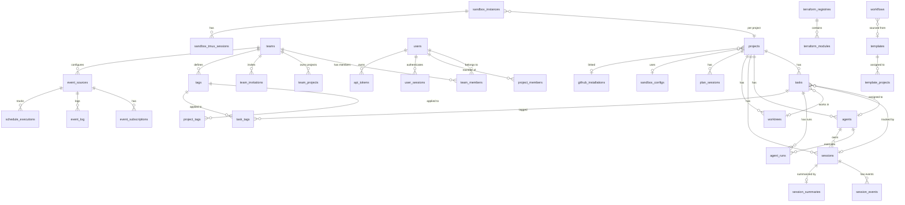

# Architecture Review: Database Schema & Queries

**Area**: 04 - Database Schema & Queries
**Date**: 2026-03-18
**Reviewer**: Claude Opus 4.6 (automated)
**Status**: Complete

---

## Executive Summary

The AgentPane database layer uses a dual-dialect approach: SQLite (via better-sqlite3 + Drizzle ORM) as the primary database and PostgreSQL as an alternative mode. The schema spans 38+ tables across SQLite and ~24 tables in PostgreSQL, with significant drift between the two. The codebase uses a hand-rolled migration system for SQLite (raw SQL strings executed at boot) rather than Drizzle Kit's migration tooling, while PostgreSQL uses proper Drizzle Kit migrations. Key concerns include N+1 query patterns in `ProjectService.listWithSummaries`, missing transactions in multi-step agent operations, a growing schema drift between SQLite and PostgreSQL dialects, and inconsistent counting patterns that fetch full rows when only a count is needed.

**Severity Distribution**: 3 Critical, 5 High, 8 Medium, 4 Low

---

## Schema Overview



---

## Table Inventory

### Core Domain Tables

| Table | Cols | Indexes | FKs | Dialect Issues |
|-------|------|---------|-----|----------------|
| `projects` | 12 | 1 (unique on path) | 2 (github_installations, sandbox_configs) | PG missing `parentAgentId` equivalent |
| `tasks` | 22 | 1 (Kanban composite in migration) | 4 (projects, agents, sessions, worktrees) | OK |
| `agents` | 11 | 1 (project_id in migration) | 1 (projects) | PG missing `parentAgentId` column |
| `sessions` | 11 | None declared | 3 (projects, agents, tasks) | PG missing `sandboxProvider`, `sandboxContainerId` |
| `worktrees` | 11 | 1 (project_id in migration) | 3 (projects, agents, tasks) | OK |
| `agent_runs` | 10 | None | 4 (agents, tasks, projects, sessions) | OK |
| `session_events` | 8 | 3 (session_idx, offset_idx, unique_offset) | 1 (sessions) | PG uses `bigint` for timestamp vs SQLite `integer` |
| `session_summaries` | 13 | 1 (unique on sessionId) | 1 (sessions) | OK |
| `audit_logs` | 12 | None | 4 (agents, agent_runs, tasks, projects) | OK |

### RBAC Tables

| Table | Cols | Indexes | FKs | Notes |
|-------|------|---------|-----|-------|
| `users` | 8 | 2 (unique github_id, github_login idx) | None | PG schema missing entirely |
| `user_sessions` | 5 | 2 (unique token, user_id idx) | 1 (users) | PG missing |
| `teams` | 5 | 1 (unique slug) | None | PG missing |
| `team_members` | 4 | 1 (user_id idx) | 2 (teams, users) | PG missing |
| `team_projects` | 3 | 1 (project_id idx) | 2 (teams, projects) | PG missing |
| `project_members` | 5 | 1 (user_id idx) | 3 (projects, users, teams) | PG missing |
| `tags` | 6 | 1 (unique team_id+name) | 1 (teams) | PG missing |
| `project_tags` | 3 | 2 (tag_id, project_id idxs) | 2 (projects, tags) | PG missing |
| `task_tags` | 3 | 2 (tag_id, task_id idxs) | 2 (tasks, tags) | PG missing |
| `api_tokens` | 13 | 3 (user_id, team_id, status idxs) | 3 (users, teams, projects) | PG missing |
| `team_invitations` | 8 | 3 (team_id, email, composite idxs) | 2 (teams, users) | PG missing |

### Supporting Tables

| Table | Cols | Indexes | FKs | Notes |
|-------|------|---------|-----|-------|
| `settings` | 3 | 0 (key is PK) | None | OK |
| `api_keys` | 8 | 1 (unique service) | None | OK |
| `templates` | 19 | None | 1 (projects) | OK |
| `template_projects` | 3 | None (composite PK) | 2 (templates, projects) | OK |
| `marketplaces` | 13 | None | None | OK |
| `cli_sessions` | 23 | 3 (project, status, last_activity) | None | Timestamp inconsistency (integer vs text) |
| `sandbox_configs` | 17 | None | None | OK |
| `sandbox_instances` | 13 | None (unique projectId) | 1 (projects) | OK |
| `sandbox_tmux_sessions` | 7 | 1 (unique sandbox+name) | 2 (sandbox_instances, tasks) | OK |
| `github_tokens` | 10 | None | 1 (teams) | OK |
| `github_installations` | 7 | 1 (unique installationId) | None | OK |
| `repository_configs` | 7 | None | 1 (github_installations) | OK |
| `terraform_registries` | 11 | None | None | OK |
| `terraform_modules` | 14 | 3 (registry, provider, name) | None (missing FK!) | FK to registries not declared |
| `workflows` | 14 | None | 1 (templates) | OK |
| `event_sources` | 12 | 2 (team_idx, slug unique) | 1 (teams) | OK |
| `event_subscriptions` | 14 | 3 (source, project, composite) | 2 (event_sources, projects) | OK |
| `event_log` | 10 | 4 (source, received_at, composite, unique) | 1 (event_sources) | OK |
| `schedule_executions` | 9 | 4 (source, status, executed_at, scheduled_at) | 3 (event_sources, tasks, event_subscriptions) | OK |

---

## Findings

### DB-001: N+1 Query Pattern in ProjectService.listWithSummaries [CRITICAL]

**File**: `src/services/project.service.ts`, lines 183-255

The `listWithSummaries()` method fetches ALL tasks for each project individually in a loop, then for each running agent fetches its task title in another nested loop:

```typescript
for (const project of projectsResult.value) {
  // Query per project - N+1!
  const projectTasks = await this.db.query.tasks.findMany({
    where: eq(tasks.projectId, project.id),
  });
  // ...
  const projectAgents = await this.db.query.agents.findMany({
    where: and(eq(agents.projectId, project.id), eq(agents.status, 'running')),
  });
  // Another nested N+1!
  const runningAgents = await Promise.all(
    projectAgents.map(async (agent) => {
      if (agent.currentTaskId) {
        const task = await this.db.query.tasks.findFirst({
          where: eq(tasks.id, agent.currentTaskId),
        });
      }
    })
  );
}
```

**Note**: The route handler at `src/server/routes/projects.ts` lines 147-281 has a FIXED version using batch `inArray` queries. But the `ProjectService.listWithSummaries()` method is still the N+1 version and may be called from other code paths.

**Recommendation**: Remove or deprecate the N+1 service method; ensure all callers use the optimized route handler pattern.

---

### DB-002: Counting via findMany Instead of COUNT(*) [HIGH]

**File**: `src/services/agent/agent-crud.service.ts`, lines 98-114

Both `getRunningCountAll()` and `getRunningCount()` fetch entire agent rows just to count them:

```typescript
async getRunningCountAll(): Promise<Result<number, never>> {
  const running = await this.db.query.agents.findMany({
    where: eq(agents.status, 'running'),
  });
  return ok(running.length); // Fetches all columns just to count
}
```

This fetches all agent data (including JSON config blobs) into memory. With many running agents, this wastes bandwidth and memory.

**Also found in**: `AgentExecutionService.getRunningCount()` at `src/services/agent/agent-execution.service.ts` line 544-549.

**Recommendation**: Use `db.select({ count: sql<number>\`count(*)\` }).from(agents).where(...)` as already done in `session-crud.service.ts` line 171 and `scheduler.service.ts` line 728.

---

### DB-003: Missing Transactions in Agent Start Flow [CRITICAL]

**File**: `src/services/agent/agent-execution.service.ts`, lines 58-255

The `start()` method performs a complex multi-step operation without a transaction:
1. Reads agent (line 62)
2. Reads task (lines 74-85)
3. Checks availability (line 96)
4. Moves task to in_progress (line 106)
5. Creates worktree (lines 108-113)
6. Creates session (lines 118-123)
7. Updates task with sessionId, worktreeId (lines 129-140)
8. Updates agent status (lines 142-151)
9. Inserts agent_run (lines 160-168)

If any step fails after step 4 (task moved to in_progress), the task is left in an inconsistent state -- in_progress with no agent, session, or worktree. A concurrent request could also see partial state between these operations.

**Recommendation**: Wrap steps 4-9 in a database transaction. The RBAC routes (teams.ts, team-members.ts, etc.) already use `db.transaction()` correctly -- apply the same pattern here.

---

### DB-004: Massive Dual-Database Schema Drift [CRITICAL]

The PostgreSQL schema is missing **17 entire tables** that exist in SQLite:

**Missing from PostgreSQL (`src/db/schema/postgres/index.ts`)**:
- `users`, `user_sessions` (RBAC authentication)
- `teams`, `team_members`, `team_projects` (team management)
- `project_members` (project-level RBAC)
- `tags`, `project_tags`, `task_tags` (tagging system)
- `api_tokens` (API token auth)
- `team_invitations` (invitation workflow)
- `event_sources`, `event_subscriptions`, `event_log` (event system)
- `schedule_executions` (cron scheduling)

**Missing columns in PostgreSQL**:
- `agents` table: missing `parentAgentId` column (exists in SQLite schema at line 24)
- `sessions` table: missing `sandboxProvider` and `sandboxContainerId` columns (exist in SQLite schema at lines 22-23)

The PostgreSQL relations file (`src/db/schema/postgres/relations.ts`) only has 17 relation definitions vs SQLite's 28+.

PostgreSQL mode (`DB_MODE=postgres`) would fail at runtime for any RBAC, team, event, or tagging operation.

**Recommendation**: Either bring PostgreSQL schema to parity or officially deprecate/remove it. The `Database` type in `src/types/database.ts` line 18 is hard-coded to `SqliteDatabase`, confirming PostgreSQL is second-class.

---

### DB-005: Missing FK on terraform_modules.registry_id [HIGH]

**File**: `src/db/schema/sqlite/terraform.ts`, line 43

```typescript
registryId: text('registry_id').notNull(),
```

The `registry_id` column has no `.references()` declaration, meaning orphan modules won't cascade-delete when a registry is removed. The migration SQL at `src/lib/bootstrap/phases/schema.ts` lines 403-419 also lacks a `REFERENCES` clause.

**Recommendation**: Add `.references(() => terraformRegistries.id, { onDelete: 'cascade' })` and update the migration SQL.

---

### DB-006: Inconsistent Timestamp Formats [HIGH]

Three different timestamp formats are used:

1. **ISO datetime strings via `datetime('now')`** -- Most tables (SQLite default). Example: `"2026-03-18 14:30:00"`
2. **ISO strings via `new Date().toISOString()`** -- All application-level updates. Example: `"2026-03-18T14:30:00.000Z"` (note the `T` and `Z`)
3. **Unix epoch integers** -- `cli_sessions.startedAt`, `cli_sessions.lastActivityAt` (lines 27-28), and `session_events.timestamp` (line 19)

The SQLite `datetime('now')` produces `YYYY-MM-DD HH:MM:SS` without timezone, while `new Date().toISOString()` produces `YYYY-MM-DDTHH:MM:SS.sssZ`. Both are stored in `TEXT` columns. These formats differ in:
- Separator (`T` vs space)
- Millisecond precision
- Timezone suffix (`Z` vs implicit UTC)

This means `ORDER BY createdAt` may produce incorrect lexicographic ordering when mixing format variants, and `WHERE createdAt > '...'` comparisons may behave unexpectedly.

**Recommendation**: Standardize on `new Date().toISOString()` everywhere. Add a utility function and replace all `datetime('now')` defaults in schema definitions.

---

### DB-007: No Automatic updatedAt Maintenance [HIGH]

**Files**: All schema files

Neither SQLite nor PostgreSQL schemas have triggers to auto-update the `updatedAt` column. The application manually sets `updatedAt: new Date().toISOString()` on every update. This is error-prone -- any direct database update that omits the `updatedAt` field will leave it stale.

Evidence: 211 occurrences of `new Date().toISOString()` across 62 files in `src/`.

The SQLite `DEFAULT (datetime('now'))` only applies on INSERT, not UPDATE.

**Recommendation**: Either create SQLite triggers for `updatedAt` or use Drizzle's `$onUpdate` feature. For PostgreSQL, use a standard `updated_at` trigger function.

---

### DB-008: Redundant Index on session_events [LOW]

**File**: `src/db/schema/sqlite/session-events.ts`, lines 23-28

```typescript
index('session_events_session_idx').on(table.sessionId),
index('session_events_offset_idx').on(table.sessionId, table.offset),
uniqueIndex('session_events_unique_offset').on(table.sessionId, table.offset),
```

The `session_events_offset_idx` composite index on `(sessionId, offset)` is fully redundant with the `session_events_unique_offset` unique index on the same columns. The unique index already serves as an index for lookups.

Additionally, `session_events_session_idx` on `(sessionId)` alone is a prefix of the composite index, making it partially redundant (the composite index can serve single-column lookups on `sessionId`).

**Recommendation**: Remove `session_events_offset_idx`. Consider removing `session_events_session_idx` if all queries that filter by `sessionId` also order by or filter on `offset`.

---

### DB-009: No Indexes on Core Lookup Columns [MEDIUM]

Several high-traffic tables lack indexes on frequently queried columns:

| Table | Missing Index | Query Pattern |
|-------|-------------|--------------|
| `sessions` | `projectId` | `listSessionsWithFilters` filters by `projectId` (session-crud.service.ts:143) |
| `sessions` | `agentId` | Filtered queries in session list (session-crud.service.ts:151) |
| `sessions` | `status` | Status filtering in session list (session-crud.service.ts:147) |
| `agent_runs` | `agentId` | Run lookup by agent |
| `agent_runs` | `taskId` | Run lookup by task |
| `audit_logs` | `projectId` | Audit log queries by project |
| `audit_logs` | `agentId` | Audit log queries by agent |
| `plan_sessions` | `taskId` | Plan session lookup by task |
| `templates` | `projectId` | Template lookup by project |

The performance indexes in `PERFORMANCE_INDEXES_MIGRATION_SQL` (schema.ts lines 524-536) add indexes for `tasks.agent_id`, `tasks(project_id, column, position)`, `worktrees.project_id`, and `agents.project_id` -- but none for the tables listed above.

**Recommendation**: Add indexes for `sessions(projectId)`, `sessions(status)`, `agent_runs(agentId)`, `agent_runs(taskId)`, and `audit_logs(projectId, createdAt)`.

---

### DB-010: Hand-Rolled SQLite Migration System [MEDIUM]

**File**: `src/lib/bootstrap/phases/schema.ts`

The SQLite migration system uses raw SQL strings with `CREATE TABLE IF NOT EXISTS` and `ALTER TABLE` wrapped in try/catch:

```typescript
export const MIGRATION_SQL = `CREATE TABLE IF NOT EXISTS "projects" (...);`;
export const SANDBOX_MIGRATION_SQL = `ALTER TABLE projects ADD COLUMN ...;`;
export const RBAC_SCHEMA_ADDITIONS = [
  `ALTER TABLE tags ADD COLUMN "updated_at" ...`,
  // Each ALTER is run individually in try/catch
];
```

There are **12 separate migration SQL constants** (MIGRATION_SQL, SANDBOX_MIGRATION_SQL, TEMPLATE_SYNC_INTERVAL_MIGRATION_SQL, SANDBOX_K8S_MIGRATION_SQL, CLI_SESSIONS_MIGRATION_SQL, CLI_SESSIONS_PERF_METRICS_MIGRATION_SQL, TERRAFORM_MIGRATION_SQL, SANDBOX_CONTAINER_ID_MIGRATION_SQL, SANDBOX_NOMAD_MIGRATION_SQL, EVENT_SYSTEM_MIGRATION_SQL, SCHEDULE_EXECUTIONS_MIGRATION_SQL, PERFORMANCE_INDEXES_MIGRATION_SQL, RBAC_MIGRATION_SQL, RBAC_SCHEMA_ADDITIONS).

Meanwhile, the Drizzle Kit migration journal (`src/db/migrations/meta/_journal.json`) only tracks 3 entries (indices 0, 10, 11), with gaps from 1-9. The numbered `.sql` files in `src/db/migrations/` (0004-0011) appear to be independent of the hand-rolled system.

**Issues**:
- No migration version tracking for the hand-rolled migrations
- Duplicate migration logic -- both a `schema.ts` bootstrap and `src/db/migrations/` exist
- `ALTER TABLE` failures are silently caught, making schema state non-deterministic
- The `_journal.json` has gaps (1-9 missing), suggesting deleted or lost migrations

**Recommendation**: Consolidate to a single migration strategy. Consider using Drizzle Kit migrations with `drizzle-orm/better-sqlite3/migrator` for SQLite (as already done for PostgreSQL in `src/lib/bootstrap/phases/postgres.ts` line 42).

---

### DB-011: Missing Transaction in Task Move + Session Create [MEDIUM]

**File**: `src/services/task.service.ts`, lines 321-410

The `moveColumn()` method creates a session record, then updates the task, then triggers agent execution -- without a transaction:

```typescript
// Step 1: Create session (line 363)
await this.db.insert(sessions).values({...});
// Step 2: Update task (line 384)
await this.db.update(tasks).set({...}).where(eq(tasks.id, id));
// Step 3: Trigger agent (line 406)
agentError = await this.triggerContainerAgent(updated, sessionId);
```

If step 2 fails, an orphan session record remains. If step 3 fails, it's handled gracefully (error returned alongside success), but the session and task are already committed.

**Recommendation**: Wrap steps 1-2 in a transaction. Step 3 (agent trigger) can remain outside since it's already failure-tolerant.

---

### DB-012: No Soft Delete Pattern; Cascade Deletes Data Permanently [MEDIUM]

All delete operations use hard deletes with CASCADE:

- Deleting a project cascades to tasks, agents, sessions, worktrees, audit_logs
- Deleting a session cascades to session_events, session_summaries
- Deleting a team cascades to team_members, team_projects, tags

There's no soft delete mechanism for audit trails. In `src/server/routes/projects.ts` line 450-456, the route handler manually deletes tasks and agents before the project -- despite the CASCADE constraint already handling this.

```typescript
// Redundant manual cleanup (CASCADE would handle this)
await db.delete(tasks).where(eq(tasks.projectId, id));
await db.delete(agents).where(eq(agents.projectId, id));
await db.delete(projects).where(eq(projects.id, id));
```

**Recommendation**: Consider adding `deletedAt` soft-delete columns for `projects`, `tasks`, `agents`, and `sessions`. Remove redundant manual cascade deletes in route handlers.

---

### DB-013: agents.currentTaskId and currentSessionId Lack FK Constraints [MEDIUM]

**File**: `src/db/schema/sqlite/agents.ts`, lines 21-22

```typescript
currentTaskId: text('current_task_id'),
currentSessionId: text('current_session_id'),
```

These columns store references to tasks and sessions but have no FK constraints, unlike `tasks.agentId` which properly references `agents.id`. This means the agent could reference a deleted task or session without any database-level enforcement.

**Recommendation**: Add `.references(() => tasks.id, { onDelete: 'set null' })` and `.references(() => sessions.id, { onDelete: 'set null' })`. Note: this creates circular FK dependencies (agents -> tasks -> agents), which is already handled elsewhere with `AnySQLiteColumn` type assertions.

---

### DB-014: cli_sessions Uses Mixed Integer/Text Timestamp Types [MEDIUM]

**File**: `src/db/schema/sqlite/cli-sessions.ts`, lines 27-28 and 37-38

```typescript
startedAt: integer('started_at').notNull(),          // Unix epoch integer
lastActivityAt: integer('last_activity_at').notNull(), // Unix epoch integer
createdAt: text('created_at').default(sql`(datetime('now'))`).notNull(),  // ISO text
updatedAt: text('updated_at').default(sql`(datetime('now'))`).notNull(),  // ISO text
```

Within the same table, `startedAt` and `lastActivityAt` use Unix epoch integers while `createdAt` and `updatedAt` use ISO datetime text. This forces callers to convert between formats and makes the index on `(projectHash, lastActivityAt)` incompatible with text-based date filtering.

**Recommendation**: Standardize all timestamp columns in `cli_sessions` to the same format used by the rest of the schema (ISO text strings).

---

### DB-015: JSON Columns Store Large Blobs Without Separate Tables [MEDIUM]

Several tables store potentially large JSON blobs in text/jsonb columns:

| Table | Column | Content |
|-------|--------|---------|
| `templates` | `cachedSkills`, `cachedCommands`, `cachedAgents` | Full cached content from Git repos |
| `marketplaces` | `cachedPlugins` | Plugin catalog with README content |
| `plan_sessions` | `turns` | Entire multi-turn conversation history |
| `tasks` | `planOptions` | Serialized plan with SDK session context |
| `event_log` | `payload` | Full webhook payloads |

These blobs are returned every time the parent row is queried, even when the blob data isn't needed. The `templates.cachedSkills` column in particular could contain many kilobytes of skill content.

**Recommendation**: For `templates`, consider a separate `template_cached_items` table. For queries that don't need blob data, use `select()` with explicit column lists instead of `findFirst()`/`findMany()`.

---

### DB-016: projects.githubInstallationId FK Missing CASCADE [LOW]

**File**: `src/db/schema/sqlite/projects.ts`, line 21

```typescript
githubInstallationId: text('github_installation_id').references(() => githubInstallations.id),
```

No `onDelete` action is specified, which defaults to `NO ACTION`. If a GitHub installation is removed, projects referencing it will have a dangling `githubInstallationId`. The migration SQL confirms this: `ON DELETE no action` (schema.ts line 149, migrations file line 149).

Similarly, `projects.sandboxConfigId` (line 23) also lacks cascade behavior.

**Recommendation**: Add `{ onDelete: 'set null' }` to both FK declarations.

---

### DB-017: Session Existence Checks Before Every Event Persist [LOW]

**File**: `src/services/session/session-stream.service.ts`, lines 118-127

Every call to `persistEvent()` queries the session to verify it exists:

```typescript
const session = await this.db.query.sessions.findFirst({
  where: eq(sessions.id, sessionId),
});
if (!session) { return err(SessionErrors.NOT_FOUND); }
```

Similarly, `getEventsBySession()` (line 185), `getSessionSummary()` (line 223), and `updateSessionSummary()` (line 250) all perform the same existence check. During an active agent session, `persistEvent()` is called for every streaming chunk, tool call, and state update -- potentially hundreds of times per session.

**Recommendation**: Cache session existence in memory (the streaming service already holds a reference to the session). Alternatively, rely on the FK constraint to fail on insert if the session doesn't exist.

---

### DB-018: persistEvent Offset Calculation Race Condition [MEDIUM]

**File**: `src/services/session/session-stream.service.ts`, lines 127-170

The offset for a new event is calculated by querying the max offset, then inserting with `max + 1`:

```typescript
const lastEvent = await this.db.query.sessionEvents.findFirst({
  where: eq(sessionEvents.sessionId, sessionId),
  orderBy: [desc(sessionEvents.offset)],
});
const nextOffset = (lastEvent?.offset ?? -1) + 1;
// ... later ...
await this.db.insert(sessionEvents).values({ offset: nextOffset, ... });
```

Two concurrent inserts can read the same max offset and both try to insert with the same value. The unique constraint catches this, and retry logic (up to 3 retries) handles it, but this is inefficient under high concurrency. Each retry re-reads the session existence and recalculates the offset.

**Recommendation**: Use an atomic approach -- either a sequence/counter column on the session record (updated via `UPDATE ... SET offset = offset + 1 RETURNING offset`) or use SQLite's `INSERT ... SELECT COALESCE(MAX(offset), -1) + 1`.

---

### DB-019: Transaction Usage Is Good in RBAC Routes [LOW]

**Positive finding**: The RBAC-related routes consistently use transactions correctly:

- `invitation-accept.ts:39` -- Atomically claims invitation
- `project-members.ts:42` -- Checks and inserts in one tx
- `me.ts:113` -- Email uniqueness check + update
- `teams.ts:53,305,381,445` -- CRUD with slug uniqueness
- `rbac-tokens.ts:144` -- Token name uniqueness + insert
- `team-projects.ts:46` -- Assignment with existence check
- `team-invitations.ts:61` -- Invitation with duplicate check
- `team-members.ts:66,252,350` -- Membership operations with owner protection
- `settings.service.ts:181` -- Bulk settings update
- `terraform-registry.service.ts:237` -- Cascade delete

This is a good pattern that should be extended to the agent execution flow (see DB-003).

---

### DB-020: Redundant Manual Cascade Deletion in Project Delete Route [LOW]

**File**: `src/server/routes/projects.ts`, lines 450-456

```typescript
// Delete associated tasks first (foreign key constraint)
await db.delete(tasks).where(eq(tasks.projectId, id));
// Delete associated agents
await db.delete(agents).where(eq(agents.projectId, id));
// Delete the project from database
await db.delete(projects).where(eq(projects.id, id));
```

Both `tasks.projectId` and `agents.projectId` have `ON DELETE CASCADE` constraints. The manual deletes are redundant and actually bypass any triggers or middleware that might be attached to cascade operations.

**Recommendation**: Remove the manual task/agent deletes and let CASCADE handle cleanup. If ordering matters for non-DB side effects, document why.

---

## Summary of Recommendations

### Immediate (Critical)
1. **DB-003**: Add transactions to the agent start flow in `agent-execution.service.ts`
2. **DB-004**: Make a decision on PostgreSQL support -- either bring to parity or remove
3. **DB-001**: Deprecate `ProjectService.listWithSummaries()` or rewrite with batch queries

### Short-Term (High)
4. **DB-002**: Replace `findMany().length` counting with `COUNT(*)` aggregates
5. **DB-005**: Add FK constraint on `terraform_modules.registry_id`
6. **DB-006**: Standardize timestamp format to ISO 8601 with timezone
7. **DB-007**: Add `$onUpdate` or trigger-based `updatedAt` maintenance
8. **DB-009**: Add missing indexes on high-traffic query columns

### Medium-Term
9. **DB-010**: Consolidate SQLite migration strategy
10. **DB-011**: Transaction-wrap task move operations
11. **DB-018**: Fix offset race condition in event persistence
12. **DB-015**: Consider normalizing large JSON blob columns

### Low Priority
13. **DB-008**: Remove redundant session_events index
14. **DB-017**: Cache session existence checks in stream service
15. **DB-020**: Remove redundant manual cascade deletes
