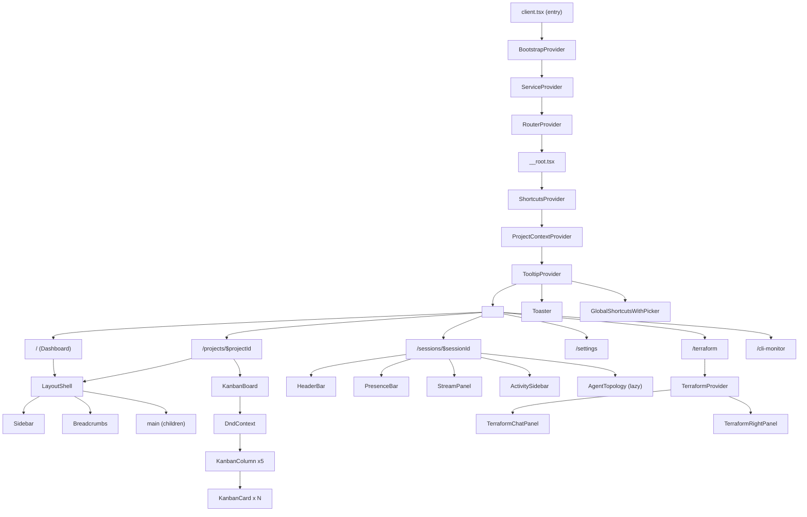

# Area 05: Frontend Component Architecture Review

**Reviewer**: Claude Opus 4.6 (1M context)
**Date**: 2026-03-18
**Scope**: `src/app/components/`, `src/app/hooks/`, `src/app/providers/`, `src/app/routes/`, and all frontend code
**Codebase snapshot**: commit `ca3ca8b` (main)

---

## Executive Summary

The AgentPane frontend is a substantial React application with **299 TypeScript/TSX files** across routes (49 files), components (231 files), hooks (10 files), providers (3 files), and services (3 files). The architecture follows a clear **features/ui** component split with a well-structured design system built on CVA + Radix + Tailwind. However, the codebase has several areas requiring attention: oversized monolithic components (3 files exceed 1,000 lines), insufficient memoization in frequently-rendered list items, minimal lazy loading (only 3 components), and no route-level data loaders despite using TanStack Router.

**Severity Distribution**: 4 High, 8 Medium, 5 Low

---

## 1. Component Hierarchy

### Architecture Diagram



### Component Categories

| Category | Count | Examples |
|----------|-------|---------|
| **UI primitives** | 21 | `Button`, `Dialog`, `Select`, `Tabs`, `Tooltip`, `Toast`, `Checkbox` |
| **Layout** | 3 | `LayoutShell`, `Sidebar`, `Breadcrumbs` |
| **Feature modules** | 15+ | `KanbanBoard`, `AgentSessionView`, `ContainerAgentPanel`, `WorkflowDesigner`, `Terraform*`, `SessionHistory` |
| **Dialogs** | 8 | `NewTaskDialog`, `NewProjectDialog`, `ApprovalDialog`, `TaskDetailDialog`, `AddTemplateDialog` |
| **Contexts** | 7 | `BootstrapContext`, `ServiceContext`, `ProjectContext`, `ShortcutsContext`, `TerraformContext`, `TopologyContext`, `CliMonitorContext` |

### Deep Nesting Concerns

The provider tree is 6 levels deep before any route content renders:

```
BootstrapProvider > ServiceProvider > RouterProvider > ShortcutsProvider > ProjectContextProvider > TooltipProvider > Outlet
```

This is within acceptable limits for a full-featured application, but each provider triggers its own context subscription. The `ProjectContextProvider` at the root level is notable because it fetches all projects on mount regardless of whether the current route needs project data.

---

## 2. Prop Drilling vs Context

### FC-001: ProjectContext Fetches at Root Level Regardless of Route [Medium]

**File**: `/Users/simon.lynch/git/agentpane_nocode/src/app/providers/project-context.tsx`, lines 86-106

```typescript
// Fetch all projects
const fetchProjects = useCallback(async () => {
  setIsLoading(true);
  setError(undefined);
  try {
    const result = await apiClient.projects.listWithSummaries({ limit: 100 });
    // ...
  }
}, []);

// Fetch projects on mount
useEffect(() => {
  void fetchProjects();
}, [fetchProjects]);
```

The `ProjectContextProvider` wraps the entire app in `__root.tsx` (line 69) and fetches all project summaries on mount. This means every route -- including `/settings`, `/marketplace`, `/terraform` -- triggers this API call even when no project data is needed.

**Recommendation**: Move `ProjectContextProvider` to a route segment that actually requires it (e.g., project-related routes), or defer the fetch until `currentProjectId` is available.

### FC-002: Prop Drilling in KanbanBoard Callback Chain [Low]

**File**: `/Users/simon.lynch/git/agentpane_nocode/src/app/routes/projects/$projectId/index.tsx`, lines 349-355

The `ProjectKanban` route component passes `onTaskMove`, `onTaskClick`, `onRunNow`, and `onStopAgent` down through `KanbanBoard` > `KanbanColumn` > `KanbanCard`. This is 3 levels deep, which is acceptable for a board component. The callbacks are properly memoized.

### FC-003: Well-Structured Feature Contexts [Positive]

Feature-specific contexts are properly scoped:
- `TerraformContext` only wraps `/terraform` routes
- `TopologyContext` only wraps topology-related components
- `CliMonitorContext` only wraps CLI monitor views

This is a good pattern that avoids unnecessary re-renders.

### FC-004: Missing Context for Shared Task Operations [Medium]

**File**: `/Users/simon.lynch/git/agentpane_nocode/src/app/routes/projects/$projectId/index.tsx`

Task CRUD operations (`handleTaskMove`, `handleRunNow`, `handleStopAgent`, `handleApprove`, `handleReject`) are defined inline in the route component (lines 123-274). These same operations are partially duplicated in `tasks/$taskId.tsx` (line 83: `onSave`, line 86: `onDelete`). A `TaskOperationsContext` or shared hook would reduce duplication.

---

## 3. Hook Composition

### Hook Inventory

| Hook | Lines | Dependencies | Purpose |
|------|-------|-------------|---------|
| `useAgentStream` | 127 | `subscribeToSession` | SSE subscription for agent streaming |
| `useContainerAgent` | 431 | `subscribeToSession` | Container agent state machine (13 handlers) |
| `useContainerAgentStatuses` | 187 | `subscribeToSession` | Multi-session status tracking |
| `useSession` | 252 | `subscribeToSession`, fetch API | Full session state with presence |
| `usePresence` | 47 | fetch API | Polling-based presence |
| `useToast` | 343 | `useSyncExternalStore` | Toast notifications (external store) |
| `useKeyboardShortcuts` | 268 | DOM events | Keyboard shortcut system |
| `useListFilters` | 257 | TanStack Router, localStorage | URL-synced filtering |
| `useSandboxStatus` | 51 | TanStack DB collection | Sandbox state via live query |
| `useTopologyStream` | 204 | `subscribeToSession`, rAF | Topology SSE with batched updates |

### FC-005: useContainerAgent Is a Monolithic State Machine [Medium]

**File**: `/Users/simon.lynch/git/agentpane_nocode/src/app/hooks/use-container-agent.ts` (431 lines)

This hook manages 13 distinct event handlers, tracks 18+ state fields in a single `useState<ContainerAgentState>`, and maintains 3 additional state variables (`connectionState`, `isStreaming`, `subscriptionRef`). Each handler creates a new state object via spread, which generates a new reference on every event.

```typescript
const handleToken = useCallback((data: ContainerAgentToken) => {
  setIsStreaming(true);
  setState((prev) => ({
    ...prev,          // Spreads 18+ fields
    status: 'running',
    streamedText: data.accumulated,
  }));
}, []);
```

**Recommendation**: Refactor to `useReducer` (like `TopologyContext` already does). This would consolidate state transitions, improve debuggability, and enable action logging.

### FC-006: Overlapping Subscription Hooks [Medium]

Three hooks (`useAgentStream`, `useSession`, `useContainerAgent`) all call `subscribeToSession` from `@/lib/streams/client` with different callback subsets. Components that need both agent streaming and session presence must use both `useSession` and either `useAgentStream` or `useContainerAgent`, opening two SSE connections to the same session.

**File**: `/Users/simon.lynch/git/agentpane_nocode/src/app/components/features/agent-session-view/index.tsx`, lines 146-148:
```typescript
const { state, leave } = useSession(sessionId, userId);
// ...
const { users } = usePresence(sessionId, userId);
```

The `AgentSessionView` uses `useSession` for chunks/tools/presence plus `usePresence` for a separate polling loop, even though `useSession` already receives presence events (line 172-183).

**Recommendation**: Consolidate into a single `useSessionSubscription` hook with configurable event masks to avoid duplicate connections.

### FC-007: useToast External Store Pattern Is Well-Designed [Positive]

**File**: `/Users/simon.lynch/git/agentpane_nocode/src/app/hooks/use-toast.ts`

The toast system uses `useSyncExternalStore` with a module-level store, which is the correct React 18+ pattern for shared mutable state. It also exports a standalone `toast` object for use outside React components (line 259). This is production-quality implementation.

### FC-008: useTopologyStream Uses rAF Batching [Positive]

**File**: `/Users/simon.lynch/git/agentpane_nocode/src/app/hooks/use-topology-stream.ts`, lines 60-80

```typescript
const scheduleUpdate = useCallback(
  (nodeId: string, action: TopologyAction) => {
    pendingUpdatesRef.current.set(nodeId, action);
    if (rafIdRef.current === null) {
      rafIdRef.current = requestAnimationFrame(flushUpdates);
    }
  },
  [flushUpdates]
);
```

This batches high-frequency progress updates into single animation frames, preventing cascade re-renders when multiple sub-agents emit events rapidly. Good performance optimization.

---

## 4. Re-render Analysis

### FC-009: KanbanCard Not Memoized Despite Being Rendered in Lists [High]

**File**: `/Users/simon.lynch/git/agentpane_nocode/src/app/components/features/kanban-board/kanban-card.tsx`

`KanbanCard` is a plain function component (not wrapped in `memo`) that renders inside `COLUMN_ORDER.map()` for every task. When any task moves, the board state changes, causing ALL cards to re-render.

The card receives callbacks `onSelect` and `onOpen` as inline arrow functions (lines 291-293):
```typescript
<KanbanCard
  key={task.id}
  task={task}
  isSelected={selectedIds.has(task.id)}
  isDragging={activeId === task.id}
  onSelect={(multi) => handleCardSelect(task.id, multi)}  // new ref every render
  onOpen={() => handleCardOpen(task)}                       // new ref every render
  onRunNow={onRunNow ? () => onRunNow(task.id) : undefined}
  agentStatus={task.sessionId ? agentStatuses.get(task.sessionId) : undefined}
/>
```

Even if `KanbanCard` were wrapped in `memo`, the inline arrow functions would defeat it.

**Recommendation**:
1. Wrap `KanbanCard` in `React.memo` with a custom comparator
2. Pass `taskId` instead of inline callbacks, and have the card call a stable handler with its own ID

### FC-010: ProjectContextProvider Context Value Triggers Full Tree Re-render [Medium]

**File**: `/Users/simon.lynch/git/agentpane_nocode/src/app/providers/project-context.tsx`, lines 170-204

The context value object is properly memoized, but includes `isPickerOpen` and `isNewProjectDialogOpen` boolean states. When the picker opens, every consumer of `useProjectContext()` re-renders, even components that only need `currentProject`.

```typescript
const value = useMemo<ProjectContextValue>(
  () => ({
    currentProject,
    currentProjectId: projectId,
    isPickerOpen,             // Modal state mixed with data
    // ...
  }),
  [currentProject, projectId, isPickerOpen, ...]
);
```

**Recommendation**: Split into two contexts -- `ProjectDataContext` (project data, rarely changes) and `ProjectPickerContext` (modal state, changes on interaction).

### FC-011: Sidebar Health Check Polling Creates Unnecessary Re-renders [Low]

**File**: `/Users/simon.lynch/git/agentpane_nocode/src/app/components/features/sidebar.tsx`, lines 111-122

```typescript
useEffect(() => {
  const checkHealth = async () => {
    const result = await apiClient.system.health();
    setIsHealthy(result.ok && result.data.status === 'healthy');
    if (result.ok && result.data.checks.database.mode) {
      setDbMode(result.data.checks.database.mode);
    }
  };
  checkHealth();
  const interval = setInterval(checkHealth, 30000);
  return () => clearInterval(interval);
}, []);
```

Every 30 seconds, two state setters fire. Since `Sidebar` is not memoized and sits at the layout level, this triggers re-renders of the entire sidebar subtree every 30 seconds even when health status hasn't changed. The `setIsHealthy` and `setDbMode` calls should compare to previous values before setting.

---

## 5. Bundle Size Concerns

### FC-012: Only 3 Components Use Lazy Loading [High]

Out of 231 component files, only 3 use `React.lazy`:

1. `agent-session-view/index.tsx` -- lazy loads `AgentTopology`
2. `agent-topology/index.tsx` -- lazy loads `AgentTopologyInner`
3. `workflow-designer/index.tsx` -- lazy loads `AIGenerateDialog`

**Missing lazy-load candidates**:
- `@xyflow/react` is imported in **20+ files** across workflow designer, topology, and terraform dependency diagram. This is a large library (~150KB minified) loaded eagerly on every route.
- `NewProjectDialog` (1,429 lines) and `NewTaskDialog` (1,580 lines) are eagerly imported.
- `react-markdown` is used in chat panels and session views.
- Session history components (14 files) are all eagerly loaded.

**Recommendation**:
- Lazy-load all React Flow-dependent features behind route-level code splitting
- Lazy-load large dialogs (`NewProjectDialog`, `NewTaskDialog`, `AddTemplateDialog`)
- Use TanStack Router's built-in lazy route loading for feature-heavy routes

### FC-013: No Route-Level Code Splitting [High]

**File**: `/Users/simon.lynch/git/agentpane_nocode/src/app/router.tsx`

TanStack Router supports `lazy` route definitions that enable automatic code splitting. None of the 49 route files use this feature. Every route component and its imports are bundled into the main chunk.

```typescript
// Current pattern - everything in main bundle:
export const Route = createFileRoute('/projects/$projectId/')({
  component: ProjectKanban,
});

// Recommended pattern - code split per route:
export const Route = createFileRoute('/projects/$projectId/')({
  component: () => import('./ProjectKanban').then(m => m.ProjectKanban),
});
```

**Recommendation**: Add `lazy` route definitions for heavy routes: `/terraform`, `/designer`, `/cli-monitor`, `/catalog`, `/events`, and all settings sub-routes.

### FC-014: Phosphor Icons Imported in 114 Files [Low]

`@phosphor-icons/react` is imported in 114 component files. While Phosphor supports tree-shaking via named imports (which is used correctly), the sheer number of unique icons across the app contributes to bundle size. Consider auditing for duplicate or unused icon imports.

---

## 6. Accessibility

### FC-015: Limited ARIA Coverage Outside Radix Components [Medium]

ARIA attributes are present primarily in Radix-based UI primitives (Dialog, Select, Tooltip) which handle accessibility automatically. Custom interactive elements have inconsistent coverage:

**Good examples**:
- `KanbanBoard` has `role="application"` and `aria-label="Kanban board"` (line 266)
- `KanbanCard` has `aria-grabbed` for drag state (line 174)
- `KanbanColumn` has `aria-label` with task count (line 56)
- `Dialog` close button has `sr-only` text (line 40)

**Missing examples**:
- The sidebar mobile toggle button (layout-shell.tsx, line 43-48) uses a raw text "hamburger" character instead of an icon with proper aria:
  ```typescript
  <span className="h-4 w-4">☰</span>  // Not accessible
  ```
- `AgentSessionView` tab buttons (lines 399-422) use plain `<button>` elements without `role="tab"`, `aria-selected`, or `role="tablist"` on the container.
- The `StreamPanel` component has no `role="log"` or `aria-live` region for streaming content.
- Only **6 files** use `sr-only` for screen reader text across 231 component files.
- Only **8 files** use `tabIndex` for keyboard navigation.

**Recommendation**: Add `role="tablist"` / `role="tab"` / `aria-selected` to all custom tab implementations. Add `aria-live="polite"` to streaming output areas. Increase `sr-only` usage for icon-only buttons.

### FC-016: Keyboard Navigation Support Is Partial [Medium]

The `ShortcutsProvider` and `useKeyboardShortcuts` hook provide a robust global shortcut system with:
- Input field detection (skips shortcuts in text inputs)
- Platform-aware modifier keys (Cmd vs Ctrl)
- Help modal for discoverability

However, keyboard navigation within components is incomplete:
- `KanbanCard` supports Enter (open) and Space (select) but no arrow key navigation between cards
- `ProjectCard` has `tabIndex={0}` but no `onKeyDown` handler
- `WorkflowCard` has `tabIndex={0}` and `onKeyDown` for Enter

---

## 7. Design System Usage

### FC-017: CVA Pattern Consistently Applied [Positive]

**Files**: `src/app/components/ui/button.tsx`, `src/app/components/features/kanban-board/styles.ts`

The codebase uses Class Variance Authority (CVA) consistently for component variants:

```typescript
// button.tsx - Clean variant definition
const buttonVariants = cva(
  'inline-flex items-center justify-center ...',
  {
    variants: {
      variant: { default: '...', destructive: '...', outline: '...', ghost: '...' },
      size: { default: 'h-9 px-4', sm: 'h-7 px-3 text-xs', lg: 'h-11 px-6 text-base', icon: 'h-9 w-9' },
    },
    defaultVariants: { variant: 'default', size: 'default' },
  }
);
```

The kanban board has 7 CVA variant definitions (`cardVariants`, `columnVariants`, `priorityVariants`, `labelVariants`, `columnIconVariants`, `agentStatusVariants`, `lastRunStatusVariants`), all following the same pattern.

### Design System Token Coverage

The `globals.css` defines a comprehensive token system with 190+ CSS custom properties organized into:
- 15 spacing tokens on a 4px grid
- 7 font size tokens
- 10 component-specific sizing tokens
- Full dark/light theme color palettes (40+ color tokens each)
- Animation timing tokens

### FC-018: Radix UI Used Correctly for Accessible Primitives [Positive]

UI components properly delegate to Radix primitives:
- `Dialog` wraps `@radix-ui/react-dialog` with styled overlay/content
- `Checkbox` wraps `@radix-ui/react-checkbox`
- `Select` wraps `@radix-ui/react-select`
- `Switch` wraps `@radix-ui/react-switch`
- `Tabs` wraps `@radix-ui/react-tabs`
- `Tooltip` wraps `@radix-ui/react-tooltip`
- `DropdownMenu` wraps `@radix-ui/react-dropdown-menu`

All use `forwardRef` for ref forwarding and `cn()` for class merging.

### FC-019: Inconsistent Tailwind Token Usage in Feature Components [Low]

While UI primitives use semantic tokens (`bg-canvas`, `text-fg`, `border-border`), some feature components mix raw Tailwind values:

**File**: `/Users/simon.lynch/git/agentpane_nocode/src/app/components/features/sidebar.tsx`, lines 144-248

The sidebar logo SVG uses hardcoded hex colors (`#58a6ff`, `#a371f7`, `#3fb950`, `#f778ba`, `#d29922`) instead of CSS custom properties. These match the theme colors but won't adapt to the light theme.

**File**: `/Users/simon.lynch/git/agentpane_nocode/src/app/components/features/agent-session-view/index.tsx`, line 332-343

Viewer colors use raw Tailwind (`bg-red-500`, `bg-blue-500`) instead of semantic tokens.

---

## 8. State Management

### FC-020: TanStack DB Usage Is Minimal [Medium]

Only **1 hook** (`useSandboxStatus`) uses TanStack DB's `useCollectionQuery` for reactive data:

```typescript
// use-sandbox-status.ts
const { data } = useCollectionQuery<SandboxStatus>(
  (q) => q.from({ sandboxStatus: sandboxStatusCollection })
    .where(({ sandboxStatus }) => eq(sandboxStatus.projectId, projectId)),
  [projectId]
);
```

The wrapper `useCollectionQuery` in `src/lib/db/use-collection-query.ts` exists to work around a TanStack DB v0.5.29 type regression and uses `any` casts.

All other data fetching uses `apiClient` with `useState` + `useEffect` patterns (e.g., Dashboard fetching projects, ProjectKanban fetching tasks). This results in:
- Manual loading/error state management in every route
- No automatic cache invalidation
- No optimistic update infrastructure (though some manual optimistic updates exist)
- Duplicated fetch-setState-loading-error patterns across 15+ route components

**Recommendation**: Evaluate whether TanStack Query (or expanding TanStack DB usage) would reduce the boilerplate. The current manual fetch pattern works but is verbose and error-prone.

### FC-021: Dashboard Uses Polling Instead of SSE for Real-time Updates [Low]

**File**: `/Users/simon.lynch/git/agentpane_nocode/src/app/routes/index.tsx`, lines 109-168

The Dashboard polls for project summaries every 5s (when agents are running) or 30s (when idle). The app already has SSE infrastructure via `subscribeToSession`. Consider using SSE for dashboard-level updates to reduce latency and server load.

### State Flow Patterns

| Pattern | Usage | Files |
|---------|-------|-------|
| **useState + useEffect fetch** | Primary data loading | 15+ route components |
| **Context + Provider** | Shared feature state | 7 contexts |
| **useReducer** | Complex state transitions | `TopologyContext` |
| **useSyncExternalStore** | Module-level shared state | `useToast` |
| **TanStack DB live query** | Reactive collection queries | 1 hook (`useSandboxStatus`) |
| **SSE subscription** | Real-time streaming | 4 hooks (`useSession`, `useAgentStream`, `useContainerAgent`, `useTopologyStream`) |
| **localStorage** | Persistence | Collapsed columns, recent projects, filter preferences |

---

## 9. Route Structure

### Route Tree

```
/ ............................ Dashboard (project grid)
/projects .................... Projects list
/projects/$projectId ......... Project kanban board
/projects/$projectId/git ..... Git management
/projects/$projectId/settings  Project settings
/projects/$projectId/tasks/$taskId  Task detail
/projects/$projectId/worktrees  Worktree management
/sessions .................... Session list
/sessions/$sessionId ......... Agent session view
/agents ...................... Agent list
/agents/$agentId ............. Agent detail
/settings .................... Settings layout (Outlet)
  /settings/api-keys
  /settings/github
  /settings/sandbox
  /settings/prompts
  /settings/agents
  /settings/appearance
  /settings/preferences
  /settings/cli-monitor
  /settings/model-optimizations
  /settings/system
  /settings/projects
  /settings/terraform
/terraform ................... Terraform layout (Outlet)
  /terraform/ ................ Terraform compose
  /terraform/modules ......... Module browser
  /terraform/modules.$moduleId Module detail
  /terraform/history ......... Composition history
  /terraform/settings ........ Terraform settings
/cli-monitor ................. CLI Monitor layout (Outlet)
  /cli-monitor/ .............. Cards view
  /cli-monitor/timeline ...... Timeline view
  /cli-monitor/terminal ...... Terminal view
/designer .................... Workflow designer
/catalog ..................... Workflow catalog
/catalog/$workflowId ......... Workflow detail
/events ...................... Events layout (Outlet)
  /events/ ................... Log view
  /events/sources ............ Event sources
  /events/subscriptions ...... Subscriptions
/marketplace ................. Marketplace
/templates/org ............... Organization templates
/templates/project ........... Project templates
/queue ....................... Task queue
/worktrees ................... Global worktree management
```

### FC-022: No Route Loaders Used [High]

**File**: `/Users/simon.lynch/git/agentpane_nocode/src/app/router.tsx`

TanStack Router supports `loader` functions that pre-fetch data before route transitions, enabling instant navigation. None of the 49 route files use this feature. Instead, every route component fetches data in `useEffect` on mount, causing a loading flash on every navigation.

```typescript
// Current pattern (every route):
function ProjectKanban() {
  const [project, setProject] = useState(null);
  const [isLoading, setIsLoading] = useState(true);
  useEffect(() => { fetchData(); }, []);
  if (isLoading) return <Loading />;
  // ...
}

// TanStack Router pattern (not used):
export const Route = createFileRoute('/projects/$projectId/')({
  loader: ({ params }) => apiClient.projects.get(params.projectId),
  component: ProjectKanban,
});
```

The router is configured with `defaultPreload: 'intent'` (line 14), which would enable preloading on hover/focus if loaders were defined.

**Recommendation**: Add loaders to data-dependent routes. This is the highest-impact change for perceived performance.

---

## Component Inventory by Feature Area

### Kanban Board (8 files)
```
kanban-board/
  index.tsx ........... 307 lines - DndContext orchestrator
  kanban-card.tsx ..... 265 lines - Task card with DnD
  kanban-column.tsx ... ~140 lines - Column with sortable
  drag-overlay.tsx .... ~50 lines - Drag preview
  use-board-state.ts .. 157 lines - Selection & collapse state
  styles.ts ........... 167 lines - CVA variants (7 variant sets)
  constants.ts ........ ~80 lines - Column config, transitions
  icons.tsx ........... ~40 lines - Column icons
```

### Session History (18 files)
```
session-history/
  components/ (12 files) - session-card, stream-viewer, tool-call-timeline, etc.
  hooks/ (3 files) - use-session-events (792 lines), use-session-replay, use-session-filters
  utils/ (3 files) - group-by-date, parse-tool-calls, format-duration
```

### Worktree Management (14 files)
```
worktree-management/
  components/ (6 files) - worktree-list, worktree-actions, summary-cards, etc.
  dialogs/ (3 files) - commit-dialog, remove-dialog, merge-dialog
  hooks/ (3 files) - use-worktrees, use-worktree-actions, use-keyboard-shortcuts
  utils/ (2 files) - format-worktree, worktree-helpers
```

### Workflow Designer (17 files)
```
workflow-designer/
  nodes/ (9 files, all memo'd) - AgentNode, SkillNode, CompactNodes, etc.
  edges/ (3 files, all memo'd) - SequentialEdge, DataflowEdge, HandoffEdge
  index.tsx ........... 608 lines - Canvas orchestrator
  AIGenerateDialog.tsx  721 lines - AI workflow generation (lazy-loaded)
  NodeInspector.tsx ... ~200 lines - Property editor
  WorkflowToolbar.tsx . ~150 lines - Toolbar
  SaveWorkflowDialog .. ~100 lines
```

---

## Oversized Files Requiring Decomposition

| File | Lines | Issue |
|------|-------|-------|
| `routes/settings/sandbox.tsx` | 2,878 | Single file with all sandbox config UI; should be split into sub-components |
| `features/new-task-dialog.tsx` | 1,580 | Includes resize/drag hooks, AI streaming, suggestion cards, and form; should be 4-5 files |
| `features/new-project-dialog.tsx` | 1,429 | Multi-step wizard in a single file; should extract step components |
| `features/project-settings.tsx` | 949 | Settings form; moderate but could use section extraction |
| `features/terraform/terraform-chat-panel.tsx` | 800 | Chat UI; could extract message rendering |
| `hooks/use-session-events.ts` | 792 | Event parsing logic; could extract event type handlers |

---

## Summary of Findings

| ID | Severity | Category | Description |
|----|----------|----------|-------------|
| FC-001 | Medium | Context | ProjectContext fetches data at root level for all routes |
| FC-004 | Medium | Context | Task operations duplicated across route components |
| FC-005 | Medium | Hooks | useContainerAgent is monolithic (431 lines, 13 handlers in useState) |
| FC-006 | Medium | Hooks | Overlapping SSE subscription hooks open duplicate connections |
| FC-009 | High | Re-render | KanbanCard not memoized; inline callbacks defeat memoization |
| FC-010 | Medium | Re-render | ProjectContext mixes modal state with data state |
| FC-011 | Low | Re-render | Sidebar health polling re-renders every 30s unconditionally |
| FC-012 | High | Bundle | Only 3 of 231 components use lazy loading |
| FC-013 | High | Bundle | No route-level code splitting despite TanStack Router support |
| FC-014 | Low | Bundle | Phosphor icons in 114 files; audit for unused imports |
| FC-015 | Medium | A11y | Custom tabs lack ARIA roles; streaming lacks aria-live |
| FC-016 | Medium | A11y | Keyboard navigation incomplete in list/card components |
| FC-019 | Low | Design | Hardcoded hex colors in sidebar; raw Tailwind in features |
| FC-020 | Medium | State | TanStack DB barely used; manual fetch patterns dominate |
| FC-022 | High | Routes | No route loaders; every navigation shows loading flash |

### Priority Recommendations

1. **Add TanStack Router loaders** to data-dependent routes (FC-022) -- highest-impact UX improvement
2. **Enable route-level code splitting** via lazy route definitions (FC-013) -- reduces initial bundle
3. **Memoize KanbanCard** and fix callback stability (FC-009) -- prevents N re-renders on board changes
4. **Lazy-load React Flow-dependent features** and large dialogs (FC-012) -- major bundle reduction
5. **Add ARIA roles to custom tab implementations** (FC-015) -- accessibility compliance
6. **Refactor useContainerAgent to useReducer** (FC-005) -- maintainability
7. **Split ProjectContext** into data/modal contexts (FC-010) -- reduces unnecessary re-renders
8. **Decompose oversized files** (sandbox.tsx, new-task-dialog.tsx, new-project-dialog.tsx)
