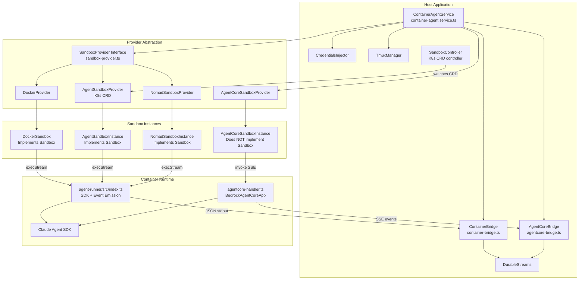

# Architecture Review 07: Sandbox & Container Architecture

**Date**: 2026-03-18
**Reviewer**: Claude Opus 4.6 (1M context)
**Scope**: `src/lib/sandbox/`, `src/services/container-agent.service.ts`, `agent-runner/`, `docker/`, and all container/sandbox infrastructure
**Finding Prefix**: SC

---

## Executive Summary

The sandbox and container architecture implements a multi-provider abstraction layer supporting five sandbox backends: Docker, Kubernetes (CRD-based), Nomad, DevContainer (defined in enum but no implementation), and AWS Bedrock AgentCore. The architecture is well-structured with a clean provider interface, proper credential isolation, and thoughtful error handling. The Docker provider is production-ready with container recovery. The Kubernetes provider delegates to a custom CRD operator. The Nomad provider is functionally complete. The AgentCore provider diverges architecturally since it uses an invoke-and-stream model rather than exec-into-container.

Key strengths: strong provider abstraction, proper shell escaping across all providers, credential injection via base64 encoding, sentinel-file cancellation mechanism, and robust container recovery on server restart. Key concerns: Docker containers run with bridge networking and no explicit network restrictions, the `devcontainer` provider type is declared but unimplemented, and tmux session management code is duplicated across three sandbox instance implementations.

---

## Architecture Diagram



---

## Provider Comparison Table

| Capability | Docker | Kubernetes (CRD) | Nomad | AgentCore |
|---|---|---|---|---|
| **Interface** | Full `Sandbox` | Full `Sandbox` | Full `Sandbox` | Custom (no `Sandbox`) |
| **Exec** | Docker exec API | SDK exec (WebSocket) | Nomad alloc exec | N/A (invoke only) |
| **Exec Streaming** | Multiplexed stream | SDK execStream | WebSocket bridge | SSE from /invocations |
| **Root Exec** | Yes (User param) | No (warns, falls back) | No (throws) | N/A |
| **Tmux** | Yes | Yes (via exec) | Yes (via exec) | N/A |
| **Container Recovery** | Yes (recover on startup) | Status refresh from CRD | Status refresh from job | N/A |
| **Warm Pool** | No | Yes (SandboxWarmPool CRD) | No | No (AWS-managed) |
| **Network Isolation** | Bridge mode only | Pod-level (controller) | Nomad network config | Firecracker microVM |
| **Filesystem** | Bind mount (rw) | CRD-defined volumes | Bind mount (rw) | AWS-managed |
| **Credentials** | Env var to agent-runner | Env var to agent-runner | Env var to agent-runner | Payload field |
| **Cancellation** | Sentinel file + kill | Sentinel file | Sentinel file | Stop file |
| **Cleanup** | Manual (cleanup method) | TTL + ownerReferences | Job stop with purge | Instance stop |
| **Health Check** | Docker ping + info | STS + CRD + namespace | Nomad leader + version | STS GetCallerIdentity |

---

## Detailed Findings

### 1. Provider Abstraction

#### SC-001: Clean Provider Interface with Strong Typing (Strength)

**Files**: `src/lib/sandbox/providers/sandbox-provider.ts:44-118`, `src/lib/sandbox/providers/sandbox-provider.ts:124-167`

The `Sandbox` and `SandboxProvider` interfaces are well-designed with clear separation of concerns. The `EventEmittingSandboxProvider` extension cleanly adds event support without polluting the base interface. All three container-based providers (Docker, K8s, Nomad) implement the same interface, enabling true drop-in replacement.

```typescript
// sandbox-provider.ts:124-167
export interface SandboxProvider {
  readonly name: string;
  create(config: SandboxConfig): Promise<Sandbox>;
  get(projectId: string): Promise<Sandbox | null>;
  getById(sandboxId: string): Promise<Sandbox | null>;
  list(): Promise<SandboxInfo[]>;
  pullImage(image: string): Promise<void>;
  isImageAvailable(image: string): Promise<boolean>;
  healthCheck(): Promise<SandboxHealthCheck>;
  cleanup(options?: { olderThan?: Date; status?: string[] }): Promise<number>;
}
```

**Assessment**: The interface is comprehensive and well-typed. The `execStream` method on `Sandbox` is optional (`execStream?`) which is appropriate since not all implementations may support it, though ContainerAgentService requires it (line 932).

#### SC-002: DevContainer Provider Type Declared but Unimplemented (Gap)

**File**: `src/db/schema/shared/enums.ts:54-60`

The `SANDBOX_TYPES` enum includes `'devcontainer'` as a valid sandbox type, but no corresponding provider implementation exists anywhere in the codebase:

```typescript
export const SANDBOX_TYPES = [
  'docker',
  'devcontainer',  // <-- No provider implementation exists
  'kubernetes',
  'nomad',
  'agentcore',
] as const;
```

**Risk**: Users could configure `devcontainer` as their sandbox provider through the project settings schema (`projectSandboxConfigSchema` in `types.ts:113-124`), which would silently fail when ContainerAgentService tries to resolve the provider.

**Recommendation**: Either implement the DevContainer provider or remove it from the enum and add a validation check in the settings UI/API.

#### SC-003: AgentCore Does Not Implement SandboxProvider Interface (Design Decision)

**File**: `src/lib/sandbox/providers/agentcore-sandbox-provider.ts:9-11`

The AgentCore provider explicitly documents that it does NOT implement the `SandboxProvider` interface because AgentCore has no exec/shell/tmux capabilities. This is handled in `ContainerAgentService` with an early branch:

```typescript
// container-agent.service.ts:859-861
if (this.isAgentCoreProvider()) {
  return this.startAgentCoreAgent(input, project);
}
```

**Assessment**: This is a reasonable architectural decision. AgentCore's invoke-and-stream model is fundamentally different from exec-into-container. The separate code path in ContainerAgentService is cleaner than forcing a square peg into a round hole.

---

### 2. Docker Implementation

#### SC-004: Docker Multiplexed Stream Parsing (Strength)

**File**: `src/lib/sandbox/providers/docker-provider.ts:66-111`

The Docker exec stream parsing correctly handles Docker's multiplexed stdout/stderr protocol with 8-byte frame headers. The implementation accumulates partial frames in a buffer and only processes complete frames:

```typescript
// docker-provider.ts:76-93
while (buffer.length >= 8) {
  const streamType = buffer[0];
  const payloadSize = buffer.readUInt32BE(4);
  if (buffer.length < 8 + payloadSize) {
    break; // Wait for more data
  }
  const payload = buffer.subarray(8, 8 + payloadSize).toString();
  buffer = buffer.subarray(8 + payloadSize);
  if (streamType === 1) { stdout += payload; }
  else if (streamType === 2) { stderr += payload; }
}
```

**Assessment**: This is robust and handles the partial-frame edge case correctly.

#### SC-005: Docker Container Recovery on Server Restart (Strength)

**File**: `src/lib/sandbox/providers/docker-provider.ts:423-525`

The `recover()` method scans for existing containers with the `agentpane-` prefix and re-registers running ones in memory. It also handles stale image detection by comparing image IDs:

```typescript
// docker-provider.ts:484-504
if (expectedImageId && containerInfo.ImageID !== expectedImageId) {
  // Stale image detected — remove container
  await container.stop();
  await container.remove({ force: true });
  removed++;
}
```

**Assessment**: Excellent resilience feature. Server restarts do not orphan running containers. The stale image detection prevents running containers from an outdated image.

#### SC-006: Docker Network Mode is Bridge with No Restrictions (Concern)

**File**: `src/lib/sandbox/providers/docker-provider.ts:565`

```typescript
HostConfig: {
  Binds: binds,
  Memory: config.memoryMb * 1024 * 1024,
  NanoCpus: config.cpuCores * 1e9,
  NetworkMode: 'bridge',  // <-- No network restrictions
  AutoRemove: false,
},
```

The Docker provider creates containers with `NetworkMode: 'bridge'` and no further network restrictions. This means containers have full outbound network access, which could be a security concern for sandboxed agent execution.

**Risk**: A compromised or misbehaving agent could exfiltrate data or interact with host-network services (e.g., Docker socket, local databases).

**Recommendation**: Consider adding an option for `NetworkMode: 'none'` or creating a custom Docker network with restricted outbound rules. The agent only needs outbound HTTPS to Anthropic's API endpoint.

#### SC-007: No Resource Limits Validation (Minor)

**File**: `src/lib/sandbox/types.ts:100-108`

The `sandboxConfigSchema` validates that `memoryMb` and `cpuCores` are positive numbers but does not set upper bounds:

```typescript
memoryMb: z.number().positive().default(SANDBOX_DEFAULTS.memoryMb),
cpuCores: z.number().positive().default(SANDBOX_DEFAULTS.cpuCores),
```

**Risk**: A misconfiguration could allocate excessive resources to a single sandbox.

**Recommendation**: Add maximum bounds (e.g., `z.number().positive().max(32768)` for memory, `z.number().positive().max(16)` for CPU).

---

### 3. Kubernetes Implementation

#### SC-008: CRD-Based Architecture with Controller Pattern (Strength)

**Files**: `src/lib/sandbox/providers/agent-sandbox-provider.ts`, `src/lib/sandbox/controllers/sandbox-controller.ts`

The Kubernetes implementation uses a proper CRD (Custom Resource Definition) pattern with a controller that watches `Sandbox` CRDs, creates pods, and syncs status back. This is the standard Kubernetes operator pattern and provides:

- Declarative sandbox lifecycle management
- OwnerReferences for automatic garbage collection (line 319-328)
- Status subresource updates for observability
- Warm pool support via `SandboxWarmPool` CRD

```typescript
// sandbox-controller.ts:336-363
const pod: k8s.V1Pod = {
  spec: {
    restartPolicy: 'Never',
    containers,
    volumes,
    securityContext: {
      runAsNonRoot: true,
      runAsUser: 1000,
      runAsGroup: 1000,
      fsGroup: 1000,
      seccompProfile: { type: 'RuntimeDefault' },
    },
  },
};
```

#### SC-009: Pod Security Standard Compliance (Strength)

**File**: `src/lib/sandbox/controllers/sandbox-controller.ts:384-400`

The controller enforces "restricted" Pod Security Standards on all sandbox containers:

```typescript
// sandbox-controller.ts:384-400
private ensureSecurityContext(container: k8s.V1Container): k8s.V1Container {
  return {
    ...container,
    securityContext: {
      allowPrivilegeEscalation: false,
      runAsNonRoot: true,
      capabilities: { drop: ['ALL'] },
      seccompProfile: container.securityContext?.seccompProfile ?? { type: 'RuntimeDefault' },
    },
  };
}
```

**Assessment**: This is best-practice Kubernetes security. All capabilities are dropped, privilege escalation is blocked, and containers run as non-root. The seccomp profile defaults to RuntimeDefault.

#### SC-010: Concurrent Creation Guard (Strength)

**File**: `src/lib/sandbox/providers/agent-sandbox-provider.ts:119-137`

The K8s provider uses a `creatingProjects` set to guard against concurrent creation races:

```typescript
// agent-sandbox-provider.ts:132-136
if (this.creatingProjects.has(config.projectId)) {
  throw K8sErrors.POD_ALREADY_EXISTS(config.projectId);
}
this.creatingProjects.add(config.projectId);
```

This is also implemented in the Nomad provider (line 129) and in `ContainerAgentService` via `startingAgents` (line 838). Good defense-in-depth.

#### SC-011: Warm Pool with Deficit-Based Reconciliation (Strength)

**File**: `src/lib/sandbox/controllers/sandbox-controller.ts:540-649`

The warm pool reconciliation uses a deficit-based approach that counts both Running and Pending sandboxes to avoid over-provisioning during startup:

```typescript
// sandbox-controller.ts:602-603
const deficit = desiredReady - currentActive;
```

It also cleans up terminal (Failed/Succeeded) warm pool sandboxes before counting.

#### SC-012: Environment Variable Injection Differs Between K8s/Nomad and Docker (Note)

**File**: `src/lib/sandbox/providers/agent-sandbox-instance.ts:136-173`

The K8s and Nomad providers validate environment variable keys against a strict regex to prevent command injection when building `sh -c` commands:

```typescript
// agent-sandbox-instance.ts:139-143
const ENV_KEY_PATTERN = /^[A-Za-z_][A-Za-z0-9_]*$/;
for (const [key] of envEntries) {
  if (!ENV_KEY_PATTERN.test(key)) {
    throw K8sErrors.EXEC_FAILED(cmd, `Invalid environment variable key: ${key}`);
  }
}
```

The Docker provider does not need this validation because it passes env vars directly to the Docker exec API (`Env: envArray` at line 297), which handles them safely.

---

### 4. Credential Injection

#### SC-013: Base64-Encoded Credential Writing (Strength)

**File**: `src/lib/sandbox/credentials-injector.ts:70-87`

The `CredentialsInjector` uses base64 encoding to safely pass credential JSON through shell commands, preventing command injection:

```typescript
// credentials-injector.ts:74-79
const encoded = Buffer.from(credentialsJson).toString('base64');
const writeResult = await sandbox.exec('sh', [
  '-c',
  `echo "${encoded}" | base64 -d > ${containerPath}`,
]);
```

Permissions are set to 600 (owner read/write only) at line 90.

#### SC-014: OAuth Token Passed via Environment Variable (Concern)

**File**: `src/services/container-agent.service.ts:1322-1323`

The OAuth token is passed to the container via an environment variable:

```typescript
// container-agent.service.ts:1322-1323
env: {
  ...env,
  CLAUDE_OAUTH_TOKEN: oauthToken,
```

Inside the container, `agent-runner/src/index.ts:329-375` writes this to `~/.claude/.credentials.json` with mode 0o600. The env var is visible via `docker inspect` or `/proc/*/environ` to anyone who can access the Docker API.

**Mitigating factor**: The Docker socket access is already a higher-privilege boundary. The agent-runner writes credentials to a file with restricted permissions immediately and does not persist the env var elsewhere. The `prepareContainerExec` method logs `CLAUDE_OAUTH_TOKEN: '[REDACTED]'` (line 676).

#### SC-015: Git Token Credential Stripping After Clone (Strength)

**File**: `src/lib/sandbox/k8s-workspace-initializer.ts:114-142`

The workspace initializer embeds the git token in the clone URL (necessary when credential helpers are unavailable in the pod), then immediately strips it:

```typescript
// k8s-workspace-initializer.ts:115-122
const stripResult = await sandbox.exec('git', [
  '-C', CONTAINER_WORKSPACE_PATH,
  'remote', 'set-url', 'origin',
  `https://github.com/${owner}/${repo}.git`,
]);
```

If stripping fails, the clone is considered failed (line 124-128) to prevent token leakage. The credential helper is also disabled (lines 131-142). Log output is sanitized via `sanitizeCredentials()` (line 47).

---

### 5. Security Boundaries

#### SC-016: Docker Containers Run as Non-Root (Strength)

**File**: `docker/Dockerfile.agent-sandbox:74`

```dockerfile
USER node
```

The container runs as the `node` user. Limited sudo is granted only for `chown` operations (line 64):

```dockerfile
RUN echo "node ALL=(ALL) NOPASSWD: /bin/chown" >> /etc/sudoers.d/node-chown
```

**Assessment**: Minimal privilege design. The node user cannot install packages, modify system files, or escalate privileges beyond changing file ownership.

#### SC-017: Workspace Path Validation in Agent-Runner (Strength)

**File**: `agent-runner/src/index.ts:377-401`

The agent-runner validates that `AGENT_CWD` is within `/workspace` and `AGENT_STOP_FILE` is within allowed roots:

```typescript
// index.ts:380-383
if (!normalized.startsWith(`${WORKSPACE_ROOT}/`) && normalized !== WORKSPACE_ROOT) {
  throw new Error(`AGENT_CWD must be within ${WORKSPACE_ROOT}`);
}
```

```typescript
// index.ts:392-397
const allowed = ALLOWED_STOP_ROOTS.some(
  (root) => normalized === root || normalized.startsWith(`${root}/`)
);
```

**Assessment**: This prevents path traversal attacks through environment variable manipulation.

#### SC-018: Shell Escape Implementation Consistent Across All Providers (Strength)

**Files**: `docker-provider.ts:261-264`, `agent-sandbox-instance.ts:99-101`, `nomad-sandbox-instance.ts:136-138`

All three container sandbox implementations use the same shell escaping pattern:

```typescript
private shellEscape(str: string): string {
  return `'${str.replace(/'/g, "'\\''")}'`;
}
```

**Assessment**: Correct single-quote escaping. Consistent implementation prevents one provider from having a shell injection vulnerability that others lack.

#### SC-019: Docker Bind Mount Gives Read-Write Access to Project Directory (Note)

**File**: `src/lib/sandbox/providers/docker-provider.ts:548`

```typescript
const binds = [
  `${config.projectPath}:/workspace:rw`,
  ...config.volumeMounts.map(
    (v) => `${v.hostPath}:${v.containerPath}:${v.readonly ? 'ro' : 'rw'}`
  ),
];
```

The project directory is mounted read-write. This is by design (agents need to modify files), but means a malicious agent could delete or corrupt the entire project directory.

**Mitigating factor**: Git worktrees provide isolation for individual tasks. The execution phase uses `bypassPermissions` mode in the Claude Agent SDK, which is the expected behavior for approved plans.

---

### 6. Agent-Runner Internals

#### SC-020: Two-Phase Execution Architecture (Strength)

**File**: `agent-runner/src/index.ts:444-803` (planning), `agent-runner/src/index.ts:810-1160` (execution)

The agent-runner implements a clean two-phase architecture:

1. **Planning phase** (`runPlanningPhase`): Creates SDK session with `permissionMode: 'plan'`. Intercepts `ExitPlanMode` tool via `canUseTool` callback. Emits `plan_ready` event when plan is captured.

2. **Execution phase** (`runExecutionPhase`): Creates or resumes SDK session with `permissionMode: 'bypassPermissions'`. Can resume a session from the planning phase for continuity.

The phase is determined by the `AGENT_PHASE` environment variable.

#### SC-021: ExitPlanMode Timeout Safety Mechanism (Strength)

**File**: `agent-runner/src/index.ts:579-594`

The agent-runner includes a timeout mechanism for the ExitPlanMode tool. If the SDK stream hangs after ExitPlanMode is detected, the runner forces a plan_ready event after 60 seconds:

```typescript
// index.ts:580-594
if (exitPlanModeDetected && exitPlanModeTimestamp) {
  const elapsed = Date.now() - exitPlanModeTimestamp;
  if (elapsed > EXIT_PLAN_MODE_TIMEOUT_MS) {
    console.error(`[agent-runner] ExitPlanMode timeout (${elapsed}ms) — forcing plan_ready`);
    // ... emit plan_ready and close session
  }
}
```

**Assessment**: Good defensive programming against SDK stream hangs.

#### SC-022: Topology Tracking for Sub-Agent Visualization (Strength)

**File**: `agent-runner/src/index.ts:92-167`

The execution phase includes topology tracking for team mode sub-agents. The `handleTopologySystemMsg` function maps SDK task lifecycle events (`task_started`, `task_progress`, `task_notification`) to topology events for the UI:

```typescript
// index.ts:86-91
interface TopologyTracker {
  taskToNodeId: Map<string, string>;
  rootEmitted: boolean;
}
```

#### SC-023: Duplicated Agent-Runner Logic Between index.ts and agentcore-handler.ts (Concern)

**Files**: `agent-runner/src/index.ts`, `agent-runner/src/agentcore-handler.ts`

The agentcore-handler duplicates significant logic from index.ts:
- `writeCredentialsFile()` (agentcore-handler.ts:110-135 vs index.ts:329-375)
- `shouldStop()` (agentcore-handler.ts:141-155 vs index.ts:406-416)
- `getAssistantText()` (agentcore-handler.ts:186-196 vs index.ts:1184-1197)
- `ExitPlanModeInput/Options` types (agentcore-handler.ts:161-167 vs index.ts:421-437)
- `FILE_MODIFY_TOOLS` and `extractFileChange()` (agentcore-handler.ts:86-104 vs index.ts:170-193)
- Stream processing loop structure (both files have nearly identical message handling)

The agentcore-handler.ts file has comments acknowledging this: `// (mirrors index.ts logic)`.

**Risk**: Bug fixes applied to one file may not be applied to the other. The topology tracking in index.ts (lines 92-167) is NOT duplicated in agentcore-handler.ts, meaning AgentCore agents lack sub-agent visualization.

**Recommendation**: Extract shared logic into a common module within agent-runner/src/ (e.g., `shared.ts` or `sdk-session-handler.ts`).

---

### 7. Container-to-Host Bridge

#### SC-024: JSON-Line Protocol for Container Communication (Strength)

**File**: `agent-runner/src/event-emitter.ts:158-185`

The agent-runner emits events as JSON lines to stdout. Critical events (started, complete, error, plan_ready) use synchronous writes via `writeSync(STDOUT_FD)` to ensure delivery even if the process crashes:

```typescript
// event-emitter.ts:171-179
if (sync) {
  try {
    writeSync(STDOUT_FD, line);
  } catch {
    process.stdout.write(line);
  }
}
```

The host-side `ContainerBridge` (container-bridge.ts) reads these lines via `readline`, validates the event structure, and publishes to DurableStreams.

#### SC-025: Stderr Fallback for Error Events (Strength)

**File**: `src/lib/agents/container-bridge.ts:376-432`

The container bridge also processes stderr for JSON error events. This is a fallback for cases where stdout has been closed or the process crashed before the error could be written to stdout:

```typescript
// container-bridge.ts:399
if (line.includes('"type":"agent:error"') || line.includes('"type": "agent:error"')) {
```

This is matched by the agent-runner's fatal error handler at index.ts:1207-1219 which writes JSON to stderr.

#### SC-026: Event Task/Session Verification (Strength)

**File**: `src/lib/agents/container-bridge.ts:346-353`

The bridge verifies that each parsed event belongs to the expected task and session:

```typescript
// container-bridge.ts:346-353
if (event.taskId !== taskId || event.sessionId !== sessionId) {
  infoLog('processStream', 'Event task/session mismatch', { ... });
  continue;
}
```

This prevents cross-contamination if multiple agents share a container.

---

### 8. Container Lifecycle

#### SC-027: Sandbox Auto-Creation in startAgent (Strength)

**File**: `src/services/container-agent.service.ts:889-909`

If no sandbox exists for a project, `startAgent` automatically creates one:

```typescript
// container-agent.service.ts:891-909
if (!sandbox) {
  sandbox = await this.provider.create({
    projectId,
    projectPath: project.path ?? '/workspace',
    image: SANDBOX_DEFAULTS.image,
    memoryMb: 2048,
    cpuCores: 2,
    idleTimeoutMinutes: 30,
    volumeMounts: [],
  });
}
```

This simplifies the user experience -- they don't need to manually create containers.

#### SC-028: Terminal State Recovery (Strength)

**File**: `src/services/container-agent.service.ts:872-886`

If a sandbox is in a terminal state (`error` or `stopped`), the service tears it down and recreates:

```typescript
// container-agent.service.ts:872-886
if (sandbox && (sandbox.status === 'error' || sandbox.status === 'stopped')) {
  try {
    await sandbox.stop();
  } catch (stopErr) { /* continue */ }
  sandbox = null;
}
```

#### SC-029: Maximum Runtime Timeout (Strength)

**File**: `src/services/container-agent.service.ts:1347-1355`

A maximum runtime timeout prevents runaway agents:

```typescript
// container-agent.service.ts:1347-1355
const maxRuntimeMs = Number(process.env.AGENT_MAX_RUNTIME_MS) || 2 * 60 * 60 * 1000;
runningAgent.timeoutHandle = setTimeout(() => {
  this.stopAgent(taskId);
}, maxRuntimeMs);
runningAgent.timeoutHandle.unref();
```

Default is 2 hours. Configurable via `AGENT_MAX_RUNTIME_MS` environment variable. The `.unref()` call ensures the timer doesn't prevent Node.js from exiting.

#### SC-030: TOCTOU Guard Before Exec (Strength)

**File**: `src/services/container-agent.service.ts:1303-1315`

A time-of-check-time-of-use guard re-validates sandbox status right before executing:

```typescript
// container-agent.service.ts:1303-1315
if ('refreshStatus' in sandbox && typeof sandbox.refreshStatus === 'function') {
  await sandbox.refreshStatus();
  if (sandbox.status !== 'running') {
    return err(SandboxErrors.CONTAINER_NOT_RUNNING);
  }
}
```

This catches the case where a sandbox goes down between the initial check and the exec call.

#### SC-031: Stale Stop File Cleanup (Strength)

**File**: `src/services/container-agent.service.ts:1132-1142`

Before starting an agent, any stale stop file from a previous run is cleaned up:

```typescript
// container-agent.service.ts:1136
await sandbox.exec('rm', ['-f', stopFilePath]);
```

This prevents a re-run from immediately self-cancelling due to a leftover sentinel file.

#### SC-032: Docker Container Validation on List (Strength)

**File**: `src/lib/sandbox/providers/docker-provider.ts:654-686`

The Docker provider validates that cached containers actually exist in Docker when `list()` is called, pruning stale entries:

```typescript
// docker-provider.ts:657-672
for (const [sandboxId, sandbox] of this.sandboxes) {
  try {
    const container = this.docker.getContainer(sandbox.containerId);
    await container.inspect();
  } catch (error) {
    if ((error as { statusCode: number }).statusCode === 404) {
      staleIds.push(sandboxId);
    }
  }
}
```

---

### 9. Error Handling

#### SC-033: Comprehensive Error Catalog (Strength)

**File**: `src/lib/errors/sandbox-errors.ts`

The sandbox error catalog provides typed, structured errors for every failure mode:
- Container lifecycle (NOT_FOUND, ALREADY_EXISTS, CREATION_FAILED, START_FAILED, STOP_FAILED, NOT_RUNNING)
- Image errors (NOT_FOUND, PULL_FAILED)
- Execution errors (EXEC_FAILED, EXEC_TIMEOUT)
- Tmux errors (SESSION_NOT_FOUND, SESSION_ALREADY_EXISTS, CREATION_FAILED)
- Credential errors (NOT_FOUND, INJECTION_FAILED)
- Agent errors (ALREADY_RUNNING, NOT_RUNNING, START_FAILED, STOP_FAILED)

Each provider (K8s, Nomad, AgentCore) has its own parallel error catalog.

#### SC-034: Non-Fatal Workspace Initialization (Strength)

**File**: `src/lib/sandbox/k8s-workspace-initializer.ts:1-10` (docstring), lines 243-276

The workspace initializer explicitly documents that all failures are non-fatal:

```
 * All failures are non-fatal:
 *  - Clone failure: falls back to empty /workspace
 *  - Worktree failure: falls back to /workspace root
```

This graceful degradation ensures agents can still work even if git operations fail.

#### SC-035: Global Error Handlers in Agent-Runner (Strength)

**File**: `agent-runner/src/index.ts:226-271`

The agent-runner registers global handlers for `uncaughtException` and `unhandledRejection` that attempt to emit error events before exiting:

```typescript
// index.ts:226-248
process.on('uncaughtException', (error: Error & { code?: string }) => {
  if (config.taskId && config.sessionId) {
    try {
      const events = createEventEmitter(config.taskId, config.sessionId);
      events.error({ error: `Uncaught: ${error.message}`, ... });
    } catch { /* best effort */ }
  }
  process.exit(1);
});
```

**Assessment**: This ensures the host process is notified of crashes even in unexpected failure modes.

#### SC-036: Pending Plan TTL and Cleanup (Strength)

**File**: `src/services/container-agent.service.ts:168-172, 732-750`

Pending plans (awaiting user approval) have a 1-hour TTL with cleanup every 5 minutes:

```typescript
const PENDING_PLAN_TTL_MS = 60 * 60 * 1000;
const PLAN_CLEANUP_INTERVAL_MS = 5 * 60 * 1000;
```

This prevents memory leaks from abandoned plans.

---

### Additional Findings

#### SC-037: Tmux Session Code Duplication (Concern)

**Files**: `docker-provider.ts:113-210`, `agent-sandbox-instance.ts:209-312`, `nomad-sandbox-instance.ts:267-396`

The tmux session management code (createTmuxSession, listTmuxSessions, killTmuxSession, sendKeysToTmux, captureTmuxPane) is duplicated across all three sandbox instance implementations with only minor differences (error types). The `TmuxManager` (tmux-manager.ts) wraps the sandbox interface but doesn't eliminate the duplication in the instance classes themselves.

**Recommendation**: Extract tmux operations into a shared mixin or utility class that takes a `SandboxExec` interface, similar to how `k8s-workspace-initializer.ts` uses a minimal `SandboxExec` interface.

#### SC-038: AgentCore SigV4 Signing is Hand-Rolled (Concern)

**File**: `src/lib/sandbox/providers/agentcore-sandbox-instance.ts:44-152`

The AgentCore sandbox instance implements AWS Signature Version 4 signing manually using Web Crypto APIs. The code has TODO comments acknowledging this should be replaced:

```typescript
// agentcore-sandbox-instance.ts:49-51
 * TODO: Replace with `@aws-sdk/client-bedrock-agentcore` InvokeAgentRuntimeCommand
 * once the package is added to dependencies.
```

**Risk**: Hand-rolled crypto signing is error-prone and doesn't handle edge cases like session tokens, request retries, or clock skew. The implementation also doesn't support AWS IAM role-based authentication (only static access keys).

**Recommendation**: Replace with the official AWS SDK client when available, or use `@aws-sdk/signature-v4` for signing.

#### SC-039: Nomad Allocation Rescheduling Handled (Strength)

**File**: `src/lib/sandbox/providers/nomad-sandbox-instance.ts:442-485`

The Nomad instance's `refreshStatus()` detects when an allocation has been rescheduled and updates the internal `allocId`:

```typescript
// nomad-sandbox-instance.ts:460-468
if (runningAlloc && runningAlloc.ID !== this.allocId) {
  log.warn(`Allocation rescheduled: ${this.allocId} → ${runningAlloc.ID}`);
  this.allocId = runningAlloc.ID;
}
```

This handles the case where Nomad reschedules a task to a different client node.

#### SC-040: AgentCore Dockerfile Uses Multi-Stage Build (Strength)

**File**: `docker/Dockerfile.agentcore`

The AgentCore Dockerfile uses a proper multi-stage build (builder + runtime), has a health check endpoint, and targets ARM64 for Firecracker compatibility:

```dockerfile
FROM --platform=linux/arm64 node:22-bookworm-slim AS builder
# ... build stage ...
FROM --platform=linux/arm64 node:22-bookworm-slim
# ... runtime stage with only production deps ...
HEALTHCHECK --interval=15s --timeout=5s --start-period=10s --retries=3 \
    CMD curl -sf http://localhost:8080/ping || exit 1
```

#### SC-041: Nomad Provider Best-Effort Cleanup on Creation Failure (Strength)

**File**: `src/lib/sandbox/providers/nomad-sandbox-provider.ts:222-229`

When sandbox creation fails after the Nomad job has been registered, the provider attempts best-effort cleanup:

```typescript
// nomad-sandbox-provider.ts:222-229
try {
  await this.client.stopJob(jobName, true);
} catch (cleanupError) {
  log.warn(`Failed to clean up job ${jobName} after creation failure`, { ... });
}
```

This prevents orphaned Nomad jobs from accumulating.

---

## Summary of Findings

| ID | Title | Severity | Category |
|----|-------|----------|----------|
| SC-001 | Clean Provider Interface with Strong Typing | Strength | Architecture |
| SC-002 | DevContainer Provider Type Declared but Unimplemented | Gap | Architecture |
| SC-003 | AgentCore Does Not Implement SandboxProvider Interface | Note | Design Decision |
| SC-004 | Docker Multiplexed Stream Parsing | Strength | Docker |
| SC-005 | Docker Container Recovery on Server Restart | Strength | Docker |
| SC-006 | Docker Network Mode is Bridge with No Restrictions | Concern | Security |
| SC-007 | No Resource Limits Validation | Minor | Configuration |
| SC-008 | CRD-Based Architecture with Controller Pattern | Strength | Kubernetes |
| SC-009 | Pod Security Standard Compliance | Strength | Security |
| SC-010 | Concurrent Creation Guard | Strength | Concurrency |
| SC-011 | Warm Pool with Deficit-Based Reconciliation | Strength | Kubernetes |
| SC-012 | Env Var Injection Differs Between Providers | Note | Implementation |
| SC-013 | Base64-Encoded Credential Writing | Strength | Security |
| SC-014 | OAuth Token Passed via Environment Variable | Concern | Security |
| SC-015 | Git Token Credential Stripping After Clone | Strength | Security |
| SC-016 | Docker Containers Run as Non-Root | Strength | Security |
| SC-017 | Workspace Path Validation in Agent-Runner | Strength | Security |
| SC-018 | Shell Escape Consistent Across Providers | Strength | Security |
| SC-019 | Docker Bind Mount Gives Read-Write Access | Note | Security |
| SC-020 | Two-Phase Execution Architecture | Strength | Agent-Runner |
| SC-021 | ExitPlanMode Timeout Safety Mechanism | Strength | Agent-Runner |
| SC-022 | Topology Tracking for Sub-Agent Visualization | Strength | Agent-Runner |
| SC-023 | Duplicated Logic Between index.ts and agentcore-handler.ts | Concern | Maintainability |
| SC-024 | JSON-Line Protocol for Container Communication | Strength | Bridge |
| SC-025 | Stderr Fallback for Error Events | Strength | Bridge |
| SC-026 | Event Task/Session Verification | Strength | Bridge |
| SC-027 | Sandbox Auto-Creation in startAgent | Strength | Lifecycle |
| SC-028 | Terminal State Recovery | Strength | Lifecycle |
| SC-029 | Maximum Runtime Timeout | Strength | Lifecycle |
| SC-030 | TOCTOU Guard Before Exec | Strength | Lifecycle |
| SC-031 | Stale Stop File Cleanup | Strength | Lifecycle |
| SC-032 | Docker Container Validation on List | Strength | Lifecycle |
| SC-033 | Comprehensive Error Catalog | Strength | Error Handling |
| SC-034 | Non-Fatal Workspace Initialization | Strength | Error Handling |
| SC-035 | Global Error Handlers in Agent-Runner | Strength | Error Handling |
| SC-036 | Pending Plan TTL and Cleanup | Strength | Error Handling |
| SC-037 | Tmux Session Code Duplication | Concern | Maintainability |
| SC-038 | AgentCore SigV4 Signing is Hand-Rolled | Concern | Security/Maintenance |
| SC-039 | Nomad Allocation Rescheduling Handled | Strength | Nomad |
| SC-040 | AgentCore Dockerfile Uses Multi-Stage Build | Strength | Docker |
| SC-041 | Nomad Provider Best-Effort Cleanup on Creation Failure | Strength | Nomad |

**Strengths**: 28 | **Concerns**: 5 | **Gaps**: 1 | **Notes**: 3 | **Minor**: 1

---

## Prioritized Recommendations

1. **SC-023** (High): Extract shared logic from `agent-runner/src/index.ts` and `agent-runner/src/agentcore-handler.ts` into a common module. The duplicated code is a maintenance hazard.

2. **SC-006** (Medium): Add network isolation options for Docker containers. At minimum, provide a `NetworkMode: 'none'` option for projects that don't need outbound access beyond the Anthropic API.

3. **SC-037** (Medium): Extract tmux session management into a shared utility to eliminate code duplication across three sandbox instance implementations.

4. **SC-038** (Medium): Replace hand-rolled AWS SigV4 signing with the official `@aws-sdk/signature-v4` package or wait for `@aws-sdk/client-bedrock-agentcore`.

5. **SC-002** (Low): Either implement the DevContainer provider or remove `'devcontainer'` from `SANDBOX_TYPES` to prevent configuration errors.

6. **SC-007** (Low): Add maximum bounds to `memoryMb` and `cpuCores` in the Zod schema to prevent resource exhaustion from misconfiguration.
