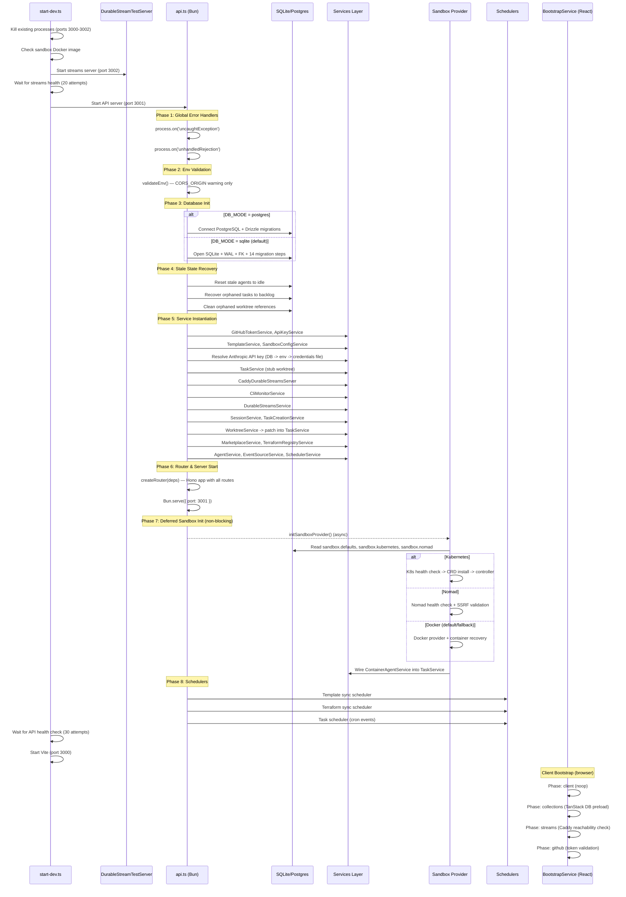

# Architecture Review: Config, Bootstrap & Lifecycle

**Area**: 09 - Config, Bootstrap & Lifecycle
**Reviewer**: Claude (automated architecture review)
**Date**: 2026-03-18
**Scope**: `src/lib/bootstrap/`, `src/lib/config/`, `src/server/api.ts`, `src/lib/env.ts`, and all initialization/shutdown code

---

## Executive Summary

AgentPane has **two distinct bootstrap systems**: a client-side `BootstrapService` (React hooks-based) and a server-side imperative initialization sequence in `src/server/api.ts`. The server-side path is the critical one, running ~14 sequential migration steps, ~20 service instantiations, and deferred sandbox provider initialization. Configuration is sourced from environment variables, a SQLite/Postgres `settings` table, and per-project `.claude/settings.json` files.

The system works but has significant structural concerns: the 1,848-line `api.ts` is a single procedural module with no dependency injection container, no formalized bootstrap phase structure (unlike the client), and deeply duplicated migration logic between client and server paths.

**Severity Distribution**: 2 Critical, 4 High, 6 Medium, 4 Low

---

## Bootstrap Sequence Diagram



---

## Findings

### CB-001: Monolithic api.ts — 1,848 Lines of Procedural Initialization [Critical]

**Location**: `/Users/simon.lynch/git/agentpane_nocode/src/server/api.ts`

The entire server bootstrap is a single procedural file with top-level `await`, module-level `let` variables, and no dependency injection container. This creates:

- **Testing difficulty**: Cannot unit-test individual bootstrap phases in isolation
- **Ordering fragility**: Service instantiation order is implicit in code position
- **Circular patching**: `TaskService` is created with a stub worktreeService, then patched later (line 518-531, 588-593)

```typescript
// Line 518-531: TaskService created with stubs
const taskService = new TaskService(db, {
  getDiff: async () => ({
    ok: false,
    error: { code: 'NOT_IMPLEMENTED', message: 'Not implemented', status: 501 },
  }),
  merge: async () => ({ ... }),
  remove: async () => ({ ... }),
});

// Line 588-593: Patched 70 lines later
taskService.setWorktreeService({
  getDiff: (worktreeId: string) => worktreeService.getDiff(worktreeId),
  merge: (worktreeId: string, targetBranch?: string) =>
    worktreeService.merge(worktreeId, targetBranch),
  remove: (worktreeId: string) => worktreeService.remove(worktreeId),
});
```

**Risk**: Any code that calls `taskService.getDiff()` between lines 531 and 593 will silently get a "Not implemented" error.

**Recommendation**: Extract a `ServerBootstrap` class (analogous to the client-side `BootstrapService`) with explicit phases, a DI container, and proper dependency resolution ordering.

---

### CB-002: Duplicated Migration Logic Between Client and Server [Critical]

**Location**:
- Client path: `src/lib/bootstrap/phases/schema.ts` (line 740-843)
- Server path: `src/server/api.ts` (lines 174-348)

The server-side `api.ts` and the client-side `validateSchema()` both run the **exact same migration SQL** but with different error handling and ordering. The server runs migrations through direct `bun:sqlite` calls; the client bootstrap runs them through `better-sqlite3`. Both apply RBAC migrations, schema additions, and index creation.

In api.ts, there are **14 individual migration steps** applied sequentially, each wrapped in its own try/catch:

```typescript
// api.ts lines 174-348 (abbreviated — 14 migration blocks)
sqlite.exec(MIGRATION_SQL);                          // 1. Base schema
sqlite.exec(SANDBOX_MIGRATION_SQL);                  // 2. Sandbox columns
sqlite.exec(SANDBOX_CONTAINER_ID_MIGRATION_SQL);     // 3. Container ID
sqlite.exec(TEMPLATE_SYNC_INTERVAL_MIGRATION_SQL);   // 4. Template sync
sqlite.exec(PERFORMANCE_INDEXES_MIGRATION_SQL);      // 5. Perf indexes
sqlite.exec(CLI_SESSIONS_MIGRATION_SQL);             // 6. CLI sessions
sqlite.exec(CLI_SESSIONS_PERF_METRICS_MIGRATION_SQL);// 7. CLI perf metrics
sqlite.exec(TERRAFORM_MIGRATION_SQL);                // 8. Terraform
sqlite.exec(RBAC_MIGRATION_SQL);                     // 9. RBAC
// ... 10-14: RBAC additions, github tokens, indexes, team seeding, events
```

The client-side `validateSchema()` runs a subset of these same migrations (lines 740-843 of `schema.ts`) but does NOT include: CLI sessions, Terraform, performance indexes, Nomad columns, AgentCore columns, or Event system migrations.

**Risk**: Schema drift between fresh installs (api.ts runs all) and client-side bootstrap (runs subset). The migration-ordering test only validates the server sequence.

**Recommendation**: Consolidate all migrations into a single ordered pipeline. The existing `migration-ordering.test.ts` already documents the canonical order — extract it into a reusable `runAllMigrations(db)` function used by both paths.

---

### CB-003: No Formal Environment Variable Validation [High]

**Location**: `src/server/api.ts` lines 23-41, `src/lib/env.ts`

The `validateEnv()` function in api.ts only checks for `CORS_ORIGIN` in production, logging a warning. It does not validate any other environment variables. Critical variables like `DATABASE_URL` (required for postgres mode) are validated later inline with immediate `process.exit(1)` (line 153).

`src/lib/env.ts` is minimal — it only handles `VITE_E2E_SEED`:

```typescript
// src/lib/env.ts — entire file
export const getRuntimeEnv = (): RuntimeEnv => {
  let e2eSeedRaw: string | undefined;
  if (typeof import.meta !== 'undefined' && import.meta.env) {
    e2eSeedRaw = import.meta.env.VITE_E2E_SEED;
  } else if (typeof process !== 'undefined' && process.env) {
    e2eSeedRaw = process.env.VITE_E2E_SEED;
  }
  return { e2eSeed: e2eSeedRaw === 'true' };
};
```

**Environment Variable Inventory**:

| Source | Key | Required | Default | Validated |
|--------|-----|----------|---------|-----------|
| env | `NODE_ENV` | No | `'development'` | No |
| env | `DB_MODE` | No | `'sqlite'` | No (accepted as raw string) |
| env | `DB_PATH` | No | `'./data/agentpane.db'` | No |
| env | `DATABASE_URL` | Yes (when `DB_MODE=postgres`) | None | Yes (exit on missing) |
| env | `CORS_ORIGIN` | No | `'http://localhost:3000'` | Warning in prod only |
| env | `ANTHROPIC_API_KEY` | Conditional | None | Resolved from multiple sources |
| env | `CLAUDE_OAUTH_TOKEN` | No | None | No |
| env | `GITHUB_TOKEN` | No | None | Validated via GitHub API |
| env | `CADDY_STREAMS_URL` | No | Port 3002 (dev) / 3000 (prod) | No |
| env | `SQLITE_DATA_DIR` | No | `'./data'` | No |
| env | `AGENTPANE_MAX_TURNS` | No | `50` | Parsed with `parseEnvNumber` |
| env | `LOG_LEVEL` | No | `'debug'` (dev) / `'info'` (prod) | Validated in logger |
| env | `VITE_E2E_SEED` | No | `false` | `=== 'true'` check |
| env | `SKIP_AUTH` | No | `'true'` (dev script) | No |
| env | `STREAMS_PORT` | No | `3002` | No |
| db | `sandbox.defaults` | No | Built-in defaults | JSON parsed at runtime |
| db | `sandbox.provider` | No | `'docker'` | String match only |
| db | `sandbox.kubernetes` | No | `{}` | No schema validation |
| db | `sandbox.nomad` | No | `{}` | No schema validation |
| db | `anthropic.apiKey` | No | None | Decrypted at runtime |
| db | `general.agentModel` | No | Hardcoded default | Via `getFullModelId` |
| file | `.claude/settings.json` | No | `DEFAULT_PROJECT_CONFIG` | Zod schema validation |
| file | `~/.claude/.credentials.json` | No | None | JSON parse + expiry check |

**Risk**: Typos in `DB_MODE` (e.g., `DB_MODE=postgress`) silently fall through to SQLite. Many DB-sourced settings are JSON-parsed without schema validation.

**Recommendation**: Create a centralized `ServerConfig` schema (Zod) validated at startup that covers all env vars with explicit required/optional/default semantics.

---

### CB-004: Temporal Coupling in Service Initialization [High]

**Location**: `src/server/api.ts` lines 446-593

Services are instantiated in a specific order dictated by constructor dependencies, but this ordering is implicit. The dependency graph:

```
Database (db)
  ├── GitHubTokenService(db)
  ├── ApiKeyService(db)
  │     └── resolveAnthropicApiKey(apiKeyService)  -- side-effects process.env
  ├── TemplateService(db)
  ├── SandboxConfigService(db)
  ├── TaskService(db, stubWorktree)  <-- stub, patched later
  ├── CaddyDurableStreamsServer(url)
  │     ├── CliMonitorService(caddyStreams, db)
  │     ├── DurableStreamsService(caddyStreams, db)
  │     └── SessionService(db, caddyStreams, config)
  │           └── TaskCreationService(db, durableStreams, sessionService)
  ├── WorktreeService(db, bunCommandRunner)
  │     └── TaskService.setWorktreeService(...)  <-- PATCH
  ├── MarketplaceService(db)
  ├── AgentService(db, worktreeService, taskService, sessionService)
  ├── EventSourceService(db)
  ├── EventSubscriptionService(db)
  ├── EventProcessingService(db, pluginRegistry, eventSource, eventSub, taskService)
  └── SchedulerService(db, pluginRegistry, eventProcessing, eventSource)
```

Key coupling issues:
1. `TaskService` exists in a partially-initialized state until `WorktreeService` is ready
2. `AgentService` depends on `taskService` and `worktreeService` — any reordering breaks it
3. `resolveAnthropicApiKey` modifies `process.env.ANTHROPIC_API_KEY` as a side effect (line 508), affecting all downstream SDK calls
4. `ContainerAgentService` is wired into `TaskService` later in deferred sandbox init (line 1413)

**Recommendation**: Use a builder/container pattern that declares dependencies and resolves them automatically in topological order.

---

### CB-005: Sandbox Provider Initialization Has No Timeout [High]

**Location**: `src/server/api.ts` lines 782-1427

The `initSandboxProvider()` function is called asynchronously after `Bun.serve()` (line 1736). It can take an unbounded amount of time:

- Minikube auto-start: up to 120 seconds (line 1368)
- CRD auto-install: multiple `kubectl apply` calls with 30-second timeouts each
- CRD registration poll: 10 seconds (line 629)
- Health check retries: no limit within a single attempt

While this is non-blocking (the server already accepts requests), there is no overall timeout for the initialization. The retry mechanism has exponential backoff (line 1707) but in dev mode `SANDBOX_MAX_RETRIES` is 0 (unlimited).

```typescript
// Line 1678-1680
const SANDBOX_MAX_RETRIES = isDev ? 0 : 10;       // 0 = unlimited in dev
const SANDBOX_BASE_DELAY_MS = isDev ? 3_000 : 15_000;
const SANDBOX_MAX_DELAY_MS = isDev ? 30_000 : 300_000;
```

**Risk**: In dev mode, sandbox provider retries infinitely every 30 seconds, consuming resources even when Docker/K8s is intentionally unavailable.

**Recommendation**: Add a configurable overall timeout for sandbox initialization, and cap dev retries at a reasonable number (e.g., 5).

---

### CB-006: Graceful Shutdown Missing Service Cleanup [High]

**Location**: `src/server/api.ts` lines 1768-1844

The shutdown handler covers:
- Stopping running agents (containerAgentService)
- Clearing K8s/Nomad heal intervals
- Clearing sandbox retry timer
- Stopping sandbox controller
- Stopping template/terraform/task schedulers
- Destroying CLI monitor service
- Closing database connection

But it **does not** handle:
1. **Draining in-flight HTTP requests** — `Bun.serve` is not told to stop accepting connections
2. **Closing the DurableStreamsService** — SSE connections are not explicitly closed
3. **Stopping the AgentService** or any running SDK sessions
4. **Flushing the CaddyDurableStreamsServer** — buffered events may be lost
5. **Stopping the TaskCreationService** cleanup interval (it has a `stop()` method at line 249 of `task-creation.service.ts` but it is never called during shutdown)

```typescript
// Line 1768-1844 (shutdown handler)
async function shutdownServer(signal: string) {
  if (isShuttingDown) return;
  isShuttingDown = true;
  // ...
  // Missing: durableStreamsService cleanup
  // Missing: sessionService cleanup
  // Missing: agentService cleanup
  // Missing: taskCreationService.stop()
  // Missing: server.stop() (Bun.serve doesn't expose this)
  // ...
}
```

**Risk**: In-flight agent sessions, SSE connections, and task creation intervals survive past the shutdown signal, potentially corrupting state or causing data loss.

**Recommendation**: Add explicit cleanup calls for all services with long-lived resources. For Bun.serve, store the server reference and call `.stop()` to drain connections.

---

### CB-007: Client Bootstrap Phases All Marked Recoverable [Medium]

**Location**: `src/lib/bootstrap/service.ts` lines 75-83

All four client-side bootstrap phases are marked `recoverable: true`:

```typescript
// Line 75-83
return [
  { name: 'client', fn: initializeClient, timeout: 5000, recoverable: true },
  { name: 'collections', fn: initializeCollections, timeout: 30000, recoverable: true },
  { name: 'streams', fn: connectStreams, timeout: 30000, recoverable: true },
  { name: 'github', fn: validateGitHub, timeout: 10000, recoverable: true },
];
```

This means **no client-side bootstrap failure is fatal**. If TanStack DB collection initialization fails, the app will proceed with no collections and likely crash on first data access, providing a worse error experience than the bootstrap error screen.

**Recommendation**: Mark `collections` as `recoverable: false` since the UI depends on having working TanStack DB collections.

---

### CB-008: Config Hot Reload Does Not Propagate to Running Services [Medium]

**Location**: `src/lib/config/hot-reload.ts`

The `watchConfig()` function uses `fs.watch` on the `.claude/settings.json` file and re-validates with Zod on change. However:

1. No code in the codebase calls `watchConfig()` — it is dead code
2. The callback signature `onConfigChange: (config: ProjectConfig) => void` has no mechanism to propagate changes to running services
3. There is no equivalent hot-reload for DB-stored settings

```typescript
// src/lib/config/hot-reload.ts — entire implementation (never called)
export const watchConfig = (
  projectPath: string,
  onConfigChange: (config: ProjectConfig) => void
): (() => void) => {
  const configPath = path.join(projectPath, '.claude', 'settings.json');
  const watcher = fs.watch(configPath, async (eventType) => {
    if (eventType === 'change') {
      try {
        const content = await fs.promises.readFile(configPath, 'utf-8');
        const parsed = JSON.parse(content);
        const validated = projectConfigSchema.parse(parsed);
        onConfigChange(validated);
      } catch (error) {
        console.error('Config reload failed:', error);
      }
    }
  });
  return () => watcher.close();
};
```

**Risk**: Configuration changes (whether file-based or DB-stored) require a server restart to take effect. The hot-reload infrastructure exists but is unused.

**Recommendation**: Either wire up the hot-reload watcher during server bootstrap, or remove the dead code. For DB settings, consider a polling mechanism or SSE-based notification.

---

### CB-009: executeWithTimeout Leaks Timers on Success [Medium]

**Location**: `src/lib/bootstrap/service.ts` lines 101-121

The `executeWithTimeout` method creates a `Promise.race` between the phase function and a timeout. When the phase completes successfully, the timeout `setTimeout` continues running until it fires, creating a timer leak:

```typescript
// Line 101-121
private async executeWithTimeout<T>(
  fn: () => Promise<ReturnType<typeof ok<T>> | ReturnType<typeof err>>,
  timeout: number
) {
  return Promise.race([
    fn(),
    new Promise<ReturnType<typeof err>>((resolve) => {
      setTimeout(                    // <-- this timer is never cleared
        () => resolve(err({ code: 'BOOTSTRAP_TIMEOUT', message: 'Timeout', status: 500 })),
        timeout
      );
    }),
  ]);
}
```

With 4 phases and timeouts of 5-30 seconds, up to 4 timers may remain active after bootstrap completes.

**Recommendation**: Use `AbortController` or manually clear the timer when the phase resolves.

---

### CB-010: Server-Side Bootstrap Error Handling Is Inconsistent [Medium]

**Location**: `src/server/api.ts` lines 149-348, 457-515

Failures during server bootstrap are handled differently depending on the phase:

| Phase | Error Handling |
|-------|---------------|
| Missing `DATABASE_URL` (postgres) | `process.exit(1)` (line 153) |
| SQLite open failure | Exception propagates, crashes process |
| Migration failure (idempotent) | `try/catch` + silent continue |
| Migration failure (ALTER TABLE) | `try/catch` + warning log |
| Missing Anthropic key (production) | `process.exit(1)` (line 469) |
| Missing Anthropic key (dev) | Warning log, continue |
| Stale agent reset failure | Error log, continue |
| Orphaned task recovery failure | Error log, continue |

There is no standardized "fail fast" vs "degrade gracefully" policy. Some critical failures (DB connection) crash immediately while others (missing API key in dev) are warnings.

**Recommendation**: Define an explicit error policy per phase: `fatal` (exit), `degraded` (continue with warning + health check reflects it), or `optional` (silently skip).

---

### CB-011: Health Check Does Not Reflect Bootstrap State [Medium]

**Location**: `src/server/routes/health.ts` lines 40-255

The health check endpoint (`/api/health`) verifies:
- Database connectivity (via query)
- GitHub token validity
- Sandbox provider availability (optional)
- Kubernetes provider health (optional)

But it does **not** check:
1. Whether the Anthropic API key is configured and valid
2. Whether the DurableStreams server is reachable
3. Whether sandbox initialization completed (vs still retrying)
4. Whether any schedulers are running

The liveness probe (`/api/health/liveness`) always returns `{ ok: true }` (line 228-229), which is correct.

The readiness probe (`/api/health/readiness`) only checks database connectivity (lines 233-252).

**Recommendation**: Add an optional `extended` query parameter to the health check that verifies all subsystems, including streams availability and API key presence.

---

### CB-012: Dev Startup Script Uses SIGKILL for Port Cleanup [Medium]

**Location**: `scripts/start-dev.ts` lines 92-133

The `killExistingProcesses()` function uses `process.kill(pid, 'SIGKILL')` (line 107) to clear ports 3000-3002. `SIGKILL` does not allow the target process to run its graceful shutdown handler, meaning:
- Database connections may not be closed cleanly
- WAL checkpointing may not complete
- Running agents are terminated without cleanup

```typescript
// Line 106-107
process.kill(parseInt(pid, 10), 'SIGKILL');
```

**Recommendation**: Use `SIGTERM` first with a short timeout, then escalate to `SIGKILL` only if the process does not exit.

---

### CB-013: Config Loading Requires ANTHROPIC_API_KEY for Non-Agent Operations [Low]

**Location**: `src/lib/config/config-service.ts` lines 54-65

The `loadProjectConfig()` function returns an error if `ANTHROPIC_API_KEY` is not set, even though many operations (viewing tasks, managing projects, browsing files) do not require it:

```typescript
// Line 59-65
if (!process.env.ANTHROPIC_API_KEY) {
  return err(
    createError('CONFIG_MISSING_API_KEY', 'Missing ANTHROPIC_API_KEY', 400, {
      env: 'ANTHROPIC_API_KEY',
    })
  );
}
```

**Recommendation**: Move the API key check to agent execution time rather than config loading time.

---

### CB-014: Secret Detection Uses Pattern Matching, Not Allowlisting [Low]

**Location**: `src/lib/config/validate-secrets.ts`

The `containsSecrets()` function checks config keys against regex patterns (`/SECRET/i`, `/PASSWORD/i`, etc.) with an allowlist of known keys. This is a reasonable heuristic but can produce false positives and negatives.

```typescript
// Line 1-4
const BLOCKED_PATTERNS = [/SECRET/i, /PASSWORD/i, /PRIVATE_KEY/i, /_TOKEN$/i, /_API_KEY$/i];
const ALLOWED_KEYS = ['ANTHROPIC_API_KEY', 'GITHUB_TOKEN'];
```

For example, a config key like `DISPLAY_SECRET_COUNT` would be incorrectly flagged, while `myS3cretKey` would pass undetected.

**Risk**: Low. This is a defense-in-depth measure and the allowlist handles known legitimate keys.

---

### CB-015: Bootstrap Service Does Not Provide Phase Timing [Low]

**Location**: `src/lib/bootstrap/service.ts` lines 43-68

The `BootstrapService.run()` method tracks progress percentage but does not record per-phase timing. The `BootstrapState` type has no timing fields:

```typescript
// src/lib/bootstrap/types.ts lines 15-20
export type BootstrapState = {
  phase: BootstrapPhase;
  progress: number;
  error?: AppError;
  isComplete: boolean;
};
```

**Recommendation**: Add `phaseTimings: Record<BootstrapPhase, number>` to the context for debugging slow startups.

---

### CB-016: Global Config Schema Defined But Never Used [Low]

**Location**: `src/lib/config/schemas.ts` lines 16-22

The `globalConfigSchema` Zod schema is defined but never imported or used anywhere in the codebase:

```typescript
// Line 16-22
export const globalConfigSchema = z.object({
  anthropicApiKey: z.string(),
  githubToken: z.string().optional(),
  databaseUrl: z.string().optional(),
  appUrl: z.string().optional(),
});
```

**Recommendation**: Either use this schema in `validateEnv()` or remove it.

---

## Summary Table

| ID | Severity | Finding | Location |
|----|----------|---------|----------|
| CB-001 | Critical | Monolithic api.ts — 1,848 lines of procedural initialization | `src/server/api.ts` |
| CB-002 | Critical | Duplicated migration logic between client and server | `api.ts` + `phases/schema.ts` |
| CB-003 | High | No formal environment variable validation | `api.ts:23-41`, `env.ts` |
| CB-004 | High | Temporal coupling in service initialization | `api.ts:446-593` |
| CB-005 | High | Sandbox provider initialization has no overall timeout | `api.ts:782-1427` |
| CB-006 | High | Graceful shutdown missing service cleanup | `api.ts:1768-1844` |
| CB-007 | Medium | Client bootstrap phases all marked recoverable | `bootstrap/service.ts:75-83` |
| CB-008 | Medium | Config hot reload is dead code | `config/hot-reload.ts` |
| CB-009 | Medium | executeWithTimeout leaks timers on success | `bootstrap/service.ts:101-121` |
| CB-010 | Medium | Server-side bootstrap error handling is inconsistent | `api.ts` (multiple) |
| CB-011 | Medium | Health check does not reflect full bootstrap state | `routes/health.ts` |
| CB-012 | Medium | Dev startup uses SIGKILL for port cleanup | `scripts/start-dev.ts:107` |
| CB-013 | Low | Config loading requires API key for non-agent ops | `config/config-service.ts:59-65` |
| CB-014 | Low | Secret detection uses pattern matching | `config/validate-secrets.ts` |
| CB-015 | Low | Bootstrap service does not provide phase timing | `bootstrap/service.ts` |
| CB-016 | Low | Global config schema defined but never used | `config/schemas.ts:16-22` |

---

## Configuration Sources and Precedence

The system loads configuration from multiple sources with the following precedence (highest first):

```
1. Environment variables (process.env)
   ├── ANTHROPIC_API_KEY
   ├── AGENTPANE_MAX_TURNS
   ├── DB_MODE, DB_PATH, DATABASE_URL
   └── ... (see inventory table above)

2. Database settings table (settings.key -> settings.value)
   ├── sandbox.defaults, sandbox.provider, sandbox.kubernetes, sandbox.nomad
   ├── anthropic.apiKey (encrypted), anthropic.model
   ├── github.token (encrypted), github.appId
   ├── general.agentModel
   └── theme

3. Project config file (.claude/settings.json)
   ├── worktreeRoot, defaultBranch, initScript
   ├── maxTurns, maxConcurrentAgents, allowedTools
   ├── model, systemPrompt, temperature
   └── sandbox config, envVars

4. Hardcoded defaults (DEFAULT_PROJECT_CONFIG)
   ├── worktreeRoot: '.worktrees'
   ├── defaultBranch: 'main'
   ├── allowedTools: ['Read', 'Edit', 'Bash', 'Glob', 'Grep']
   └── maxTurns: 50

5. Credentials file (~/.claude/.credentials.json)
   └── claudeAiOauth.accessToken (OAuth tokens)
```

For per-project config, `loadProjectConfig()` in `config-service.ts` merges these layers using `deepMerge`:

```typescript
// config-service.ts line 67-76
const baseConfigResult = await loadProjectConfigFrom({ projectPath });
const envOverrides: Partial<ProjectConfig> = {
  maxTurns: parseEnvNumber(process.env.AGENTPANE_MAX_TURNS, baseConfigResult.value.maxTurns),
};
const merged = deepMerge(baseConfigResult.value, envOverrides);
```

---

## Recommendations Priority

1. **[CB-001, CB-004]** Extract server bootstrap into a structured `ServerBootstrap` class with explicit dependency resolution
2. **[CB-002]** Consolidate migrations into a single reusable `runAllMigrations()` function
3. **[CB-006]** Complete the shutdown handler with all service cleanup, HTTP drain, and TaskCreationService.stop()
4. **[CB-003]** Add centralized Zod-based env validation at process start
5. **[CB-005]** Add configurable timeout cap for sandbox initialization
6. **[CB-011]** Extend health check to cover all subsystems
